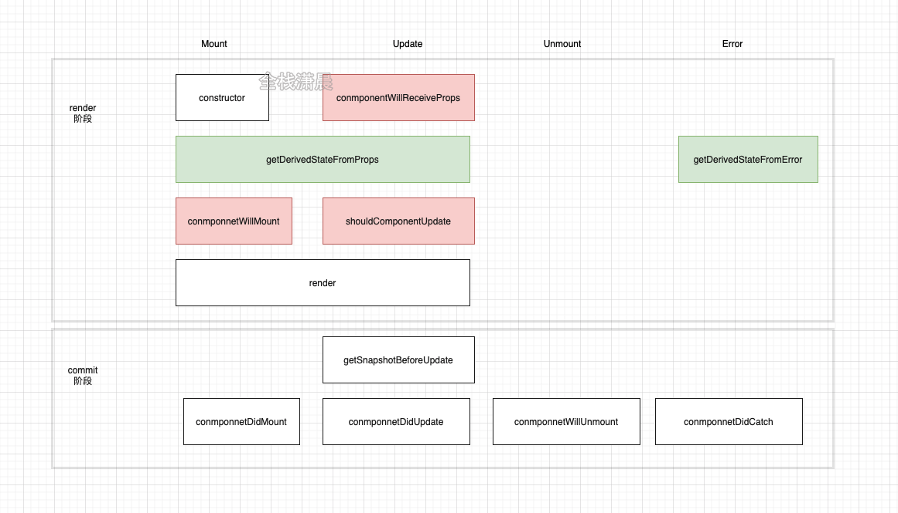
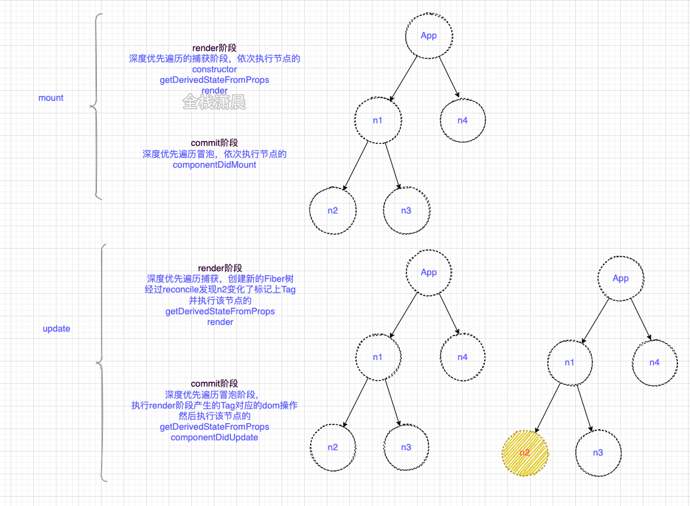
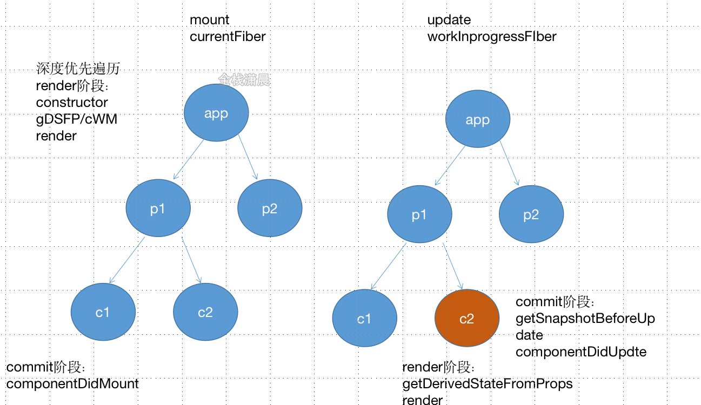

## 生命周期调用顺序
各阶段生命周期执行情况
函数组件hooks的周期会在hooks章节讲解，这一章的使命周期主要针对类组件，各阶段生命周期执行情况看下图：

* render 阶段
1. mount时：组件首先会经历constructor、getDerivedStateFromProps、componnetWillMount、render
2. update时：组件首先会经历componentWillReceiveProps、getDerivedStateFromProps、shouldComponentUpdate、render
3. error时：会调用getDerivedStateFromError
* commit 阶段
  1. mount时：组件会经历componnetDidMount
  2. update时：组件会调用getSnapshotBeforeUpdate、componnetDidUpdate
  3. unMount时：调用componnetWillUnmount
  4. error时：调用componnetDidCatch

* mount时：首先会按照深度优先的方式，依次构建wip Fiber节点然后切换成current Fiber，在render阶段会依次执行各个节点的constructor、getDerivedStateFromProps/componnetWillMount、render，在commit阶段，也就是深度优先遍历向上冒泡的时候依次执行节点的componnetDidMount
* update时：同样会深度优先构建wip Fiber树，在构建的过程中会diff子节点，在render阶段，如果返现有节点的变化，例如上图的c2，那就标记这个节点Update Flag，然后执行getDerivedStateFromProps和render，在commit阶段会依次执行节点的getSnapshotBeforeUpdate、componnetDidUpdate
