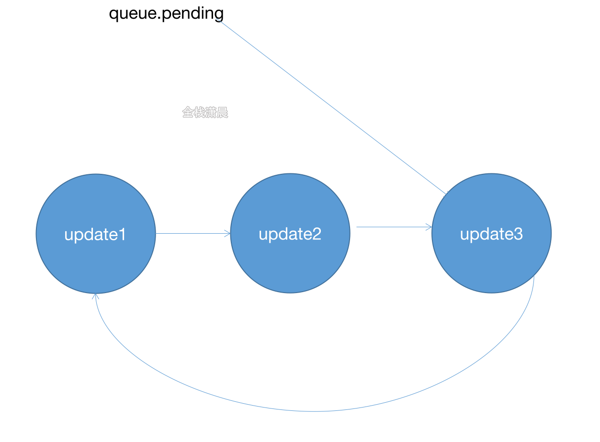
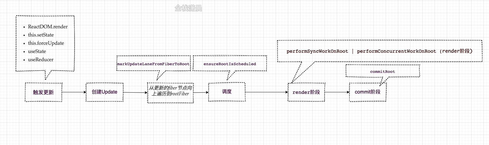
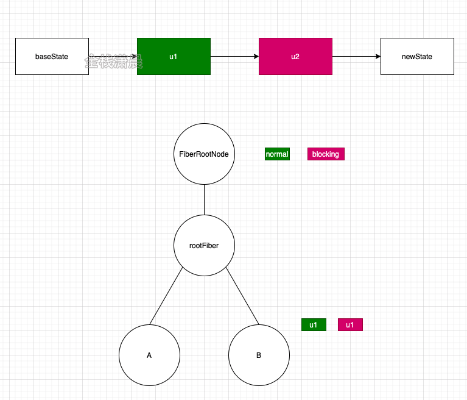
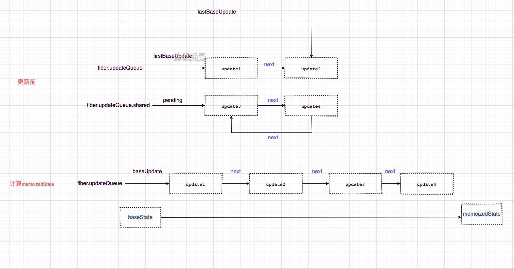

## 状态更新流程

setState&forceUpdate

在react中触发状态更新的几种方式：

ReactDOM.render
this.setState
this.forceUpdate
useState
useReducer

我们重点看下重点看下this.setState和this.forceUpdate，hook在第13章讲
1. this.setState内调用this.updater.enqueueSetState，主要是将update加入updateQueue中
```javascript
//ReactBaseClasses.js
Component.prototype.setState = function (partialState, callback) {
  if (!(typeof partialState === 'object' || typeof partialState === 'function' || partialState == null)) {
    {
      throw Error( "setState(...): takes an object of state variables to update or a function which returns an object of state variables." );
    }
  }
  this.updater.enqueueSetState(this, partialState, callback, 'setState');
};
```
```javascript
//ReactFiberClassComponent.old.js
enqueueSetState(inst, payload, callback) {
  const fiber = getInstance(inst);//fiber实例
   
  const eventTime = requestEventTime();
  const suspenseConfig = requestCurrentSuspenseConfig();
     
  const lane = requestUpdateLane(fiber, suspenseConfig);//优先级
   
  const update = createUpdate(eventTime, lane, suspenseConfig);//创建update
   
  update.payload = payload;
   
  if (callback !== undefined && callback !== null) {  //赋值回调
    update.callback = callback;
  }
   
  enqueueUpdate(fiber, update);//update加入updateQueue
  scheduleUpdateOnFiber(fiber, lane, eventTime);//调度update
}
```
enqueueUpdate用来将update加入updateQueue队列
```javascript
//ReactUpdateQueue.old.js
export function enqueueUpdate<State>(fiber: Fiber, update: Update<State>) {
  const updateQueue = fiber.updateQueue;
  if (updateQueue === null) {
    returnt
  }
   
  const sharedQueue: SharedQueue<State> = (updateQueue: any).shared;
  const pending = sharedQueue.pending;
  if (pending === null) {
    update.next = update;//与自己形成环状链表
  } else {
    update.next = pending.next;//加入链表的结尾
    pending.next = update;
  }
  sharedQueue.pending = update;
}


```

2. this.forceUpdate和this.setState一样，只是会让tag赋值ForceUpdate

```javascript
//ReactBaseClasses.js
Component.prototype.forceUpdate = function(callback) {
  this.updater.enqueueForceUpdate(this, callback, 'forceUpdate');
};
```

```javascript
//ReactFiberClassComponent.old.js
enqueueForceUpdate(inst, callback) {
    const fiber = getInstance(inst);
    const eventTime = requestEventTime();
    const suspenseConfig = requestCurrentSuspenseConfig();
    const lane = requestUpdateLane(fiber, suspenseConfig);
   
    const update = createUpdate(eventTime, lane, suspenseConfig);
       
    //tag赋值ForceUpdate
    update.tag = ForceUpdate;
       
    if (callback !== undefined && callback !== null) {
      update.callback = callback;
    }
       
    enqueueUpdate(fiber, update);
    scheduleUpdateOnFiber(fiber, lane, eventTime);
   
  },
};
```

如果标记ForceUpdate，render阶段组件更新会根据checkHasForceUpdateAfterProcessing，和checkShouldComponentUpdate来判断，如果Update的tag是ForceUpdate，则checkHasForceUpdateAfterProcessing为true，当组件是PureComponent时，checkShouldComponentUpdate会浅比较state和props，所以当使用this.forceUpdate一定会更新

```javascript
//ReactFiberClassComponent.old.js
const shouldUpdate =
  checkHasForceUpdateAfterProcessing() ||
  checkShouldComponentUpdate(
    workInProgress,
    ctor,
    oldProps,
    newProps,
    oldState,
    newState,
    nextContext,
  );
```



Update&updateQueue
HostRoot或者ClassComponent触发更新后，会在函数createUpdate中创建update，并在后面的render阶段的beginWork中计算Update。FunctionComponent对应的Update在第11章讲，它和HostRoot或者ClassComponent的Update结构有些不一样

```javascript
//ReactUpdateQueue.old.js
export function createUpdate(eventTime: number, lane: Lane): Update<*> {//创建update
  const update: Update<*> = {
    eventTime,
    lane,

    tag: UpdateState,
    payload: null,
    callback: null,

    next: null,
  };
  return update;
}
```

* lane：优先级（第12章讲）

* tag：更新的类型，例如UpdateState、ReplaceState

* payload：ClassComponent的payload是setState第一个参数，HostRoot的payload是ReactDOM.render的第一个参数

* callback：setState的第二个参数

* next：连接下一个Update形成一个链表，例如同时触发多个setState时会形成多个Update，然后用next 连接

对于HostRoot或者ClassComponent会在mount的时候使用initializeUpdateQueue创建updateQueue，然后将updateQueue挂载到fiber节点上
```javascript
//ReactUpdateQueue.old.js
export function initializeUpdateQueue<State>(fiber: Fiber): void {
  const queue: UpdateQueue<State> = {
    baseState: fiber.memoizedState,
    firstBaseUpdate: null,
    lastBaseUpdate: null,
  shared: {
      pending: null,
    },
    effects: null,
  };
fiber.updateQueue = queue;
}
```

baseState：初始state，后面会基于这个state，根据Update计算新的state
firstBaseUpdate、lastBaseUpdate：Update形成的链表的头和尾
shared.pending：新产生的update会以单向环状链表保存在shared.pending上，计算state的时候会剪开这个环状链表，并且链接在lastBaseUpdate后
effects：calback不为null的update

从触发更新的fiber节点向上遍历到rootFiber
在markUpdateLaneFromFiberToRoot函数中会从触发更新的节点开始向上遍历到rootFiber，遍历的过程会处理节点的优先级（第15章讲）
```javascript
//ReactFiberWorkLoop.old.js
function markUpdateLaneFromFiberToRoot(
    sourceFiber: Fiber,
    lane: Lane,
  ): FiberRoot | null {
    sourceFiber.lanes = mergeLanes(sourceFiber.lanes, lane);
    let alternate = sourceFiber.alternate;
    if (alternate !== null) {
      alternate.lanes = mergeLanes(alternate.lanes, lane);
    }
    let node = sourceFiber;
    let parent = sourceFiber.return;
    while (parent !== null) {//从触发更新的节点开始向上遍历到rootFiber
      parent.childLanes = mergeLanes(parent.childLanes, lane);//合并childLanes优先级
      alternate = parent.alternate;
      if (alternate !== null) {
        alternate.childLanes = mergeLanes(alternate.childLanes, lane);
      } else {
      }
      node = parent;
      parent = parent.return;
    }
    if (node.tag === HostRoot) {
      const root: FiberRoot = node.stateNode;
      return root;
    } else {
      return null;
    }
  }
```

如果当前根节点更新的优先级是normal，u1、u2都参与状态的计算，如果当前根节点更新的优先级是userBlocking，则只有u2参与计算



调度
在ensureRootIsScheduled中，scheduleCallback会以一个优先级调度render阶段的开始函数performSyncWorkOnRoot或者performConcurrentWorkOnRoot
```javascript
//ReactFiberWorkLoop.old.js
if (newCallbackPriority === SyncLanePriority) {
  // 任务已经过期，需要同步执行render阶段
  newCallbackNode = scheduleSyncCallback(
    performSyncWorkOnRoot.bind(null, root)
  );
} else {
  // 根据任务优先级异步执行render阶段
  var schedulerPriorityLevel = lanePriorityToSchedulerPriority(
    newCallbackPriority
  );
  newCallbackNode = scheduleCallback(
    schedulerPriorityLevel,
    performConcurrentWorkOnRoot.bind(null, root)
  );
}
```
状态更新
classComponent状态计算发生在processUpdateQueue函数中，涉及很多链表操作，看图更加直白

* 初始时fiber.updateQueue单链表上有firstBaseUpdate（update1）和lastBaseUpdate（update2），以next连接
* 
* fiber.updateQueue.shared环状链表上有update3和update4，以next连接互相连接
* 
* 计算state时，先将fiber.updateQueue.shared环状链表‘剪开’，形成单链表，连接在fiber.updateQueue后面形成baseUpdate
* 
* 然后遍历按这条链表，根据baseState计算出memoizedState




带优先级的状态更新
类似git提交，这里的c3意味着高优先级的任务，比如用户出发的事件，数据请求，同步执行的代码等。

通过ReactDOM.render创建的应用没有优先级的概念，类比git提交，相当于先commit，然后提交c3

* 在concurrent模式下，类似git rebase，先暂存之前的代码，在master上开发，然后rebase到之前的分支上

优先级是由Scheduler来调度的，这里我们只关心状态计算时的优先级排序，也就是在函数processUpdateQueue中发生的计算，例如初始时有c1-c4四个update，其中c1和c3为高优先级

1. 在第一次render的时候，低优先级的update会跳过，所以只有c1和c3加入状态的计算
2. 在第二次render的时候，会以第一次中跳过的update（c2）之前的update（c1）作为baseState，跳过的update和之后的update（c2，c3，c4）作为baseUpdate重新计算
在在concurrent模式下，componentWillMount可能会执行多次，变现和之前的版本不一致

注意，fiber.updateQueue.shared会同时存在于workInprogress Fiber和current Fiber，目的是为了防止高优先级打断正在进行的计算而导致状态丢失，这段代码也是发生在processUpdateQueue中
现在来看下计算状态的函数
```javascript
//ReactUpdateQueue.old.js
export function processUpdateQueue<State>(
  workInProgress: Fiber,
  props: any,
  instance: any,
  renderLanes: Lanes,
): void {
  const queue: UpdateQueue<State> = (workInProgress.updateQueue: any);
  hasForceUpdate = false;

  let firstBaseUpdate = queue.firstBaseUpdate;//updateQueue的第一个Update
  let lastBaseUpdate = queue.lastBaseUpdate;//updateQueue的最后一个Update
  let pendingQueue = queue.shared.pending;//未计算的pendingQueue

  if (pendingQueue !== null) {
    queue.shared.pending = null;
    const lastPendingUpdate = pendingQueue;//未计算的ppendingQueue的最后一个update
    const firstPendingUpdate = lastPendingUpdate.next;//未计算的pendingQueue的第一个update
    lastPendingUpdate.next = null;//剪开环状链表
    if (lastBaseUpdate === null) {//将pendingQueue加入到updateQueue
      firstBaseUpdate = firstPendingUpdate;
    } else {
      lastBaseUpdate.next = firstPendingUpdate;
    }
    lastBaseUpdate = lastPendingUpdate;

    const current = workInProgress.alternate;//current上做同样的操作
    if (current !== null) {
      const currentQueue: UpdateQueue<State> = (current.updateQueue: any);
      const currentLastBaseUpdate = currentQueue.lastBaseUpdate;
      if (currentLastBaseUpdate !== lastBaseUpdate) {
        if (currentLastBaseUpdate === null) {
          currentQueue.firstBaseUpdate = firstPendingUpdate;
        } else {
          currentLastBaseUpdate.next = firstPendingUpdate;
        }
        currentQueue.lastBaseUpdate = lastPendingUpdate;
      }
    }
  }

  if (firstBaseUpdate !== null) {
    let newState = queue.baseState;

    let newLanes = NoLanes;

    let newBaseState = null;
    let newFirstBaseUpdate = null;
    let newLastBaseUpdate = null;

    let update = firstBaseUpdate;
    do {
      const updateLane = update.lane;
      const updateEventTime = update.eventTime;
      if (!isSubsetOfLanes(renderLanes, updateLane)) {//判断优先级是够足够
        const clone: Update<State> = {//优先级不够 跳过当前update
          eventTime: updateEventTime,
          lane: updateLane,

          tag: update.tag,
          payload: update.payload,
          callback: update.callback,

          next: null,
        };
        if (newLastBaseUpdate === null) {//保存跳过的update
          newFirstBaseUpdate = newLastBaseUpdate = clone;
          newBaseState = newState;
        } else {
          newLastBaseUpdate = newLastBaseUpdate.next = clone;
        }
        newLanes = mergeLanes(newLanes, updateLane);
      } else {
        //直到newLastBaseUpdate为null才不会计算，防止updateQueue没计算完
        if (newLastBaseUpdate !== null) {
          const clone: Update<State> = {
            eventTime: updateEventTime,
            lane: NoLane,

            tag: update.tag,
            payload: update.payload,
            callback: update.callback,

            next: null,
          };
          newLastBaseUpdate = newLastBaseUpdate.next = clone;
        }

        newState = getStateFromUpdate(//根据updateQueue计算state
          workInProgress,
          queue,
          update,
          newState,
          props,
          instance,
        );
        const callback = update.callback;
        if (callback !== null) {
          workInProgress.flags |= Callback;//Callback flag
          const effects = queue.effects;
          if (effects === null) {
            queue.effects = [update];
          } else {
            effects.push(update);
          }
        }
      }
      update = update.next;//下一个update
      if (update === null) {//重置updateQueue
        pendingQueue = queue.shared.pending;
        if (pendingQueue === null) {
          break;
        } else {
          const lastPendingUpdate = pendingQueue;

          const firstPendingUpdate = ((lastPendingUpdate.next: any): Update<State>);
          lastPendingUpdate.next = null;
          update = firstPendingUpdate;
          queue.lastBaseUpdate = lastPendingUpdate;
          queue.shared.pending = null;
        }
      }
    } while (true);

    if (newLastBaseUpdate === null) {
      newBaseState = newState;
    }

    queue.baseState = ((newBaseState: any): State);//新的state
    queue.firstBaseUpdate = newFirstBaseUpdate;//新的第一个update
    queue.lastBaseUpdate = newLastBaseUpdate;//新的最后一个update

    markSkippedUpdateLanes(newLanes);
    workInProgress.lanes = newLanes;
    workInProgress.memoizedState = newState;
  }

	//...
}
```