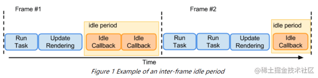
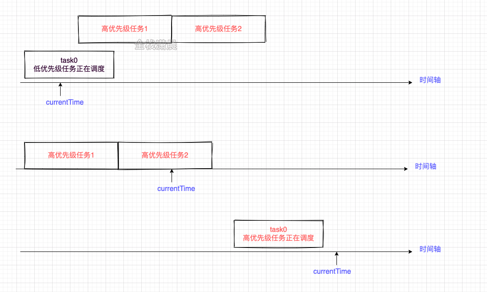

## scheduler&Lane
当我们在类似下面的搜索框组件进行搜索时会发现，组件分为搜索部分和搜索结果展示列表，我们期望输入框能立刻响应，结果列表可以有等待的时间，如果结果列表数据量很大，在进行渲染的时候，我们又输入了一些文字，因为用户输入事件的优先级是很高的，所以就要停止结果列表的渲染，这就引出了不同任务之间的优先级和调度

Scheduler
我们知道如果我们的应用占用较长的js执行时间，比如超过了设备一帧的时间，那么设备的绘制就会出不的现象。

Scheduler主要的功能是时间切片和调度优先级，react在对比差异的时候会占用一定的js执行时间，Scheduler内部借助MessageChannel实现了在浏览器绘制之前指定一个时间片，如果react在指定时间内没对比完，Scheduler就会强制交出执行权给浏览器

##  时间切片
​ 在浏览器的一帧中js的执行时间如

requestIdleCallback是在浏览器重绘重排之后，如果还有空闲就可以执行的时机，所以为了不影响重绘重排，可以在浏览器在requestIdleCallback中执行耗性能的计算，但是由于requestIdleCallback存在兼容和触发时机不稳定的问题，scheduler中采用MessageChannel来实现requestIdleCallback，当前环境不支持MessageChannel就采用setTimeout。

​ 在之前的介绍中我们知道在performUnitOfWork之后会执行render阶段和commit阶段，如果在浏览器的一帧中，cup的计算还没完成，就会让出js执行权给浏览器，这个判断在workLoopConcurrent函数中，shouldYield就是用来判断剩余的时间有没有用尽。在源码中每个时间片时5ms，这个值会根据设备的fps调整。
```javascript
function workLoopConcurrent() {
  while (workInProgress !== null && !shouldYield()) {
    performUnitOfWork(workInProgress);
  }
}

function forceFrameRate(fps) {//计算时间片
  if (fps < 0 || fps > 125) {
    console['error'](
      'forceFrameRate takes a positive int between 0 and 125, ' +
        'forcing frame rates higher than 125 fps is not supported',
    );
    return;
  }
  if (fps > 0) {
    yieldInterval = Math.floor(1000 / fps);
  } else {
    yieldInterval = 5;//时间片默认5ms
  }
}
```
## 任务的暂停
在shouldYield函数中有一段，所以可以知道，如果当前时间大于任务开始的时间+yieldInterval，就打断了任务的进行。

## 调度优先级
​ 在Scheduler中有两个函数可以创建具有优先级的任务
* runWithPriority：以一个优先级执行callback，如果是同步的任务，优先级就是ImmediateSchedulerPriority
```javascript
function unstable_runWithPriority(priorityLevel, eventHandler) {
  switch (priorityLevel) {//5种优先级
    case ImmediatePriority:
    case UserBlockingPriority:
    case NormalPriority:
    case LowPriority:
    case IdlePriority:
      break;
    default:
      priorityLevel = NormalPriority;
  }
  
  var previousPriorityLevel = currentPriorityLevel;//保存当前的优先级
  currentPriorityLevel = priorityLevel;//priorityLevel赋值给currentPriorityLevel
  
  try {
    return eventHandler();//回调函数
  } finally {
    currentPriorityLevel = previousPriorityLevel;//还原之前的优先级
  }
}
```

* scheduleCallback：以一个优先级注册callback，在适当的时机执行，因为涉及过期时间的计算，所以scheduleCallback比runWithPriority的粒度更细。

  * 在scheduleCallback中优先级意味着过期时间，优先级越高priorityLevel就越小，过期时间离当前时间就越近，var expirationTime = startTime + timeout;例如IMMEDIATE_PRIORITY_TIMEOUT=-1，那var expirationTime = startTime + (-1);就小于当前时间了，所以要立即执行。

  * scheduleCallback调度的过程用到了小顶堆，所以我们可以在O(1)的复杂度找到优先级最高的task，不了解可以查阅资料，在源码中小顶堆存放着任务，每次peek都能取到离过期时间最近的task。

  * scheduleCallback中，未过期任务task存放在timerQueue中，过期任务存放在taskQueue中。

​ 新建newTask任务之后，判断newTask是否过期，没过期就加入timerQueue中，如果此时taskQueue中还没有过期任务，timerQueue中离过期时间最近的task正好是newTask，则设置个定时器，到了过期时间就加入taskQueue中。

​ 当timerQueue中有任务，就取出最早过期的任务执行。
```javascript
ority:
      timeout = LOW_PRIORITY_TIMEOUT;
      break;
    case NormalPriority:
    default:
      timeout = NORMAL_PRIORITY_TIMEOUT;
      break;
  }

  var expirationTime = startTime + timeout;//优先级越高 过期时间越小

  var newTask = {//新建task
    id: taskIdCounter++,
    callback//回调函数
    priorityLevel,
    startTime,//开始时间
    expirationTime,//过期时间
    sortIndex: -1,
  };
  if (enableProfiling) {
    newTask.isQueued = false;
  }

  if (startTime > currentTime) {//没有过期
    newTask.sortIndex = startTime;
    push(timerQueue, newTask);//加入timerQueue
    //taskQueue中还没有过期任务，timerQueue中离过期时间最近的task正好是newTask
    if (peek(taskQueue) === null && newTask === peek(timerQueue)) {
      if (isHostTimeoutScheduled) {
        cancelHostTimeout();
      } else {
        isHostTimeoutScheduled = true;
      }
      //定时器，到了过期时间就加入taskQueue中
      requestHostTimeout(handleTimeout, startTime - currentTime);
    }
  } else {
    newTask.sortIndex = expirationTime;
    push(taskQueue, newTask);//加入taskQueue
    if (enableProfiling) {
      markTaskStart(newTask, currentTime);
      newTask.isQueued = true;
    }
    if (!isHostCallbackScheduled && !isPerformingWork) {
      isHostCallbackScheduled = true;
      requestHostCallback(flushWork);//执行过期的任务
    }
  }

  return newTask;
}
```

任务暂停之后怎么继续

​ 在workLoop函数中有这样一段
```javascript
const continuationCallback = callback(didUserCallbackTimeout);//callback就是调度的callback
currentTime = getCurrentTime();
if (typeof continuationCallback === 'function') {//判断callback执行之后的返回值类型
  currentTask.callback = continuationCallback;//如果是function类型就把又赋值给currentTask.callback
  markTaskYield(currentTask, currentTime);
} else {
  if (enableProfiling) {
    markTaskCompleted(currentTask, currentTime);
    currentTask.isQueued = false;
  }
  if (currentTask === peek(taskQueue)) {
    pop(taskQueue);//如果是function类型就从taskQueue中删除
  }
}
advanceTimers(currentTime);
``` 
在performConcurrentWorkOnRoot函数的结尾有这样一个判断，如果callbackNode等于originalCallbackNode那就恢复任务的执行

```javascript
if (root.callbackNode === originalCallbackNode) {
  // The task node scheduled for this root is the same one that's
  // currently executed. Need to return a continuation.
  return performConcurrentWorkOnRoot.bind(null, root);
}
```

## Lane
​ Lane的和Scheduler是两套优先级机制，相比来说Lane的优先级粒度更细，Lane的意思是车道，类似赛车一样，在task获取优先级时，总是会优先抢内圈的赛道，Lane表示的优先级有以下几个特点。

* 可以表示不同批次的优先级
​ 从代码中中可以看到，每个优先级都是个31位二进制数字，1表示该位置可以用，0代表这个位置不能用，从第一个优先级NoLanes到OffscreenLane优先级是降低的，优先级越低1的个数也就越多（赛车比赛外圈的车越多），也就是说含多个1的优先级就是同一个批次。
```javascript
export const NoLanes: Lanes = /*                        */ 0b0000000000000000000000000000000;
export const NoLane: Lane = /*                          */ 0b0000000000000000000000000000000;
  
export const SyncLane: Lane = /*                        */ 0b0000000000000000000000000000001;
export const SyncBatchedLane: Lane = /*                 */ 0b0000000000000000000000000000010;
  
export const InputDiscreteHydrationLane: Lane = /*      */ 0b0000000000000000000000000000100;
const InputDiscreteLanes: Lanes = /*                    */ 0b0000000000000000000000000011000;
  
const InputContinuousHydrationLane: Lane = /*           */ 0b0000000000000000000000000100000;
const InputContinuousLanes: Lanes = /*                  */ 0b0000000000000000000000011000000;
  
export const DefaultHydrationLane: Lane = /*            */ 0b0000000000000000000000100000000;
export const DefaultLanes: Lanes = /*                   */ 0b0000000000000000000111000000000;
  
const TransitionHydrationLane: Lane = /*                */ 0b0000000000000000001000000000000;
const TransitionLanes: Lanes = /*                       */ 0b0000000001111111110000000000000;
  
const RetryLanes: Lanes = /*                            */ 0b0000011110000000000000000000000;
  
export const SomeRetryLane: Lanes = /*                  */ 0b0000010000000000000000000000000;
  
export const SelectiveHydrationLane: Lane = /*          */ 0b0000100000000000000000000000000;
  
const NonIdleLanes = /*                                 */ 0b0000111111111111111111111111111;
  
export const IdleHydrationLane: Lane = /*               */ 0b0001000000000000000000000000000;
const IdleLanes: Lanes = /*                             */ 0b0110000000000000000000000000000;
  
export const OffscreenLane: Lane = /*                   */ 0b1000000000000000000000000000000;
```
* 优先级的计算的性能高

​ 例如，可以通过二进制按位与来判断a和b代表的lane是否存在交集
```javascript
export function includesSomeLane(a: Lanes | Lane, b: Lanes | Lane) {
  return (a & b) !== NoLanes;
}
```
### Lane模型中task是怎么获取优先级的（赛车的初始赛道）

​ 任务获取赛道的方式是从高优先级的lanes开始的，这个过程发生在findUpdateLane函数中，如果高优先级没有可用的lane了就下降到优先级低的lanes中寻找，其中pickArbitraryLane会调用getHighestPriorityLane获取一批lanes中优先级最高的那一位，也就是通过lanes & -lanes获取最右边的一位
```javascript
export function findUpdateLane(
  lanePriority: LanePriority,
  wipLanes: Lanes,
): Lane {
  switch (lanePriority) {
    //...
    case DefaultLanePriority: {
      let lane = pickArbitraryLane(DefaultLanes & ~wipLanes);//找到下一个优先级最高的lane
      if (lane === NoLane) {//上一个level的lane都占满了下降到TransitionLanes继续寻找可用的赛道
        lane = pickArbitraryLane(TransitionLanes & ~wipLanes);
        if (lane === NoLane) {//TransitionLanes也满了
          lane = pickArbitraryLane(DefaultLanes);//从DefaultLanes开始找
        }
      }
      return lane;
    }
  }
}
```

### Lane模型中高优先级是怎么插队的（赛车抢赛道）
​ 在Lane模型中如果一个低优先级的任务执行，并且还在调度的时候触发了一个高优先级的任务，则高优先级的任务打断低优先级任务，此时应该先取消低优先级的任务，因为此时低优先级的任务可能已经进行了一段时间，Fiber树已经构建了一部分，所以需要将Fiber树还原，这个过程发生在函数prepareFreshStack中，在这个函数中会初始化已经构建的Fiber树
```javascript
function ensureRootIsScheduled(root: FiberRoot, currentTime: number) {
  const existingCallbackNode = root.callbackNode;//之前已经调用过的setState的回调
  //...
	if (existingCallbackNode !== null) {
    const existingCallbackPriority = root.callbackPriority;
    //新的setState的回调和之前setState的回调优先级相等 则进入batchedUpdate的逻辑
    if (existingCallbackPriority === newCallbackPriority) {
      return;
    }
    //两个回调优先级不一致，则被高优先级任务打断，先取消当前低优先级的任务
    cancelCallback(existingCallbackNode);
  }
	//调度render阶段的起点
	newCallbackNode = scheduleCallback(
    schedulerPriorityLevel,
    performConcurrentWorkOnRoot.bind(null, root),
  );
	//...
}
```

```javascript
function prepareFreshStack(root: FiberRoot, lanes: Lanes) {
  root.finishedWork = null;
  root.finishedLanes = NoLanes;
	//...
  //workInProgressRoot等变量重新赋值和初始化
  workInProgressRoot = root;
  workInProgress = createWorkInProgress(root.current, null);
  workInProgressRootRenderLanes = subtreeRenderLanes = workInProgressRootIncludedLanes = lanes;
  workInProgressRootExitStatus = RootIncomplete;
  workInProgressRootFatalError = null;
  workInProgressRootSkippedLanes = NoLanes;
  workInProgressRootUpdatedLanes = NoLanes;
  workInProgressRootPingedLanes = NoLanes;
	//...
}
```
Lane模型中怎么解决饥饿问题（最后一名赛车最后也要到达终点啊）
​ 在调度优先级的过程中，会调用markStarvedLanesAsExpired遍历pendingLanes（未执行的任务包含的lane），如果没过期时间就计算一个过期时间，如果过期了就加入root.expiredLanes中，然后在下次调用getNextLane函数的时候会优先返回expiredLanes
```javascript
export function markStarvedLanesAsExpired(
  root: FiberRoot,
  currentTime: number,
): void {

  const pendingLanes = root.pendingLanes;
  const suspendedLanes = root.suspendedLanes;
  const pingedLanes = root.pingedLanes;
  const expirationTimes = root.expirationTimes;

  let lanes = pendingLanes;
  while (lanes > 0) {//遍历lanes
    const index = pickArbitraryLaneIndex(lanes);
    const lane = 1 << index;

    const expirationTime = expirationTimes[index];
    if (expirationTime === NoTimestamp) {

      if (
        (lane & suspendedLanes) === NoLanes ||
        (lane & pingedLanes) !== NoLanes
      ) {
        expirationTimes[index] = computeExpirationTime(lane, currentTime);//计算过期时间
      }
    } else if (expirationTime <= currentTime) {//过期了
      root.expiredLanes |= lane;//在expiredLanes加入当前遍历到的lane
    }

    lanes &= ~lane;
  }
}
```
```javascript
export function getNextLanes(root: FiberRoot, wipLanes: Lanes): Lanes {
 	//...
  if (expiredLanes !== NoLanes) {
    nextLanes = expiredLanes;
    nextLanePriority = return_highestLanePriority = SyncLanePriority;//优先返回过期的lane
  } else {
  //...
    }
  return nextLanes;
}
```
​ 下图更直观，随之时间的推移，低优先级的任务被插队，最后也会变成高优先级的任
