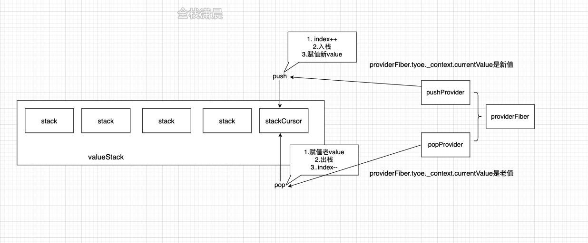
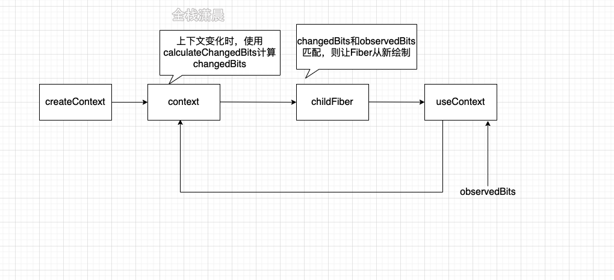

# context





## cursor/valueStack
react源码中存在一个valueStack和valueCursor用来记录context的历史信息和当前context，另外还有一个didPerformWorkStackCursor用来表示当前的context有没有变化
```javascript
//ReactFiberNewContext.new.js
const valueCursor: StackCursor<mixed> = createCursor(null);
const didPerformWorkStackCursor: StackCursor<boolean> = createCursor(false);
//ReactFiberStack.new.js
const valueStack: Array<any> = [];
function pushProvider(providerFiber, nextValue) {
  var context = providerFiber.type._context;
  {
    push(valueCursor, context._currentValue, providerFiber);
    context._currentValue = nextValue;
  }
}
function popProvider(providerFiber) {
  var currentValue = valueCursor.current;
  pop(valueCursor, providerFiber);
  var context = providerFiber.type._context;

  {
    context._currentValue = currentValue;
  }
}

```
在render阶段调用updateContextProvider的时候会执行pushProvider，将新的值push进valueStack中

在commit阶段调用completeWork的时候会执行popProvider，将栈顶context pop出来，

为什么会有这样一个机制呢，因为我们的context是跨层级的，在之前讲到render阶段和commit阶段的时候，我们会以深度优先遍历的方式遍历节点，如果涉及跨层级读取状态就有点力不从心了，就需要一层一层往下传递我们的props，所以我们可以用一个stack记录我们的context，在render阶段pushProvider，在commit阶段popProvider，在每个具体的层级能根据valueCursor取当前value

createContext
```javascript
export function createContext<T>(
  defaultValue: T,
  calculateChangedBits: ?(a: T, b: T) => number,
): ReactContext<T> {
  if (calculateChangedBits === undefined) {//可以传入计算bit的函数
    calculateChangedBits = null;
  } else {
    //...
  }

  const context: ReactContext<T> = {
    $$typeof: REACT_CONTEXT_TYPE,
    _calculateChangedBits: calculateChangedBits,//计算value变化的函数
    _currentValue: defaultValue,//dom环境的value
    _currentValue2: defaultValue,//art环境的value
    _threadCount: 0,
    Provider: (null: any),
    Consumer: (null: any),
  };

  context.Provider = {
    $$typeof: REACT_PROVIDER_TYPE,
    _context: context,
  };


  if (__DEV__) {
   
  } else {
    context.Consumer = context;
  }


  return context;
}

//示例
const NameChangedBits = 0b01;
const AgeChangedBits =  0b10;
const AppContext = createContext({}, (prevValue, nextValue) => {
  let result = 0;
  if (prevValue.name !== nextValue.name) {
    result |= NameChangedBits;
  };
  if (prevValue.age !== nextValue.age) {
    result |= AgeChangedBits;
  };
  return result;
});
```

在简化之后的createContext中可以看到，context和Provider、Consumer的关系是这样的：
```javascript
context.Provider = {
    $$typeof: REACT_PROVIDER_TYPE,
    _context: context,
  };
context.Consumer = context;
```

### useContext

useContext会调用readContext，readContext会创建dependce，加入当前fiber的dependencies链表中
```javascript
function readContext(context, observedBits) {
  {
  if (lastContextWithAllBitsObserved === context) ; else if (observedBits === false || observedBits === 0) ; else {
    var resolvedObservedBits;

    //生成resolvedObservedBits
    if (typeof observedBits !== 'number' || observedBits === MAX_SIGNED_31_BIT_INT) {
      lastContextWithAllBitsObserved = context;
      resolvedObservedBits = MAX_SIGNED_31_BIT_INT;
    } else {
      resolvedObservedBits = observedBits;
    }

    var contextItem = {//生成dependce
      context: context,
      observedBits: resolvedObservedBits,
      next: null
    };

    if (lastContextDependency === null) {
      //...

      lastContextDependency = contextItem;
      currentlyRenderingFiber.dependencies = {//dependencies链表的第一个
        lanes: NoLanes,
        firstContext: contextItem,
        responders: null
      };
    } else {
      lastContextDependency = lastContextDependency.next = contextItem;//加入dependencies链表
    }
  }

  return  context._currentValue ;
}
```
provider/customer
在render阶段会调用updateContextProvider，注意几个关键的步骤

pushProvider：将当前context加入valueStack
calculateChangedBits：useContext可以设置observedBits，没有设置的话就是MAX_SIGNED_31_BIT_INT，也就是31位1，用于计算changedBits，这个计算context是否变化的过程就发生在calculateChangedBits函数中，用这样的方式可以提高context变化之后的性能
bailoutOnAlreadyFinishedWork/propagateContextChange：如果changedBits没有改变则走bailoutOnAlreadyFinishedWork的逻辑，跳过当前节点的更新，如果改变则执行propagateContextChange
```javascript
function updateContextProvider(current, workInProgress, renderLanes) {
  var providerType = workInProgress.type;
  var context = providerType._context;
  var newProps = workInProgress.pendingProps;
  var oldProps = workInProgress.memoizedProps;
  var newValue = newProps.value;

  //...

  pushProvider(workInProgress, newValue);

  if (oldProps !== null) {
    var oldValue = oldProps.value;
    var changedBits = calculateChangedBits(context, newValue, oldValue);

    if (changedBits === 0) {//context没有改变
      if (oldProps.children === newProps.children && !hasContextChanged()) {
        return bailoutOnAlreadyFinishedWork(current, workInProgress, renderLanes);
      }
    } else {//context改变了
      propagateContextChange(workInProgress, context, changedBits, renderLanes);
    }
  }

  var newChildren = newProps.children;
  reconcileChildren(current, workInProgress, newChildren, renderLanes);
  return workInProgress.child;
}
function calculateChangedBits(context, newValue, oldValue) {
  if (objectIs(oldValue, newValue)) {
		//没有改变
    return 0;
  } else {
    var changedBits = typeof context._calculateChangedBits === 'function' ? context._calculateChangedBits(oldValue, newValue) : MAX_SIGNED_31_BIT_INT;

    {
      if ((changedBits & MAX_SIGNED_31_BIT_INT) !== changedBits) {
        error('calculateChangedBits: Expected the return value to be a ' + '31-bit integer. Instead received: %s', changedBits);
      }
    }

    return changedBits | 0;
  }
}

//示例
const NameChangedBits = 0b01;
const AgeChangedBits = 0b10;
const AppContext = createContext({}, (prevValue, nextValue) => {
  let result = 0;
  if (prevValue.name !== nextValue.name) {
    result |= NameChangedBits;
  };
  if (prevValue.age !== nextValue.age) {
    result |= AgeChangedBits;
  };
  return result;
});
function propagateContextChange(workInProgress, context, changedBits, renderLanes) {
  var fiber = workInProgress.child;

  if (fiber !== null) {
    fiber.return = workInProgress;//fiber不存在 就找父节点
  }

  while (fiber !== null) {
    var nextFiber = void 0;//遍历fiber

    var list = fiber.dependencies;

    if (list !== null) {
      nextFiber = fiber.child;
      var dependency = list.firstContext;

      while (dependency !== null) {//遍历dependencies链表
        if (dependency.context === context && (dependency.observedBits & changedBits) !== 0) {
					//有变化
          if (fiber.tag === ClassComponent) {
            //创建新的update
            var update = createUpdate(NoTimestamp, pickArbitraryLane(renderLanes));
            update.tag = ForceUpdate; 
            enqueueUpdate(fiber, update);
          }

          fiber.lanes = mergeLanes(fiber.lanes, renderLanes);//合并优先级
          var alternate = fiber.alternate;

          if (alternate !== null) {
            alternate.lanes = mergeLanes(alternate.lanes, renderLanes);
          }

          scheduleWorkOnParentPath(fiber.return, renderLanes); //更新祖先节点的优先级

          list.lanes = mergeLanes(list.lanes, renderLanes); 
          break;
        }

        dependency = dependency.next;
      }
    } 
    	//...
      nextFiber = fiber.sibling;
    } else {
      nextFiber = fiber.child;
    }
    //...

    fiber = nextFiber;
  }
}
```

updateContextConsumer关键的代码如下，执行prepareToReadContext判断优先级是否足够加入当前这次render，readContext取到当前context的value
```javascript
function updateContextConsumer(current, workInProgress, renderLanes) {
  var context = workInProgress.type;
  //...
  prepareToReadContext(workInProgress, renderLanes);
  var newValue = readContext(context, newProps.unstable_observedBits);
  var newChildren;
  {
    ReactCurrentOwner$1.current = workInProgress;
    setIsRendering(true);
    newChildren = render(newValue);
    setIsRendering(false);
  }

	//...
  workInProgress.flags |= PerformedWork;
  reconcileChildren(current, workInProgress, newChildren, renderLanes);
  return workInProgress.child;
}
```