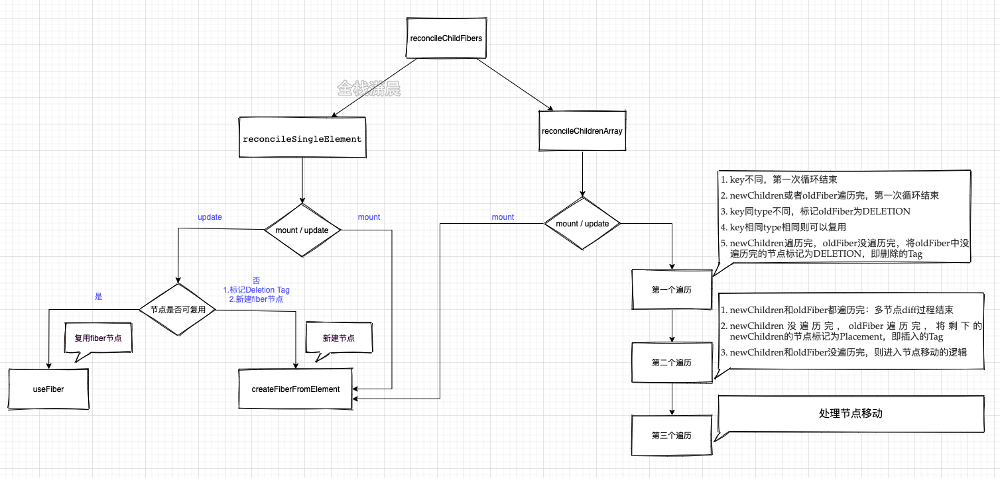
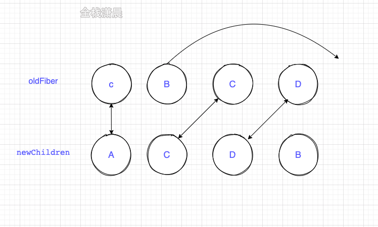
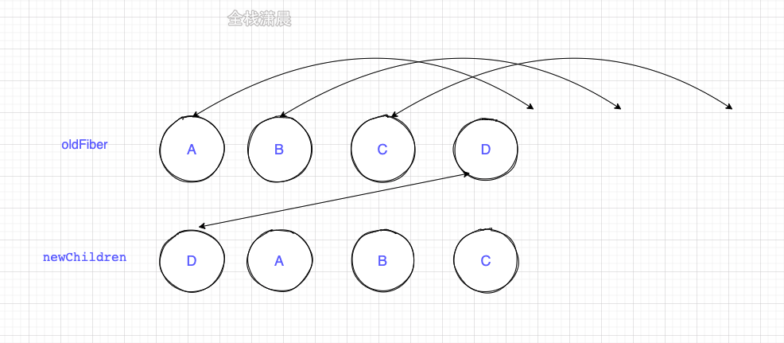

## diff 算法

在 render 阶段更新 Fiber 节点时，我们会调用 reconcileChildFibers 对比 current Fiber 和 jsx 对象构建 workInProgress Fiber，这里 current Fiber 是指当前 dom 对应的 fiber 树，jsx 是 class 组件 render 方法或者函数组件的返回值。

在 reconcileChildFibers 中会根据 newChild 的类型来进入单节点的 diff 或者多节点 diff

```typescript
//ReactChildFiber.old.js
function reconcileChildFibers(
  returnFiber: Fiber,
  currentFirstChild: Fiber | null,
  newChild: any
): Fiber | null {
  const isObject = typeof newChild === "object" && newChild !== null;

  if (isObject) {
    switch (newChild.$$typeof) {
      case REACT_ELEMENT_TYPE:
        //单一节点diff
        return placeSingleChild(
          reconcileSingleElement(
            returnFiber,
            currentFirstChild,
            newChild,
            lanes
          )
        );
    }
  }
  //...

  if (isArray(newChild)) {
    //多节点diff
    return reconcileChildrenArray(
      returnFiber,
      currentFirstChild,
      newChild,
      lanes
    );
  }

  // 删除节点
  return deleteRemainingChildren(returnFiber, currentFirstChild);
}
```

我们知道对比两颗
diff 过程的主要流程如下图：


我们知道对比两颗树的复杂度本身 O(n3),对我们的应用来说，这个是不能承受的量级，react 为了降低复杂度，提出了三个前提：

1. 只对同级比较，跨层级的 dom 不会进行复用
2. 不同类型节点生成的 dom 树不同
3. 可以通过 key 来对元素的 diff 的过程提供复用的线索，例如：

```javascript
const a = (
  <>
    <p key="0">0</p>
    <p key="1">1</p>
  </>
);
const b = (
  <>
    <p key="1">1</p>
    <p key="0">0</p>
  </>
);
```

如果 a 和 b 里的元素都没有 key，因为节点的更新前后文本节点不同，导致他们都不能复用，所以会销毁之前的节点，并新建节点，但是现在有 key 了，b 中的节点会在老的 a 中寻找 key 相同的节点尝试复用，最后发现只是交换位置就可以完成更新，具体对比过程后面会讲到。

### 单节点 diff

单点 diff 有如下几种情况：

key 和 type 相同表示可以复用节点
key 不同直接标记删除节点，然后新建节点
key 相同 type 不同，标记删除该节点和兄弟节点，然后新创建节点

```typescript
function reconcileSingleElement(
  returnFiber: Fiber,
  currentFirstChild: Fiber | null,
  element: ReactElement
): Fiber {
  const key = element.key;
  let child = currentFirstChild;

  //child节点不为null执行对比
  while (child !== null) {
    // 1.比较key
    if (child.key === key) {
      // 2.比较type

      switch (child.tag) {
        //...

        default: {
          if (child.elementType === element.type) {
            // type相同则可以复用 返回复用的节点
            return existing;
          }
          // type不同跳出
          break;
        }
      }
      //key相同，type不同则把fiber及和兄弟fiber标记删除
      deleteRemainingChildren(returnFiber, child);
      break;
    } else {
      //key不同直接标记删除该节点
      deleteChild(returnFiber, child);
    }
    child = child.sibling;
  }

  //新建新Fiber
}
```

多节点 diff
多节点 diff 比较复杂，我们分三种情况进行讨论，其中 a 表示更新前的节点，b 表示更新后的节点

- 属性变化

```typescript
const a = (
  <>
    <p key="0" name="0">
      0
    </p>
    <p key="1">1</p>
  </>
);
const b = (
  <>
    <p key="0" name="00">
      0
    </p>
    <p key="1">1</p>
  </>
);
```

- type 变化

```typescript
const a = (
  <>
    <p key="0">0</p>
    <p key="1">1</p>
  </>
);
const b = (
  <>
    <div key="0">0</div>
    <p key="1">1</p>
  </>
);
```

- 新增节点

```
const a = (
    <>
      <p key="0">0</p>
      <p key="1">1</p>
    </>
  );
  const b = (
    <>
      <p key="0">0</p>
      <p key="1">1</p>
      <p key="2">2</p>
    </>
  );
```

在源码中多节点 diff 有三个 for 循环遍历（并不意味着所有更新都有经历三个遍历，进入循环体有条件，也有条件跳出循环），第一个遍历处理节点的更新（包括 props 更新和 type 更新和删除），第二个遍历处理其他的情况（节点新增），其原因在于在大多数的应用中，节点更新的频率更加频繁，第三个处理位节点置改变

- 第一次遍历 因为老的节点存在于 current Fiber 中，所以它是个链表结构，还记得 Fiber 双缓存结构嘛，节点通过 child、return、sibling 连接，而 newChildren 存在于 jsx 当中，所以遍历对比的时候，首先让 newChildren[i]与 oldFiber 对比，然后让 i++、nextOldFiber = oldFiber.sibling。在第一轮遍历中，会处理三种情况，其中第 1，2 两种情况会结束第一次循环

  1. key 不同，第一次循环结束
  2. newChildren 或者 oldFiber 遍历完，第一次循环结束
  3. key 同 type 不同，标记 oldFiber 为 DELETION
  4. key 相同 type 相同则可以复用
     ​ newChildren 遍历完，oldFiber 没遍历完，在第一次遍历完成之后将 oldFiber 中没遍历完的节点标记为 DELETION，即删除的 DELETION Tag

- 第二个遍历 第二个遍历考虑三种情况

  1. newChildren 和 oldFiber 都遍历完：多节点 diff 过程结束
  2. newChildren 没遍历完，oldFiber 遍历完，将剩下的 newChildren 的节点标记为 Placement，即插入的 Tag
  3. newChildren 和 oldFiber 没遍历完，则进入节点移动的逻辑

- 第三个遍历 主要逻辑在 placeChild 函数中，例如更新前节点顺序是 ABCD，更新后是 ACDB

  1. newChild 中第一个位置的 A 和 oldFiber 第一个位置的 A，key 相同可复用，lastPlacedIndex=0
  2. newChild 中第二个位置的 C 和 oldFiber 第二个位置的 B，key 不同跳出第一次循环，将 oldFiber 中的 BCD 保存在 map 中
  3. newChild 中第二个位置的 C 在 oldFiber 中的 index=2 > lastPlacedIndex=0 不需要移动，lastPlacedIndex=2
  4. newChild 中第三个位置的 D 在 oldFiber 中的 index=3 > lastPlacedIndex=2 不需要移动，lastPlacedIndex=3
  5. newChild 中第四个位置的 B 在 oldFiber 中的 index=1 < lastPlacedIndex=3,移动到最后
     看图更直观
     

  例如更新前的节点顺序是 ABCD，更新后的是 DABC

  1. newChild 中第一个位置的 D 和 oldFiber 第一个位置的 A，key 不相同不可复用，将 oldFiber 中的 ABCD 保存在 map 中，lastPlacedIndex=0
  2. newChild 中第一个位置的 D 在 oldFiber 中的 index=3 > lastPlacedIndex=0 不需要移动，lastPlacedIndex=3
  3. newChild 中第二个位置的 A 在 oldFiber 中的 index=0 < lastPlacedIndex=3,移动到最后
  4. newChild 中第三个位置的 B 在 oldFiber 中的 index=1 < lastPlacedIndex=3,移动到最后
  5. newChild 中第四个位置的 C 在 oldFiber 中的 index=2 < lastPlacedIndex=3,移动到最后

看图更直观


```typescript
// ReactChildFiber.old.js
function placeChild(newFiber, lastPlaceIndex, newIndex) {
  newFiber.index = newIndex;

  if (!shouldTrackEffects) {
    return lastPlaceIndex;
  }
  var current = newFiber.alternate;
  if (current !== null) {
    var oldIndex = current.index;
    if (oldIndex < lastPlaceIndex) {
      newFiber.flags = Placement;
      return lastPlaceIndex;
    } else {
      return oldIndex;
    }
  } else {
    newFiber.flags = Placement;
    return lastPlaceIndex;
  }
}
```

```typescript
function reconcileChildArray(
  returnFiber:Fiber,//父fiber节点
  currentFirstChild:Fiber|null,childs第一个节点
  newChildren: Array<*>,//新节点数组 也就是jsx数组
  lanes:Lanes, // lane相关 第12章介绍
):Fiber | null{
  let resultingFirstChild:Fiber|null = null;//diff之后返回的第一个节点
  let previousNewFiber:Fiber|null = null;// 新节点中上次对比过的节点

  let oldFiber = currentFirstChild;//正在对比的oldFiber
  let lastPlaceIndex = 0; //上次客服用的节点位置 或者olderFiber的位置
  let newIdx = 0;//新节点中对比到了的位置
  let nextOldFiber = null;//正在对比的oldFiber

  for(;oldFiber!=null&&newIdx<newChildren.length;newIx++){//第一次遍历
    if(oldFiber.index>newIdx){
      nextOldFiber = oldFiber;
      oldFiber = null;
    }else{
      nextOldFiber = oldFiber.sibling;
    }
    const newFiber = updateSlot(//更新节点，如果key不同则newFiber=null
        returnFiber,
        oldFiber,
        newChildren[newIdx],
        lanes,
      );
    if (newFiber === null) {
        if (oldFiber === null) {
          oldFiber = nextOldFiber;
        }
        break;//跳出第一次遍历
    }
    if(shouldTrackSideEffects){// 检查shouldTrackSideEffects
      if(oldFiber && newFiber.alternate ===null){
        deleteChild(returnFiber, oldFiber);
      }
    }
    lastPlaceIndex = placeChild(newFiber,lastPlaceIndex,newIds);//标记节点插入
    if(previousNewFiber===null){
       resultingFirstChild = newFiber;
    }else{
      previousNewFiber.sibling = newFiber;
    }
    previousNewFiber = newFiber;
    oldFiber = nextOldFiber;
  }
  if (newIdx === newChildren.length) {
      deleteRemainingChildren(returnFiber, oldFiber);//将oldFiber中没遍历完的节点标记为DELETION
      return resultingFirstChild;
   }
  if (oldFiber === null) {
      for (; newIdx < newChildren.length; newIdx++) {//第2次遍历
        const newFiber = createChild(returnFiber, newChildren[newIdx], lanes);
        if (newFiber === null) {
          continue;
        }
        lastPlacedIndex = placeChild(newFiber, lastPlacedIndex, newIdx);//插入新增节点
        if (previousNewFiber === null) {
          resultingFirstChild = newFiber;
        } else {
          previousNewFiber.sibling = newFiber;
        }
        previousNewFiber = newFiber;
      }
      return resultingFirstChild;
  }
  // 将剩下的oldFiber加入map中
  const existingChildren = mapRemainingChildren(returnFiber, oldFiber);
  for (; newIdx < newChildren.length; newIdx++) {//第三次循环 处理节点移动
      const newFiber = updateFromMap(
        existingChildren,
        returnFiber,
        newIdx,
        newChildren[newIdx],
        lanes,
      );
      if (newFiber !== null) {
        if (shouldTrackSideEffects) {
          if (newFiber.alternate !== null) {
            existingChildren.delete(//删除找到的节点
              newFiber.key === null ? newIdx : newFiber.key,
            );
          }
        }
        lastPlacedIndex = placeChild(newFiber, lastPlacedIndex, newIdx);//标记为插入的逻辑
        if (previousNewFiber === null) {
          resultingFirstChild = newFiber;
        } else {
          previousNewFiber.sibling = newFiber;
        }
        previousNewFiber = newFiber;
      }
    }

    if (shouldTrackSideEffects) {
      //删除existingChildren中剩下的节点
      existingChildren.forEach(child => deleteChild(returnFiber, child));
    }

    return resultingFirstChild;


}
```


介绍些reactdiff算法

在render阶段,对比currentFiber和jsx对象构建的workInProgressFiber。 current fiber指当前dom树对应的fiber。jsx是class组件render方法或者函数组件的返回值。
