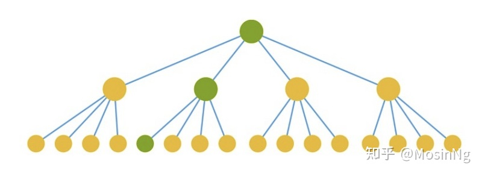

# 总结

至此我们介绍了 react 的理念，如果解决 cpu 和 io 的瓶颈，关键是实现异步可中断的更新

我们介绍了 react 源码架构 ui=fn(state)），从 scheduler 开始调度（根据过期事件判断优先级），经过 render 阶段的深度优先遍历形成 effectList（中间会执行 reconcile|diff），交给 commit 处理真实节点（中间穿插生命周期和部分 hooks），而这些调度的过程都离不开 Fiber 的支撑，Fiber 是工作单元，也是节点优先级、更新 UpdateQueue、节点信息的载体，Fiber 双缓存则提供了对比前后节点更新的基础。我们还介绍了 jsx 是 React.createElement 的语法糖。Lane 模型则提供了更细粒度的优先级对比和计算，这一切都为 concurrent mode 提供了基础，在这之上变可以实现 Suspense 和 batchedUpdate（16、17 版本实现的逻辑不一样），18 章 context 的 valueStack 和 valueCursor 在整个架构中运行机制，19 章介绍了新版事件系统，包括事件生产、监听和触发

1. jsx 和 Fiber 有什么关系

答：mount 时通过 jsx 对象（调用 createElement 的结果）调用 createFiberFromElement 生成 Fiber update 时通过 reconcileChildFibers 或 reconcileChildrenArray 对比新 jsx 和老的 Fiber（current Fiber）生成新的 wip Fiber 树

2. react17 之前 jsx 文件为什么要声明 import React from 'react'，之后为什么不需要了

答：jsx 经过编译之后编程 React.createElement，不引入 React 就会报错，react17 改变了编译方式，变成了 jsx.createElement

function App() {
return <h1>Hello World</h1>;
}
//转换后
import {jsx as \_jsx} from 'react/jsx-runtime';

function App() {
return \_jsx('h1', { children: 'Hello world' });
} 3. Fiber 是什么，它为什么能提高性能

答：Fiber 是一个 js 对象，能承载节点信息、优先级、updateQueue，同时它还是一个工作单元。

Fiber 双缓存可以在构建好 wip Fiber 树之后切换成 current Fiber，内存中直接一次性切换，提高了性能
Fiber 的存在使异步可中断的更新成为了可能，作为工作单元，可以在时间片内执行工作，没时间了交还执行权给浏览器，下次时间片继续执行之前暂停之后返回的 Fiber
Fiber 可以在 reconcile 的时候进行相应的 diff 更新，让最后的更新应用在真实节点上

## hooks

1. 为什么 hooks 不能写在条件判断中

答：hook 会按顺序存储在链表中，如果写在条件判断中，就没法保持链表的顺序

## 状态/生命周期

1. setState 是同步的还是异步的

答：legacy 模式下：命中 batchedUpdates 时是异步 未命中 batchedUpdates 时是同步的

concurrent 模式下：都是异步的

2. componentWillMount、componentWillMount、componentWillUpdate 为什么标记 UNSAFE

答：新的 Fiber 架构能在 scheduler 的调度下实现暂停继续，排列优先级，Lane 模型能使 Fiber 节点具有优先级，在高优先级的任务打断低优先级的任务时，低优先级的更新可能会被跳过，所有以上生命周期可能会被执行多次，和之前版本的行为不一致。

## 组件

1. react 元素$$typeof 属性什么

答：用来表示元素的类型，是一个 symbol 类型

2. react 怎么区分 Class 组件和 Function 组件

答：Class 组件 prototype 上有 isReactComponent 属性

函数组件和类组件的相同点和不同点

答：相同点：都可以接收 props 返回 react 元素

不同点：

编程思想：类组件需要创建实例，面向对象，函数组件不需要创建实例，接收输入，返回输出，函数式编程

内存占用：类组建需要创建并保存实例，占用一定的内存

值捕获特性：函数组件具有值捕获的特性 下面的函数组件换成类组件打印的 num 一样吗

```javascript
export default function App() {
  const [num, setNum] = useState(0);
  const click = () => {
    setTimeout(() => {
      console.log(num);
    }, 3000);
    setNum(num + 1);
  };

  return <div onClick={click}>click {num}</div>;
}


export default class App extends React.Component {
  state = {
    num: 0
  };

  click = () => {
    setTimeout(() => {
      console.log(this.state.num);
    }, 3000);
    this.setState({ num: this.state.num + 1 });
  };

  render() {
    return <div onClick={this.click}>click {this.state.num}</div>;
  }
}


```

可测试性：函数组件方便测试

状态：类组件有自己的状态，函数组件没有只能通过 useState

生命周期：类组件有完整生命周期，函数组件没有可以使用 useEffect 实现类似的生命周期

逻辑复用：类组件继承 Hoc（逻辑混乱 嵌套），组合优于继承，函数组件 hook 逻辑复用

跳过更新：shouldComponentUpdate PureComponent，React.memo

发展未来：函数组件将成为主流，屏蔽 this、规范、复用，适合时间分片和渲染

## 开放性问题

1. 说说你对 react 的理解/请说一下 react 的渲染过程

答：是什么：react 是构建用户界面的 js 库

能干什么：可以用组件化的方式构建快速响应的 web 应用程序

如何干：声明式（jsx） 组件化（方便拆分和复用 高内聚 低耦合） 一次学习随处编写

做的怎么样： 优缺（社区繁荣 一次学习随处编写 api 简介）缺点（没有系统解决方案 选型成本高 过于灵活）

设计理念：跨平台（虚拟 dom） 快速响应（异步可中断 增量更新）

性能瓶颈：cpu io fiber 时间片 concurrent mode

渲染过程：scheduler render commit Fiber 架构

2. 聊聊 react 生命周期 详见第 11 章

3. 简述 diff 算法 详见第 9 章

4. react 有哪些优化手段

答：shouldComponentUpdate、不可变数据结构、列表 key、pureComponent、react.memo、useEffect 依赖项、useCallback、useMemo、bailoutOnAlreadyFinishedWork ...

5. react 为什么引入 jsx

答：jsx 声明式 虚拟 dom 跨平台

解释概念：jsx 是 js 语法的扩展 可以很好的描述 ui jsx 是 React.createElement 的语法糖

想实现什么目的：声明式 代码结构简洁 可读性强 结构样式和事件可以实现高内聚 低耦合 、复用和组合 不需要引入新的概念和语法 只写 js， 虚拟 dom 跨平

有哪些可选方案：模版语法 vue ag 引入了控制器 作用域 服务等概念

jsx 原理：babel 抽象语法树 classic 是老的转换 automatic 新的转换

6. 说说 virtual Dom 的理解

答：是什么：React.createElement 函数返回的就是虚拟 dom，用 js 对象描述真实 dom 的 js 对象

优点：处理了浏览器的兼容性 防范 xss 攻击 跨平台 差异化更新 减少更新的 dom 操作

缺点：额外的内存 初次渲染不一定快

你对合成事件的理解

类型 原生事件 合成事件
命名方式 全小写 小驼峰
事件处理函数 字符串 函数对象
阻止默认行为 返回 false event.preventDefault()
理解：

React 把事件委托到 document 上（v17 是 container 节点上）
先处理原生事件 冒泡到 document 上在处理 react 事件
React 事件绑定发生在 reconcile 阶段 会在原生事件绑定前执行
优势：

进行了浏览器兼容。顶层事件代理，能保证冒泡一致性(混合使用会出现混乱)

默认批量更新

避免事件对象频繁创建和回收，react 引入事件池，在事件池中获取和释放对象（react17 中废弃） react17 事件绑定在容器上了

我们写的事件是绑定在 dom 上么，如果不是绑定在哪里？ 答：v16 绑定在 document 上，v17 绑定在 container 上
为什么我们的事件手动绑定 this(不是箭头函数的情况) 答：合成事件监听函数在执行的时候会丢失上下文
为什么不能用 return false 来阻止事件的默认行为？ 答：说到底还是合成事件和原生事件触发时机不一样
react 怎么通过 dom 元素，找到与之对应的 fiber 对象的？ 答：通过 internalInstanceKey 对应

## 解释结果和现象

23. 点击 Father 组件的 div，Child 会打印 Child 吗

```javascript
function Child() {
  console.log("Child");
  return <div>Child</div>;
}

function Father(props) {
  const [num, setNum] = React.useState(0);
  return (
    <div
      onClick={() => {
        setNum(num + 1);
      }}
    >
      {num}
      {props.children}
    </div>
  );
}

function App() {
  return (
    <Father>
      <Child />
    </Father>
  );
}

const rootEl = document.querySelector("#root");
ReactDOM.render(<App />, rootEl);
```

答： 不会，源码中是否命中 bailoutOnAlreadyFinishedWork 24. 打印顺序是什么

```javascript
function Child() {
  useEffect(() => {
    console.log("Child");
  }, []);
  return <h1>child</h1>;
}

function Father() {
  useEffect(() => {
    console.log("Father");
  }, []);

  return <Child />;
}

function App() {
  useEffect(() => {
    console.log("App");
  }, []);

  return <Father />;
}
```

25. useLayout/componentDidMount 和 useEffect 的区别是什么

```javascript
class App extends React.Component {
  componentDidMount() {
    console.log("mount");
  }
}

useEffect(() => {
  console.log("useEffect");
}, []);
```

### 怎么减少 Render

React 复用 render 的条件
回顾 React 构建 Fiber 树的过程，在 beginWork 函数中

```javascript
if (current !== null) {
  const oldProps = current.memoizedProps;
  const newProps = workInProgress.pendingProps;

  if (
    oldProps !== newProps ||
    hasLegacyContextChanged() ||
    // Force a re-render if the implementation changed due to hot reload:
    (__DEV__ ? workInProgress.type !== current.type : false)
  ) {
    // If props or context changed, mark the fiber as having performed work.
    // This may be unset if the props are determined to be equal later (memo).
    didReceiveUpdate = true;
  } else if (!includesSomeLane(renderLanes, updateLanes)) {
    didReceiveUpdate = false;
    switch (workInProgress.tag) {
      case HostRoot:
        pushHostRootContext(workInProgress);
        if (enableCache) {
          const root: FiberRoot = workInProgress.stateNode;
          const cache: Cache = current.memoizedState.cache;
          pushCacheProvider(workInProgress, cache);
          pushRootCachePool(root);
        }
        resetHydrationState();
        break;
      //... 这个是各个节点类型的复用逻辑 代码省略
    }
    return bailoutOnAlreadyFinishedWork(current, workInProgress, renderLanes);
  }
} else {
  didReceiveUpdate = false;
}
```

全程只需要关注 didReceiveUpdate 和是否走入 bailout 逻辑即复用原来的节点，不需要调用 render 生成新节点。

current 指现在的 fiber 树， current ≠= null 说明现在是更新阶段，如果不是，说明在 mount 阶段，直接全部需要生成。

1. oldProps === newProps
   这里的判断 Props 是全等情况，这意味着即使 props 每一项值都没有变化，React.createElement 仍然会创建一个新的 props 对象，从而执行一次 render。
2. !hasLegacyContextChanged()
   这个好理解，就是 React 的 context 的 value 没有改变，因此 context 设计要尽可能的小范围。
3. !includesSomeLane(renderLanes, updateLanes)
   lane 是更新优先级比较模型，这里要求节点 render 的优先级要比 update 更小，才会进入复用逻辑。
4. memo 组件需要 compare(prevProps, nextProps)。还有一个条件，就是对 memo 组件，会执行 oldProps 和 newProps 的浅比较，如果一致的话，也会进入复用节点逻辑。代码在 updateMemoComponent 函数。

优化 Render 的建议
前面说了 React 怎么复用节点不进入 Render 的条件，下面总结下几个优化的方式

1. 减少 Props 变动层级

对不使用 memo 优化的一般组件来说，父组件的变动会造成所有的 props 变动，从而造成所有子组件的 render，如上面所说的条件 1。所以写代码的时候也要注意 state 全部提到父组件的代价。



如图，我们只想变动绿色的部分，但由于根 state 状态变动，导致所有的子组件都 render 了一遍，黄色部分则是浪费的部分。

2. memo 优化
   由于一般的组件只进行 oldProps === newProps 的判断，所以作为优化条件，可以将组件变成 memo 组件或者 class 组件的 shouldcomponentupdate 判断。如上面所说条件 4 进行浅比较。

```javascript

const Child = React.memo(function ({name}) {
  return <h2>
    {name}
  </h2>
});
```

但也要注意事件的内联写法，或者对象传递，由于是浅比较，则会造成永远变动。

```javascript
<ComplexComponent onClick={evt => onClick(evt.id)} otherProps={values} />
```

如何保持 props 不变：
a. 对应 hooks 写法来说，可以用 useCallback 或者 useMemo 缓存对象或函数。
b. 或者推荐用https://github.com/immerjs/immer 这样的不可变数据处理库。
c. 还有一种写法，则是通过 ref 转发来保持对象不变，写起来略有点麻烦。

3. 精细化 context

还有上面的条件 2 优化，则和优化建议 1 一样，需要精细化管理 context 的层级，如果所有的状态都放到顶级 context，那代价也是够大的。
这两个建议可以合并成一条，即减少变动的层级。

为什么这么蛋疼，这也是 react 函数设计理念的代价，即不做数据改变，如果要改变，数据就 copy 一份新的。

所以对于有些优化方案，就采取的表面是函数式，内部更新则是响应式的变动优化，类似于https://formilyjs.org/#/bdCRC5/dzUZU8il 的表单优化方案。
所以对于有些优化方案，就采取的表面是函数式，内部更新则是响应式的变动优化，类似于https://formilyjs.org/#/bdCRC5/dzUZU8il 的表单优化方案。

检测 render 工具
另外有个工具可以打印出不必要的更新 welldone-software/why-did-you-render

内部的原理也并不复杂，核心是劫持了 React.createElement 函数，然后采取如上的比较策略，打印出 render 的原因。

另外的一个建议是多用浏览器的 Performance 工具，它能够准确的分析出 render 的运行时间，从而帮助找到比较费时的 render 任务。

下图为知乎的 Performance 分析。

### 4. React 高阶组件、Render props、hooks 有什么区别，为什么要不断迭代

这三者是目前 react 解决代码复用的主要方式：

- 高阶组件（HOC）是 React 中用于复用组件逻辑的一种高级技巧。HOC 自身不是 React API 的一部分，它是一种基于 React 的组合特性而形成的设计模式。具体而言，高阶组件是参数为组件，返回值为新组件的函数。
- render props 是指一种在 React 组件之间使用一个值为函数的 prop 共享代码的简单技术，更具体的说，render prop 是一个用于告知组件需要渲染什么内容的函数 prop。
- 通常，render props 和高阶组件只渲染一个子节点。让 Hook 来服务这个使用场景更加简单。这两种模式仍有用武之地，（例如，一个虚拟滚动条组件或许会有一个 renderltem 属性，或是一个可见的容器组件或许会有它自己的 DOM 结构）。但在大部分场景下，Hook 足够了，并且能够帮助减少嵌套。

1. HOC 官方解释：
   高阶组件（HOC）是 React 中用于复用组件逻辑的一种高级技巧。HOC 自身不是 React API 的一部分，它是一种基于 React 的组合特性而形成的设计模式。
   简言之，HOC 是一种组件的设计模式，HOC 接受一个组件和额外的参数（如果需要），返回一个新的组件。HOC 是纯函数，没有副作用。

```javascript
// hoc的定义
function withSubscription(WrappedComponent, selectData) {
  return class extends React.Component {
    constructor(props) {
      super(props);
      this.state = {
        data: selectData(DataSource, props)
      };
    }
    // 一些通用的逻辑处理
    render() {
      // ... 并使用新数据渲染被包装的组件!
      return <WrappedComponent data={this.state.data} {...this.props} />;
    }
  };

// 使用
const BlogPostWithSubscription = withSubscription(BlogPost,
  (DataSource, props) => DataSource.getBlogPost(props.id));
```

HOC 的优缺点 ∶

优点 ∶ 逻辑服用、不影响被包裹组件的内部逻辑。
缺点 ∶ hoc 传递给被包裹组件的 props 容易和被包裹后的组件重名，进而被覆盖

（2）Render props 官方解释 ∶
"render prop"是指一种在 React 组件之间使用一个值为函数的 prop 共享代码的简单技术

具有 render prop 的组件接受一个返回 React 元素的函数，将 render 的渲染逻辑注入到组件内部。在这里，"render"的命名可以是任何其他有效的标识符。

```javascript
// DataProvider组件内部的渲染逻辑如下
class DataProvider extends React.Components {
  state = {
    name: "Tom",
  };

  render() {
    return (
      <div>
        <p>共享数据组件自己内部的渲染逻辑</p>
        {this.props.render(this.state)}
      </div>
    );
  }
}

// 调用方式
<DataProvider render={(data) => <h1>Hello {data.name}</h1>} />;
```

由此可以看到，render props 的优缺点也很明显 ∶

- 优点：数据共享、代码复用，将组件内的 state 作为 props 传递给调用者，将渲染逻辑交给调用者。
- 缺点：无法在 return 语句外访问数据、嵌套写法不够优雅

（3）Hooks 官方解释 ∶

Hook 是 React 16.8 的新增特性。它可以让你在不编写 class 的情况下使用 state 以及其他的 React 特性。通过自定义 hook，可以复用代码逻辑。

```javascript
// 自定义一个获取订阅数据的hook
function useSubscription() {
  const data = DataSource.getComments();
  return [data];
}
//
function CommentList(props) {
  const {data} = props;
  const [subData] = useSubscription();
    ...
}
// 使用
<CommentList data='hello' />
```

以上可以看出，hook 解决了 hoc 的 prop 覆盖的问题，同时使用的方式解决了 render props 的嵌套地狱的问题。hook 的优点如下 ∶

- 使用直观；
- 解决 hoc 的 prop 重名问题；
- 解决 render props 因共享数据 而出现嵌套地狱的问题；
- 能在 return 之外使用数据的问题。
- 需要注意的是：hook 只能在组件顶层使用，不可在分支语句中使用。

总结 ∶
Hoc、render props 和 hook 都是为了解决代码复用的问题，但是 hoc 和 render props 都有特定的使用场景和明显的缺点。hook 是 react16.8 更新的新的 API，让组件逻辑复用更简洁明了，同时也解决了 hoc 和 render props 的一些缺点。

28. 类组件与函数组件有什么异同？
    相同点：
    组件是 React 可复用的最小代码片段，它们会返回要在页面中渲染的 React 元素。也正因为组件是 React 的最小编码单位，所以无论是函数组件还是类组件，在使用方式和最终呈现效果上都是完全一致的。
    我们甚至可以将一个类组件改写成函数组件，或者把函数组件改写成一个类组件（虽然并不推荐这种重构行为）。从使用者的角度而言，很难从使用体验上区分两者，而且在现代浏览器中，闭包和类的性能只在极端场景下才会有明显的差别。所以，基本可认为两者作为组件是完全一致的。
    不同点：

- 它们在开发时的心智模型上却存在巨大的差异。类组件是基于面向对象编程的，它主打的是继承、生命周期等核心概念；而函数组件内核是函数式编程，主打的是 immutable、没有副作用、引用透明等特点。
- 之前，在使用场景上，如果存在需要使用生命周期的组件，那么主推类组件；设计模式上，如果需要使用继承，那么主推类组件。但现在由于 React Hooks 的推出，生命周期概念的淡出，函数组件可以完全取代类组件。其次继承并不是组件最佳的设计模式，官方更推崇“组合优于继承”的设计概念，所以类组件在这方面的优势也在淡出。
- 性能优化上，类组件主要依靠 shouldComponentUpdate  阻断渲染来提升性能，而函数组件依靠 React.memo 缓存渲染结果来提升性能。
  从上手程度而言，类组件更容易上手，从未来趋势上看，由于 React Hooks 的推出，函数组件成了社区未来主推的方案。
- 类组件在未来时间切片与并发模式中，由于生命周期带来的复杂度，并不易于优化。而函数组件本身轻量简单，且在 Hooks 的基础上提供了比原先更细粒度的逻辑组织与复用，更能适应 React 的未来发展。
