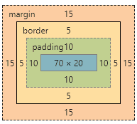

# 盒模型介绍

## 1.什么是盒模型

盒模型又称为框模型，包含了元素内容(content)，内边距（padding），边框（border),外边距（margin)几个要素：如图


## 2. css如何设置获取这两种模型的宽和高

通过css3新增的属性box-sizing: content-box | border-box分别设置盒模型为标准模型（content-box)和IE模型（border-box)

```css
.content-box {
  box-sizing:content-box;
  width: 100px;
  height: 50px;
  padding: 10px;
  border: 5px solid red;
  margin: 15px;
}
```


.content-box设置为标准模型，它的元素宽度width=100px。



.border-box设置为IE模型，它的元素宽度width=content + 2 padding + 2 border = 70px + 2 10px + 2 5px = 100px。

