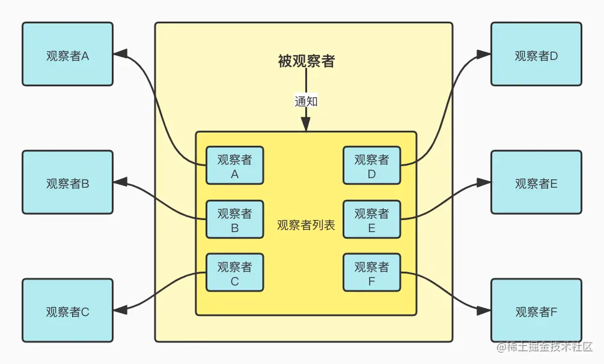
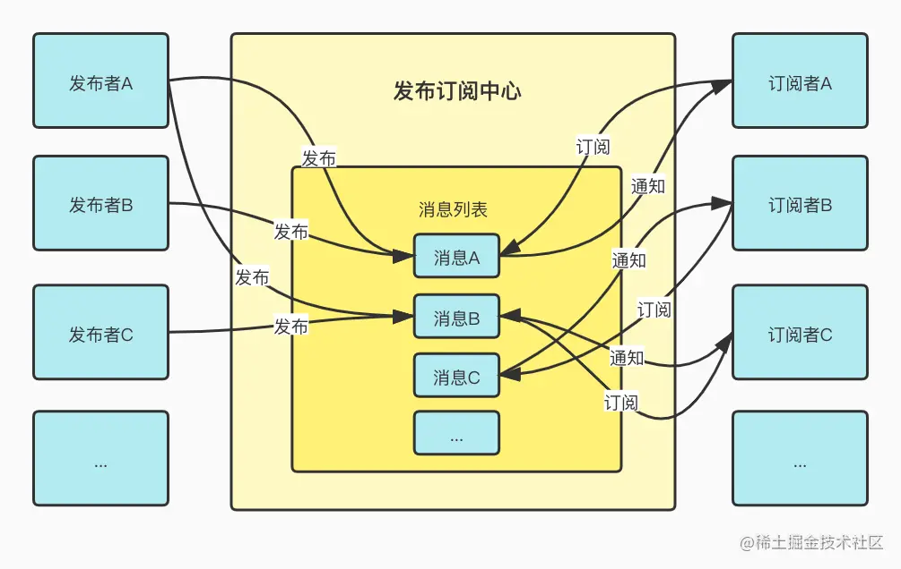

# 发布订阅和观察者

## 一、定性区别

首先，观察者是经典软件设计模式中的一种，但发布订阅只是软件架构中的一种消息范式。所以不要再被“观察者模式和发布订阅模式 xxx”这样的问题误导。

## 二、组成区别

其次，就是实现二者所需的角色数量有着明显的区别。观察者模式本身只需要 2 个角色便可成型，即观察者和被观察者，其中被观察者是重点。而发布订阅需要至少 3 个角色来组成，包括发布者、订阅者和发布订阅中心，其中发布订阅中心是重点。

| 观察者模式     | 发布订阅           |
| -------------- | ------------------ |
| 2 个角色       | 3 个角色           |
| 重点是被观察者 | 重点是发布订阅中心 |

## 各自实现

### 1. 观察者模式实现

观察者模式一般至少有一个可被观察的对象 Subject ，可以有多个观察者去观察这个对象。二者的关系是通过被观察者主动建立的，被观察者至少要有三个方法——添加观察者、移除观察者、通知观察者。
当被观察者将某个观察者添加到自己的观察者列表后，观察者与被观察者的关联就建立起来了。此后只要被观察者在某种时机触发通知观察者方法时，观察者即可接收到来自被观察者的消息。

### 2. 发布订阅

与观察者模式相比，发布订阅核心基于一个中心来建立整个体系。其中发布者和订阅者不直接进行通信，而是发布者将要发布的消息交由中心管理，订阅者也是根据自己的情况，按需订阅中心中的消息。

让我们来想象一下邮件系统，你可以作为订阅者订阅某个网站的通知，邮件系统在其中充当发布订阅中心的角色，而发布者则是你订阅的网站。
整个链路是从你的订阅开始，虽然在你订阅之前，别人可能已经订阅过某些网站并不断接收来自网站更新所发出的消息。你的订阅动作是在某个你想订阅的网站填入自己的邮箱，如果这一步以邮件系统为中心，那么则是在的邮箱内记录这个网站信息，后续当网站有内容更新时，邮件系统会及时接收到并向你发送邮件，以达到通知你这个订阅者的目的。

1）降级为观察者模式
这里说的是以邮件系统为中心，假如以网站为中心，那么你对于网站就相当于一个观察者，你希望观察网站的一举一动，即网站内容的更新。那么订阅动作本身便成了你让网站将你的邮箱加入网站维护的观察者列表。这样当网站有内容更新后，便会通知所有观察者，也就是订阅者，这时发布订阅模型则退化成了观察者模式。

2）升级为发布订阅
可以看出，此时网站和用户间其实是有耦合的，也就是网站除了要维护自身功能外，还需要维护订阅者列表，并且在内容更新后完成通知工作。这样在用户和网站之间有一部分关系是维护在网站内部的。如果网站想把这部分任务抽离出来，自然便恢复至发布订阅模型，即建立单独的消息中心来管理发布者和订阅者之间的关系以及接收变化和通知消息的工作。

经过这样的对比，我们可以知道为什么要区分观察者模式和发布订阅，以及它们之间的差别。

3）与观察者模式的关联
但是发布订阅真的和观察者模式是割裂开来的吗？并不是
其实发布订阅的实现内部利用了观察者模式，让我们回顾一下观察者模式的核心，观察者模式由观察者和被观察者组成，其中被观察者是重点。二者的关联可以是在创建被观察者后，调用其添加观察者方法主动建立和某个观察者的关系，或是在创建观察者时即声明要观察的对象，即被观察者。其中观察者和被观察者一般为一对多关系，即一个被观察者可以被多个观察者观察。
那么分析发布订阅模型即可发现，其中订阅者和发布订阅中心的关系类似观察者和被观察者的关系。注意只是类似，因为虽然其中订阅者和观察者都是消费的一方，期待能够即时接收到其他方的变化。
但区别在于观察者模式中的被观察者需要在每次自身改变后都绑定式地触发对观察者的通知，因为这是观察者模式这一模式所要实现的核心，也就是类似事件处理系统的机制，被观察者有义务针对自身的变化给出响应式的反馈到观察者们，这就是为什么说观察者模式是松耦合的，因为被观察者的功能不纯粹，要包含一部分观察者和自身关系的逻辑。
而发布订阅与之的区别在于，因为发布者把消息通知的权限交由发布订阅中心管理，发布者只需关心自身的发布逻辑，而不会直接和其所发布内容的订阅者直接通信。订阅者也如此，其只关心向发布订阅中心注册自己想要接收通知的栏目，并实现自己在接收到通知后的逻辑，而无需关心消息来自何方，发布者是谁。因此发布者和订阅者由于发布订阅中心的出现而完全解耦。
由于发布订阅中心这一中间层的出现，对于生产方和消费方的通信管理变得更加的可管理和可拓展。比如这样同样可以实现通过观察者模式实现的事件机制，即消息中心在接收到新的消息发布后即时通知到该类目下的所有订阅者，只不过此时的发布者与消息中心的关系为一对一，并且消息中心与订阅者为一对多，消息中心只相当于发布者的一层代理。

## 四、实际应用

在实际应用中，对于以上二者的实现可能会更加的复杂，同时也会根据各自的场景进行变形，所以大可不必拘泥于二者的标准实现。因为不论是设计模式还是技术模型大多都只是前人根据经验总结而成的编程思想，知道它们可能会对某些复杂问题的解决有启发性的帮助，进而借助这类思想巧妙地解决特定场景的问题。
至于具体应用实例我能想到的有如下实践，欢迎补充。

Node.js中自带的EventEmiter模块
Vue.js中数据响应式的实现

其他比如你在代码中发现有watch、watcher、observe、observer、listen、listener、dispatch、trigger、emit、on、event、eventbus、EventEmitter这类单词出现的地方，很有可能是在使用观察者模式或发布订阅的思想。等下次你发现有这些词的时候，不妨点进它的源码实现看看其他coder在实现观察者模式或发布订阅时有哪些巧妙的细节。
