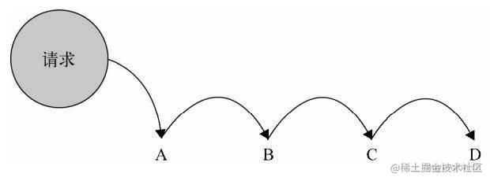

# 设计模式

## 引言

面向对象编程就是将你的需求抽象成一个对象，然后对这个对象进行分析，为其添加对应的特征（属性）与行为（方法），我们将这个对象称之为 类。 面向对象一个很重要的特点就是封装，虽然 javascript 这种解释性的弱类型语言没有像一些经典的强类型语言(例如C++，JAVA等)有专门的方式用来实现类的封装，但我们可以利用 javascript 语言灵活的特点，去模拟实现这些功能。而在许多大型web项目中国，JavaScript代码的数量已经非常多了，我们有必要将一些优秀的设计模式借鉴到JavaScript中。


## 装饰者模式

给对象动态地添加职责的方式称为装饰者模式。传统的面向对象语言中给对象添加功能常常使用继承的方式，但是继承的方式不灵活，而与之相比，装饰者模式更加灵活，“即用即付”。

AOP 装饰函数：

```javascript
Function.prototype.before = function(fn) {
  const self = this
  return function() {
    fn.apply(new(self), arguments)  // https://github.com/MuYunyun/blog/pull/30#event-1817065820
    return self.apply(new(self), arguments)
  }
}

Function.prototype.after = function(fn) {
  const self = this
  return function() {
    self.apply(new(self), arguments)
    return fn.apply(new(self), arguments)
  }
}
```
### 场景：插件式的表单验证
上面formSubmit函数除了提交ajax请求之外，还要验证用户输入的合法，这样会造成函数臃肿，职责混乱，我们可以分离检验输入和ajax请求的代码，我们把校验输入的逻辑放在validata函数中，并且约定当validata函数返回false的时候，表示校验未通过
```javascript
Function.prototype.before = function( beforefn ){
		var __self = this;
		return function(){
			if ( beforefn.apply( this, arguments ) === false ){
	// beforefn 返回false 的情况直接return，不再执行后面的原函数
				return;
			}
			return __self.apply( this, arguments );
		}
	}


	var validata = function(){
		if ( username.value === '' ){
			alert ( '用户名不能为空' );
			return false;
		}
		if ( password.value === '' ){
			alert ( '密码不能为空' );
			return false;
		}
	}
	var formSubmit = function(){
		var param = {
			username: username.value,
			password: password.value
		}
		ajax( 'http:// xxx.com/login', param );
	}

	formSubmit = formSubmit.before( validata );

	submitBtn.onclick = function(){
		formSubmit();
	}
```

## 发布-订阅模式

发布-订阅模式又叫观察者模式，它定义对象间的一种一对多的依赖关系，当一个对象的状态发生改变时，所有依赖于它的对象都将得到通知。在JavaScript中，我们一般用事件模型来替代传统的发布-订阅模式。

## 状态模式

状态模式的关键在于区分事物内部的状态，事物内部状态的改变往往会带来事物的行为改变

* 状态模式定义了状态与行为之间的关系，并将它们封装在一个类中。
* context中的请求动作和状态类中封装的行为可以非常容易地独立变化而互不影响

类似算法中的有限状态机,所有的状态集合，状态转变集合,状态转变逻辑，

## 代理模式

代理有很多种类，比如保护代理会过滤请求，代理B可以拒绝将A发起的请求给传递给C；虚拟代理会将一些操作交给代理执行，代理B可以在A满足某些条件下再执行操作，即虚拟代理会把一些开销大的对象延迟到真正需要它的时候再去创建。保护代理用于控制不同权限的对象对目标对象的访问，但在JavaScript中并不太容易实现保护代理，因为我们无法判断谁访问了某个对象。
代理和本体的接口必须保持一致性，对于用户，他们并不清楚代理和本体的区别，在任何使用本体的地方都可以替换成使用代理。

### 场景：图片预加载

```javascript
//只有本体
var myImage=(function(){
    var imgNode=document.createElement('img');
    document.body.appendChild(imgNode);
    
    return{
        setSrc:function(src){
            imgNode.src=src;
        }
    }
})
myImg.setSrc('./logo.lpg');

//有本体和代理的情况；引入代理对象proxyImage,通过这个代理对象，在图片被真正加载好之前，页面将出现一张占位的菊花图来提示用户图片正在被加载
var myImage=(function(){
    var imgNode=document.createElement('img');
    document.body.appendChild(imgNode);
    return{
        setSrc:function(src){
            imgNode.src=src;
        }
    }
})()

var proxyImage=(function(){
    var img=new Image;
    img.onload=function(){
        myImage.setSrc(this.src);
    }
    return{
        setSrc:function(src){
            myImage.setSrc('./loading.gif');
            img.src=src;
        }
    }
})()
proxyImage.setSrc('./logo.jpg')
```

## 策略模式

策略模式的目的就是将算法的使用与算法的实现分离开，一个策略模式的程序至少由两部分组成。第一个部分是策略类，策略类封装了具体的算法，并负责具体的计算过程。第二个部分是环境类Context，Context接受客户的请求，随后把请求委托给某一个策略类。

### 传统面向对象语言实现

```javascript
/*strategy类*/
var performanceS=function(){};

performanceS.prototype.caculate=function(salary){
    return salary*4;
}

var performanceA=function(){};

performanceA.prototype.caculate=function(salary){
    return salary*3;
}

var performanceB=function(){};

performanceB.proptype.caculate=function(salary){
    return salary*2;
}

/*Context类*/
var Bonus=function(){
    this.salary=null;
    this.strategy=null;
}

Bonus.prototype.setSalary=function(salary){
    this.salary=salary;
}
Bonus.prototype.setStrategy=function(strategy){
    this.strategy=strategy;
}
Bonus.prototype.getBonus=function(){
    return this.strategy.caculate(this.salary);
}

var bonus=new Bonus();
bonus.setSalary(1000);
bonus.setStrategy(new performanceS());
console.log(bonus.getBonus());
```
### Javascript中实现
在JavaScript中，Stratege我们可以把它定义为函数对象，Context负责接收用户的请求并委托给strategy对象
```javascript
var strategies={
    "S":function(salary){
        return salary*4;
    },
    "A":function(salary){
        return salary*3;
    },
    "B":function(salary){
        return salary*2;
    }
};

var calculateBonus=function(level,salary){
    return strategies[level](salary);
};

console.log(calculateBonus('S',2000));
```

## 职责链模式

职责链模式: 类似多米诺骨牌, 通过请求第一个条件, 会持续执行后续的条件, 直到返回结果为止。



重要性: 4 星, 在项目中能对 if-else 语句进行优化

### 场景 :手机售卖

场景: 某电商针对已付过定金的用户有优惠政策, 在正式购买后, 已经支付过 500 元定金的用户会收到 100 元的优惠券, 200 元定金的用户可以收到 50 元优惠券, 没有支付过定金的用户只能正常购买。
```javascript
// orderType: 表示订单类型, 1: 500 元定金用户；2: 200 元定金用户；3: 普通购买用户
// pay: 表示用户是否已经支付定金, true: 已支付；false: 未支付
// stock: 表示当前用于普通购买的手机库存数量, 已支付过定金的用户不受此限制

const order = function( orderType, pay, stock ) {
  if ( orderType === 1 ) {
    if ( pay === true ) {
      console.log('500 元定金预购, 得到 100 元优惠券')
    } else {
      if (stock > 0) {
        console.log('普通购买, 无优惠券')
      } else {
        console.log('库存不够, 无法购买')
      }
    }
  } else if ( orderType === 2 ) {
    if ( pay === true ) {
      console.log('200 元定金预购, 得到 50 元优惠券')
    } else {
      if (stock > 0) {
        console.log('普通购买, 无优惠券')
      } else {
        console.log('库存不够, 无法购买')
      }
    }
  } else if ( orderType === 3 ) {
    if (stock > 0) {
        console.log('普通购买, 无优惠券')
    } else {
      console.log('库存不够, 无法购买')
    }
  }
}

order( 3, true, 500 ) // 普通购买, 无优惠券
```
下面用职责链改造代码：

```javascript

const order500 = function(orderType, pay, stock) {
  if ( orderType === 1 && pay === true ) {
    console.log('500 元定金预购, 得到 100 元优惠券')
  } else {
    order200(orderType, pay, stock)
  }
}

const order200 = function(orderType, pay, stock) {
  if ( orderType === 2 && pay === true ) {
    console.log('200 元定金预购, 得到 50 元优惠券')
  } else {
    orderCommon(orderType, pay, stock)
  }
}

const orderCommon = function(orderType, pay, stock) {
  if (orderType === 3 && stock > 0) {
    console.log('普通购买, 无优惠券')
  } else {
    console.log('库存不够, 无法购买')
  }
}

order500( 3, true, 500 ) // 普通购买, 无优惠券

```
改造后可以发现代码相对清晰了, 但是链路代码和业务代码依然耦合在一起, 进一步优化:
```javascript
// 业务代码
const order500 = function(orderType, pay, stock) {
  if ( orderType === 1 && pay === true ) {
    console.log('500 元定金预购, 得到 100 元优惠券')
  } else {
    return 'nextSuccess'
  }
}

const order200 = function(orderType, pay, stock) {
  if ( orderType === 2 && pay === true ) {
    console.log('200 元定金预购, 得到 50 元优惠券')
  } else {
    return 'nextSuccess'
  }
}

const orderCommon = function(orderType, pay, stock) {
  if (orderType === 3 && stock > 0) {
    console.log('普通购买, 无优惠券')
  } else {
    console.log('库存不够, 无法购买')
  }
}

// 链路代码
const chain = function(fn) {
  this.fn = fn
  this.sucessor = null
}

chain.prototype.setNext = function(sucessor) {
  this.sucessor = sucessor
}

chain.prototype.init = function() {
  const result = this.fn.apply(this, arguments)
  if (result === 'nextSuccess') {
    this.sucessor.init.apply(this.sucessor, arguments)
  }
}

const order500New = new chain(order500)
const order200New = new chain(order200)
const orderCommonNew = new chain(orderCommon)

order500New.setNext(order200New)
order200New.setNext(orderCommonNew)

order500New.init( 3, true, 500 ) // 普通购买, 无优惠券
```
重构后, 链路代码和业务代码彻底地分离。假如未来需要新增 order300, 那只需新增与其相关的函数而不必改动原有业务代码。

另外结合 AOP 还能简化上述链路代码:

```javascript
// 业务代码
const order500 = function(orderType, pay, stock) {
  if ( orderType === 1 && pay === true ) {
    console.log('500 元定金预购, 得到 100 元优惠券')
  } else {
    return 'nextSuccess'
  }
}

const order200 = function(orderType, pay, stock) {
  if ( orderType === 2 && pay === true ) {
    console.log('200 元定金预购, 得到 50 元优惠券')
  } else {
    return 'nextSuccess'
  }
}

const orderCommon = function(orderType, pay, stock) {
  if (orderType === 3 && stock > 0) {
    console.log('普通购买, 无优惠券')
  } else {
    console.log('库存不够, 无法购买')
  }
}

// 链路代码
Function.prototype.after = function(fn) {
  const self = this
  return function() {
    const result = self.apply(self, arguments)
    if (result === 'nextSuccess') {
      return fn.apply(self, arguments) // 这里 return 别忘记了~
    }
  }
}

const order = order500.after(order200).after(orderCommon)

order( 3, true, 500 ) // 普通购买, 无优惠券
```

类似的柯里化，洋葱模型，compose中的插件机制

## 单例模式

单例模式的定义：保证一个类仅有一个实例，并提供一个访问它的全局访问点
应用：线程池、全局缓存，浏览器中的window对象等
```javascript
var user=(function(){
    var _name='sven',_age=29;
    return{
        getUserInfo:function(){
            return _name+'-'+'_age';
        }
    }
})
```

## 中介者模式

中介者模式是指对象和对象之间借助第三方中介者进行通信.中介模式使各个对象之间得以解耦，以中介者和对象之间的一对多关系取代了对象之间的网状多对多关系。各个对象只需关注自身的实现，对象之间的交互关系交给了中介者来实现和维护。
一场测试结束后, 公布结果: 告知解答出题目的人挑战成功, 否则挑战失败。

```javascript
const player = function(name) {
  this.name = name
  playerMiddle.add(name)
}

player.prototype.win = function() {
  playerMiddle.win(this.name)
}

player.prototype.lose = function() {
  playerMiddle.lose(this.name)
}

//在这段代码中 A、B、C 之间没有直接发生关系, 而是通过另外的 playerMiddle 对象建立链接, 姑且将之当成是中介者模式了
const playerMiddle = (function() { 
  const players = []
  const winArr = []
  const loseArr = []
  return {
    add: function(name) {
      players.push(name)
    },
    win: function(name) {
      winArr.push(name)
      if (winArr.length + loseArr.length === players.length) {
        this.show()
      }
    },
    lose: function(name) {
      loseArr.push(name)
      if (winArr.length + loseArr.length === players.length) {
        this.show()
      }
    },
    show: function() {
      for (let winner of winArr) {
        console.log(winner + '挑战成功;')
      }
      for (let loser of loseArr) {
        console.log(loser + '挑战失败;')
      }
    },
  }
}())

const a = new player('A 选手')
const b = new player('B 选手')
const c = new player('C 选手')

a.win()
b.win()
c.lose()
```

##  适配器模式

适配器模式用来解决两个软件实体的接口不兼容的问题

```javascript
var googleMap = {
		show: function(){
			console.log( '开始渲染谷歌地图' );
		}
	};
	var baiduMap = {
		display: function(){
			console.log( '开始渲染百度地图' );
		}
	};

    var renderMap = function( map ){
		if ( map.show instanceof Function ){
			map.show();
		}
	}; 


  //解决百度地图中展示地图的方法名与谷歌地图中展示地图的方法名不一样的问题
	var baiduMapAdapter = {
		show: function(){
			return baiduMap.display();

		}
	};

	renderMap( googleMap ); // 输出：开始渲染谷歌地图
	renderMap( baiduMapAdapter ); // 输出：开始渲染百度地图
```

## 迭代器模式

迭代器是指提供一种方法顺序访问一个聚合对象中的各个元素，而又不需要暴露该对象的内部表示。迭代器模式可以把迭代的过程从业务逻辑中分离出来，在使用迭代器模式之后，即使不关心对象的内部构造，也可以按顺序访问其中的每个元素。

## 组合模式

* 组合模式在对象间形成树形结构;
* 组合模式中基本对象和组合对象被一致对待;
* 无须关心对象有多少层, 调用时只需在根部进行调用;
扫描文件夹时, 文件夹下面可以为另一个文件夹也可以为文件, 我们希望统一对待这些文件夹和文件, 这种情形适合使用组合模式。

## 享元模式

享元模式是一种优化程序性能的模式, 本质为减少对象创建的个数。

以下情况可以使用享元模式:
* 有大量相似的对象, 占用了大量内存
* 对象中大部分状态可以抽离为外部状态

```javascript
const Model = function(gender, underwear) {
  this.gender = gender
  this.underwear = underwear
}

Model.prototype.takephoto = function() {
  console.log(`${this.gender}穿着${this.underwear}`)
}

for (let i = 1; i < 51; i++) {
  const maleModel = new Model('male', `第${i}款衣服`)
  maleModel.takephoto()
}

for (let i = 1; i < 51; i++) {
  const female = new Model('female', `第${i}款衣服`)
  female.takephoto()
}
```

## 模板方法模式

模板方法是一种基于继承的设计模式，模板方法模式有两个部分组成，第一个是抽象父类，第二个是具体的实现子类。但在JavaScript中，我们很多时候都不需要画瓢一样去实现一个模板方法模式，高阶函数是更好的选择。
```javascript
var Coffee = function(){};
	Coffee.prototype.boilWater = function(){
		console.log( '把水煮沸' );
	};
	Coffee.prototype.brewCoffeeGriends = function(){
		console.log( '用沸水冲泡咖啡' );
	};
	Coffee.prototype.pourInCup = function(){
		console.log( '把咖啡倒进杯子' );
	};
	Coffee.prototype.addSugarAndMilk = function(){
		console.log( '加糖和牛奶' );
	};
	Coffee.prototype.init = function(){
		this.boilWater();
		this.brewCoffeeGriends();
		this.pourInCup();
		this.addSugarAndMilk();
	};
	var coffee = new Coffee();
	coffee.init();

	var Tea = function(){};
	Tea.prototype.boilWater = function(){
		console.log( '把水煮沸' );
	};
	Tea.prototype.steepTeaBag = function(){
		console.log( '用沸水浸泡茶叶' );
	};
	Tea.prototype.pourInCup = function(){
		console.log( '把茶水倒进杯子' );
	};
	Tea.prototype.addLemon = function(){
		console.log( '加柠檬' );
	};
	Tea.prototype.init = function(){
		this.boilWater();
		this.steepTeaBag();
		this.pourInCup();
		this.addLemon();
	};
	var tea = new Tea();
	tea.init();
```
## 命令模式

我们把某次任务分成两个部分，一部分程序员实现绘制按钮，他们不知道按钮用来干什么，一部分程序员负责编写点击按钮后的具体行为。

## 参考链接
[前端面试之JavaScript设计模式](https://juejin.cn/post/6844903861606416397)