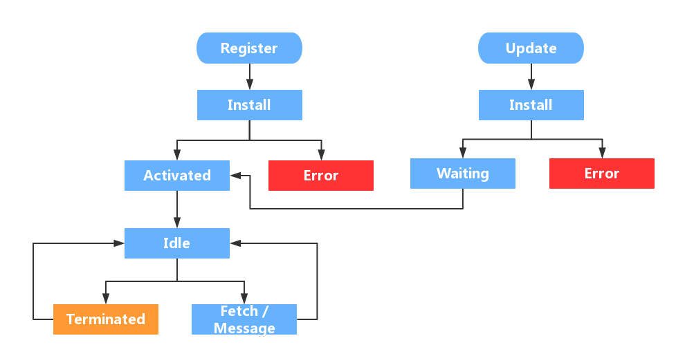

# web worker
Web Worker 的作用，就是为 JavaScript 创造多线程环境，允许主线程创建 Worker 线程，将一些任务分配给后者运行。在主线程运行的同时，Worker 线程在后台运行，两者互不干扰。等到 Worker 线程完成计算任务，再把结果返回给主线程。这样的好处是，一些计算密集型或高延迟的任务，被 Worker 线程负担了，主线程（通常负责 UI 交互）就会很流畅，不会被阻塞或拖慢。

Worker 线程一旦新建成功，就会始终运行，不会被主线程上的活动（比如用户点击按钮、提交表单）打断。这样有利于随时响应主线程的通信。但是，这也造成了 Worker 比较耗费资源，不应该过度使用，而且一旦使用完毕，就应该关闭。

Web Worker 有以下几个使用注意点。

（1）同源限制

分配给 Worker 线程运行的脚本文件，必须与主线程的脚本文件同源。

（2）DOM 限制

Worker 线程所在的全局对象，与主线程不一样，无法读取主线程所在网页的 DOM 对象，也无法使用document、window、parent这些对象。但是，Worker 线程可以navigator对象和location对象。

（3）通信联系

Worker 线程和主线程不在同一个上下文环境，它们不能直接通信，必须通过消息完成。

（4）脚本限制

Worker 线程不能执行alert()方法和confirm()方法，但可以使用 XMLHttpRequest 对象发出 AJAX 请求。

（5）文件限制

Worker 线程无法读取本地文件，即不能打开本机的文件系统（file://），它所加载的脚本，必须来自网络。


# service worker

## 概念

一个服务器与浏览器之间的中间人角色，如果网站中注册了service worker那么它可以拦截当前网站所有的请求，进行判断（需要编写相应的判断程序），如果需要向服务器发起请求的就转给服务器，如果可以直接使用缓存的就直接返回缓存不再转给服务器。从而大大提高浏览体验。

## 以下是一些细碎的描述
基于web worker（一个独立于JavaScript主线程的独立线程，在里面执行需要消耗大量资源的操作不会堵塞主线程）
在web worker的基础上增加了离线缓存的能力
本质上充当Web应用程序（服务器）与浏览器之间的代理服务器（可以拦截全站的请求，并作出相应的动作->由开发者指定的动作）
创建有效的离线体验（将一些不常更新的内容缓存在浏览器，提高访问体验）
由事件驱动的,具有生命周期
可以访问cache和indexDB
支持推送
并且可以让开发者自己控制管理缓存的内容以及版本

Service Worker本质上也是浏览器缓存资源用的，只不过他不仅仅是Cache，也是通过worker的方式来进一步优化。
他基于h5的web worker，所以绝对不会阻碍当前js线程的执行，sw最重要的工作原理就是：

1、后台线程：独立于当前网页线程；
2、网络代理：在网页发起请求时代理，来缓存文件。

### 1.兼容性

可以看到，基本上新版浏览器还是兼容滴。之前是只有chrome和firefox支持，现在微软和苹果也相继支持了。

### 2.成熟度

判断一个技术是否值得尝试，肯定要考虑下它的成熟程度，否则过一段时间又和应用缓存一样被规范抛弃就尴尬了。
所以这里我列举了几个使用Service Worker的页面：
淘宝
网易新闻
考拉
所以说还是可以尝试下的。

### 3  调试方法

一个网站是否启用Service Worker，可以通过开发者工具中的Application来查看：
被Service Worker缓存的文件，可以在Network中看到Size项为from Service Worker
也可以在Application的Cache Storage中查看缓存的具体内容：
如果是具体的断点调试，需要使用对应的线程，不再是main线程了，这也是webworker的通用调试方法：

### 4 ● 使用条件

sw 是基于 HTTPS 的，因为Service Worker中涉及到请求拦截，所以必须使用HTTPS协议来保障安全。如果是本地调试的话，localhost是可以的。
而我们刚好全站强制https化，所以正好可以使用。

### 5 生命周期


### 注册
要使用Service Worker，首先需要注册一个sw，通知浏览器为该页面分配一块内存，然后sw就会进入安装阶段。

```javascript

(function() {
    if('serviceWorker' in navigator) {
        navigator.serviceWorker.register('./sw.js');
    }
})()
```
### installing
我们注册后，浏览器就会开始安装sw，可以通过事件监听：
```javascript
main.css'
];
self.addEventListener('install', function(event) {

    //调试时跳过等待过程
    self.skipWaiting();


    // Perform install steps
    //首先 event.waitUntil 你可以理解为 new Promise，
    //它接受的实际参数只能是一个 promise，因为,caches 和 cache.addAll 返回的都是 Promise，
    //这里就是一个串行的异步加载，当所有加载都成功时，那么 SW 就可以下一步。
    //另外，event.waitUntil 还有另外一个重要好处，它可以用来延长一个事件作用的时间，
    //这里特别针对于我们 SW 来说，比如我们使用 caches.open 是用来打开指定的缓存，但开启的时候，
    //并不是一下就能调用成功，也有可能有一定延迟，由于系统会随时睡眠 SW，所以，为了防止执行中断，
    //就需要使用 event.waitUntil 进行捕获。另外，event.waitUntil 会监听所有的异步 promise
    //如果其中一个 promise 是 reject 状态，那么该次 event 是失败的。这就导致，我们的 SW 开启失败。
    event.waitUntil(
        caches.open(CACHE_NAME)
            .then(function(cache) {
                console.log('[SW]: Opened cache');
                return cache.addAll(allAssets);
            })
    );

});

```

安装时，sw就开始缓存文件了，会检查所有文件的缓存状态，如果都已经缓存了，则安装成功，进入下一阶段。

activated

如果是第一次加载sw，在安装后，会直接进入activated阶段，而如果sw进行更新，情况就会显得复杂一些。流程如下：
首先老的sw为A，新的sw版本为B。
B进入install阶段，而A还处于工作状态，所以B进入waiting阶段。只有等到A被terminated后，B才能正常替换A的工作。

这个terminated的时机有如下几种方式：

1、关闭浏览器一段时间；
2、手动清除Service Worker；
3、在sw安装时直接跳过waiting阶段.

activated阶段可以做很多有意义的事情，比如更新存储在Cache中的key和value：
```javascript

var CACHE_PREFIX = 'cms-sw-cache';
var CACHE_VERSION = '0.0.20';
/**
 * 找出对应的其他key并进行删除操作
 * @returns {*}
 */
function deleteOldCaches() {
    return caches.keys().then(function (keys) {
        var all = keys.map(function (key) {
            if (key.indexOf(CACHE_PREFIX) !== -1 && key.indexOf(CACHE_VERSION) === -1){
                console.log('[SW]: Delete cache:' + key);
                return caches.delete(key);
            }
        });
        return Promise.all(all);
    });
}
//sw激活阶段,说明上一sw已失效
self.addEventListener('activate', function(event) {


    event.waitUntil(
        // 遍历 caches 里所有缓存的 keys 值
        caches.keys().then(deleteOldCaches)
    );
});
```
## idle
这个空闲状态一般是不可见的，这种一般说明sw的事情都处理完毕了，然后处于闲置状态了。
浏览器会周期性的轮询，去释放处于idle的sw占用的资源。
## fetch
该阶段是sw最为关键的一个阶段，用于拦截代理所有指定的请求，并进行对应的操作。
所有的缓存部分，都是在该阶段，这里举一个简单的例子：
```javascript
//监听浏览器的所有fetch请求，对已经缓存的资源使用本地缓存回复
self.addEventListener('fetch', function(event) {
    event.respondWith(
        caches.match(event.request)
            .then(function(response) {
                //该fetch请求已经缓存
                if (response) {
                    return response;
                }
                return fetch(event.request);
                }
            )
    );
});
```
生命周期大概讲清楚了，我们就以一个具体的例子来说明下原生的Service Worker是如何在生产环境中使用的吧。

##03 Workbox

由于直接写原生的sw.js，比较繁琐和复杂，所以一些工具就出现了，而Workbox是其中的佼佼者，由google团队推出。
在 Workbox 之前，GoogleChrome 团队较早时间推出过 sw-precache 和 sw-toolbox 库，但是在 GoogleChrome 工程师们看来，Workbox 才是真正能方便统一的处理离线能力的更完美的方案，所以停止了对 sw-precache 和 sw-toolbox 的维护。

### share worker

什么是sharedWorker
sharedWorker 顾名思义，是 worker 的一种，可以由所有同源的页面共享。同Worker的api一样，传入js的url，就可以注册一个 sharedWorker 实例:

let myWorker = new SharedWorker('worker.js');
但是与普通 Worker 不同的是：
1 同一个js url 只会创建一个 sharedWorker，其他页面再使用同样的url创建sharedWorker，会复用已创建的 worker，这个worker由那几个页面共享。
2 sharedWorker通过port来发送和接收消息

接下来，我们看一下具体是 worker 和页面之间是如何发送和接收消息的。