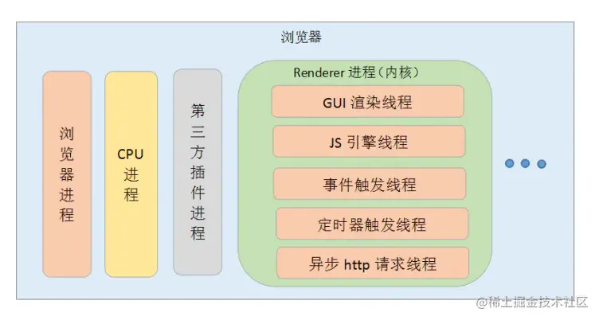
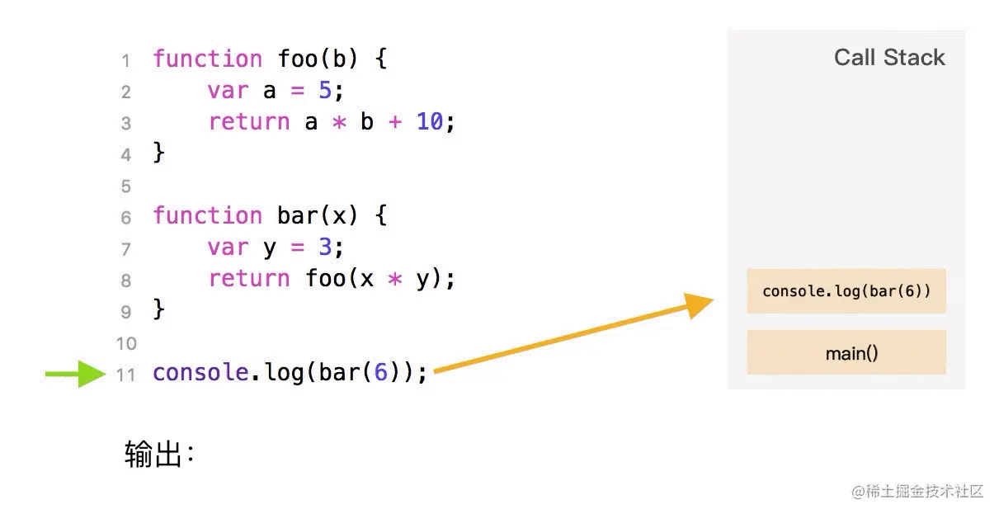
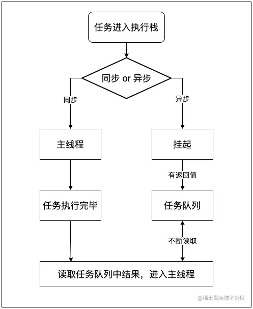
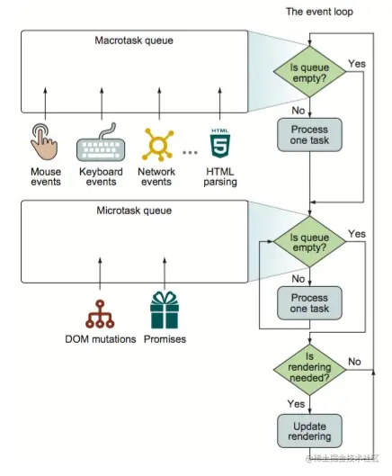

---
[[toc]]
---
# js事件循环

## 异步执行原理

#### 1. 单线程的浏览器

我们知道，JavaScript是一种单线程语言，它主要用来与用户互动，以及操作DOM。
JavaScript 有同步和异步的概念，这就解决了代码阻塞的问题：

同步：如果在一个函数返回的时候，调用者就能够得到预期结果，那么这个函数就是同步的；
异步：如果在函数返回的时候，调用者还不能够得到预期结果，而是需要在将来通过一定的手段得到，那么这个函数就是异步的。

那单线程有什么好处呢？

* 在 JS 运行的时候可能会阻止 UI 渲染，这说明了两个线程是互斥的。这是因为 JS 可以修改 DOM，如果在 JS 执行的时候 UI 线程还在工作，就可能导致不能安全的渲染 UI。
* 得益于 JS 是单线程运行的，可以达到节省内存，节约上下文切换时间的好处。

#### 2. 多线程的浏览器

JS 是单线程的，在同一个时间只能做一件事情，那为什么浏览器可以同时执行异步任务呢？
这是因为浏览器是多线程的，当 JS 需要执行异步任务时，浏览器会另外启动一个线程去执行该任务。也就是说，JavaScript是单线程的指的是执行JavaScript代码的线程只有一个，是浏览器提供的JavaScript引擎线程（主线程）。除此之外，浏览器中还有定时器线程、 HTTP 请求线程等线程，这些线程主要不是来执行 JS 代码的。
比如主线程中需要发送数据请求，就会把这个任务交给异步 HTTP 请求线程去执行，等请求数据返回之后，再将 callback 里需要执行的 JS 回调交给 JS 引擎线程去执行。也就是说，浏览器才是真正执行发送请求这个任务的角色，而 JS 只是负责执行最后的回调处理。所以这里的异步不是 JS 自身实现的，而是浏览器为其提供的能力。

比如主线程中需要发送数据请求，就会把这个任务交给异步 HTTP 请求线程去执行，等请求数据返回之后，再将 callback 里需要执行的 JS 回调交给 JS 引擎线程去执行。也就是说，浏览器才是真正执行发送请求这个任务的角色，而 JS 只是负责执行最后的回调处理。所以这里的异步不是 JS 自身实现的，而是浏览器为其提供的能力。


##### chrome架构图



可以看到，Chrome不仅拥有多个进程，还有多个线程。以渲染进程为例，就包含GUI渲染进程，JS引擎线程、事件触发线程、定时器触发线程、异步HTTP请求线程，这些线程为JS在浏览器中完成了异步任务提供了基础

## 2. 浏览器的事件循环

js任务分为同步和异步：

* 同步任务: 在主线程排队执行的任务，只有一个任务执行完毕，才能执行下一个任务
* 异步任务: 不进入主线程，而是放在任务队列中，若有多个异步任务则需要在任务队列中排队等待，任务队列类似于缓冲区，任务下一步会被移到执行栈任务后主线程执行调用栈的任务。

上面提到了主线程和执行栈，下面就来看看这两个概念。

#### 1. 执行栈与任务队列

1. 执行栈: 从名字可以看出，执行栈使用到的是数据结构中的栈结构， 它是一个存储函数调用的栈结构，遵循先进后出的原则。它主要负责跟踪所有要执行的代码。 每当一个函数执行完成时，就会从堆栈中弹出（pop）该执行完成函数；如果有代码需要进去执行的话，就进行 push 操作。以下图为例：



当执行这段代码时，首先会执行一个 main 函数，然后执行我们的代码。根据先进后出的原则，后执行的函数会先弹出栈，在图中也可以发现，foo 函数后执行，当执行完毕后就从栈中弹出了。
JavaScript在按顺序执行执行栈中的方法时，每次执行一个方法，都会为它生成独有的执行环境（上下文)，当这个方法执行完成后，就会销毁当前的执行环境，并从栈中弹出此方法，然后继续执行下一个方法。

2. 任务队列： 从名字中可以看出，任务队列使用到的是数据结构中的队列结构，它用来保存异步任务，遵循先进先出的原则。它主要负责将新的任务发送到队列中进行处理。
JavaScript在执行代码时，会将同步的代码按照顺序排在执行栈中，然后依次执行里面的函数。当遇到异步任务时，就将其放入任务队列中，等待当前执行栈所有同步代码执行完成之后，就会从异步任务队列中取出已完成的异步任务的回调并将其放入执行栈中继续执行，如此循环往复，直到执行完所有任务。


javascript任务的执行顺序如下：



在事件驱动的模式下，至少包含了一个执行循环来检测任务队列中是否有新任务。通过不断循环，去取出异步任务的回调来执行，这个过程就是事件循环，每一次循环就是一个事件周期。

#### 2. 宏任务和微任务

任务队列其实不止一种，根据任务种类的不同，可以分为微任务(micro task)队列和宏任务（macro task)队列。常见的任务如下：

* 宏任务： script(整体代码),setTimeout,setInterval,I/O,UI交互事件，setImmediate(nodejs环境,IE,Edge) postMessage
* 微任务： Promise, MutationObserver,process.nextTick(nodejs环境)

任务队列执行顺序如下： 


可以看到，eventloop在处理宏任务和微任务的逻辑是的执行情况如下：

1. javascript引擎首先从宏任务队列中取出第一个任务；
2. 执行完毕后，再将微任务中的所有任务取出，按照顺序分别全部执行（这里不仅指开始执行时队列里的微任务），如果这一步过程中产生新的微任务，也需要执行，也就是说在执行微任务过程中产生新的微任务并不会推迟到下一个循环中，执行，而知在当前的循环中继续执行
3. 然后再从宏任务队列中去下一个，执行完毕后，再次将microtask queue中的全部取出，循环往复，直到两个queue中的任务都取完。

也就是说，一次eventloop循环会处理一个宏任务和所有这次循环中产生的微任务。

下面通过例子来体会事件循环：

```javascript
console.log('同步代码1');

setTimeout(() => {
    console.log('setTimeout')
}, 0)

new Promise((resolve) => {
  console.log('同步代码2')
  resolve()
}).then(() => {
    console.log('promise.then')
})

console.log('同步代码3');
```
执行结果

```
"同步代码1"
"同步代码2"
"同步代码3"
"promise.then"
"setTimeout"
```
代码的执行过程：

* 开始执行js代码，宏任务
* 遇到第一个console，它是同步代码，加入执行栈，执行并出栈，打印出 "同步代码1"；
* 遇到setTimeout，它是一个宏任务，加入宏任务队列；
* 遇到new Promise 中的console，它是同步代码，加入执行栈，执行并出栈，打印出 "同步代码2"；
* 遇到Promise then，它是一个微任务，加入微任务队列；
* 遇到第三个console，它是同步代码，加入执行栈，执行并出栈，打印出 "同步代码3"；
* 此时执行栈为空，去执行微任务队列中所有任务，打印出 "promise.then"；
* 执行完微任务队列中的任务，就去执行宏任务队列中的一个任务，打印出 "setTimeout"

那么问题来了，为什么要将任务队列分为微任务和宏任务呢，他们之间的本质区别是什么呢？

JavaScript在遇到异步任务时，会将此任务交给其他线程来执行（比如遇到setTimeout任务，会交给定时器触发线程去执行，待计时结束，就会将定时器回调任务放入任务队列等待主线程来取出执行），主线程会继续执行后面的同步任务。
对于微任务，比如promise.then，当执行promise.then时，浏览器引擎不会将异步任务交给其他浏览器的线程去执行，而是将任务回调存在一个队列中，当执行栈中的任务执行完之后，就去执行promise.then所在的微任务队列。
所以，宏任务和微任务的本质区别如下：

微任务：不需要特定的异步线程去执行，没有明确的异步任务去执行，只有回调；
宏任务：需要特定的异步线程去执行，有明确的异步任务去执行，有回调；


## 3. Node.js的事件循环

详见[nodejs事件循环](./nodejs事件循环.md)

## 4. Node与浏览器event loop差异

Node.js与浏览器的 Event Loop 差异如下：

* Node.js：microtask 在事件循环的各个阶段之间执行；
* 浏览器：microtask 在事件循环的 macrotask 执行完之后执行；


执行全局的 Script 代码（与浏览器无差）；
把微任务队列清空：注意，Node 清空微任务队列的手法比较特别。在浏览器中，我们只有一个微任务队列需要接受处理；但在 Node 中，有两类微任务队列：next-tick 队列和其它队列。其中这个 next-tick 队列，专门用来收敛 process.nextTick 派发的异步任务。在清空队列时，优先清空 next-tick 队列中的任务，随后才会清空其它微任务；
开始执行 macro-task（宏任务）。注意，Node 执行宏任务的方式与浏览器不同：在浏览器中，我们每次出队并执行一个宏任务；而在 Node 中，我们每次会尝试清空当前阶段对应宏任务队列里的所有任务（除非达到系统限制）；
步骤3开始，会进入 3 -> 2 -> 3 -> 2…的循环。

### 参考链接

[彻底搞懂JavaScript事件循环](https://juejin.cn/post/6992167223523541023)