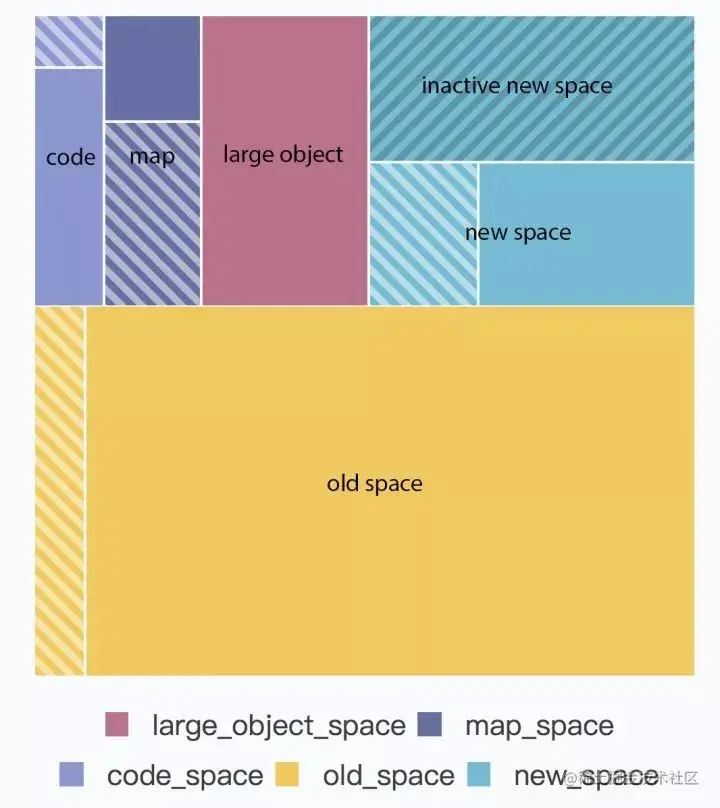
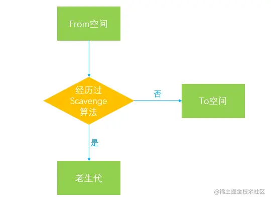

# v8垃圾回收

#### 引言

作为目前最流行的JavaScript引擎，V8引擎从出现的那一刻起便广泛受到人们的关注，我们知道，JavaScript可以高效地运行在浏览器和Nodejs这两大宿主环境中，也是因为背后有强大的V8引擎在为其保驾护航，甚至成就了Chrome在浏览器中的霸主地位。不得不说，V8引擎为了追求极致的性能和更好的用户体验，为我们做了太多太多，从原始的Full-codegen和Crankshaft编译器升级为Ignition解释器和TurboFan编译器的强强组合，到隐藏类，内联缓存和HotSpot热点代码收集等一系列强有力的优化策略，V8引擎正在努力降低整体的内存占用和提升到更高的运行性能。
本篇主要是从V8引擎的垃圾回收机制入手，讲解一下在JavaScript代码执行的整个生命周期中V8引擎是采取怎样的垃圾回收策略来减少内存占比的，当然这部分的知识并不太影响我们写代码的流程，毕竟在一般情况下我们很少会遇到浏览器端出现内存溢出而导致程序崩溃的情况，但是至少我们对这方面有一定的了解之后，能增强我们在写代码过程中对减少内存占用，避免内存泄漏的主观意识，也许能够帮助你写出更加健壮和对V8引擎更加友好的代码。本文也是笔者在查阅资料巩固复习的过程中慢慢总结和整理出来的，若文中有错误的地方，还请指正。

## 1. 为何要垃圾回收

我们知道，在V8引擎朱行执行javascript代码的过程中，当遇到函数时，会为其创建一个函数执行上下文（Context)环境并添加到调用堆栈的栈顶，函数的组用域（handleScope)中包含了该函数中声明的所有变量，当函数执行完毕后，对应的执行上下文从栈顶弹出，函数作用域会随之销毁。其包含的所有变量也会被统一释放并被自动回收。试想如果在这个作用域被销毁的过程中，其中的变量不被收回，即持久占用内存，那么必然会导致内存暴增，从而引发内存泄漏导致程序性能的直线下降甚至崩溃，因此内存在使用完毕之后当归还操作系统以保证内存的重复利用。

但是JavaScript作为一门高级编程语言，并不像C语言或C++语言中需要手动地申请分配和释放内存，V8引擎已经帮我们自动进行了内存的分配和管理，好让我们有更多的精力去专注于业务层面的复杂逻辑，这对于我们前端开发人员来说是一项福利，但是随之带来的问题也是显而易见的，那就是由于不用去手动管理内存，导致写代码的过程中不够严谨从而容易引发内存泄漏(毕竟这是别人对你的好，你没有付出过，又怎能体会得到？)。

## 2. v8引擎的内存限制

虽然v8引擎帮助我们实现了自动的内存回收管理，v8的内存使用也是有限制的。v8引擎在64为系统下最多只能使用1.4Gb的内存，在32位系统下最多只能使用0.7Gb的内存，在这样的限制下，必然会导致在node中无法直接操作大内存对象，比如将一个2GB大小的文件全部读入内存进行字符串分析处理，即使物理内存高达32GB也无法充分利用计算机的内存资源，那么为什么会有这种限制呢？这个要回到V8引擎的设计之初，起初只是作为浏览器端JavaScript的执行环境，在浏览器端我们其实很少会遇到使用大量内存的场景，因此也就没有必要将最大内存设置得过高。但这只是一方面，其实还有另外两个主要的原因：

* JS单线程机制： 作为浏览器的脚本语言，JS的主要用途是与用户交互以及操作DOM，那么这也决定了其作为当线程的本质。在执行垃圾回收时，程序中的其他各种逻辑都要进入暂停等待阶段，直到垃圾回收结束后才会再次重新执行js逻辑。因此，由于js的单线程机制，垃圾回收的过程阻碍了主线程逻辑的执行

> 虽然js是单线程的，但是为了能够充分利用操作系统的多和cpu计算能力，在html5中引入了新的WebWorker标准，其作用就是为js创造多线程环境，允许主线程创建的Worker线程，将一些任务分配给后者运行。Web worker不是js的一部分，而是通过js访问的浏览器特性，其虽然创造了一个多线程的执行环境，但是子线程完全受主线程控制，不能访问浏览器特定的API，例如操作DOM，因此这个新标准并没有改变js单线程的本质。

* 垃圾回收机制： 垃圾回收本身也是一件非常耗时的操作，假设v8的堆内存为1.5G,那么V8做一次小的垃圾回收需要50ms以上，而坐一次非增量式回收甚至需要1S以上，可见其耗时之久，而在这1s的时间内，浏览器一直处于等待的状态，同时会失去对用户的响应。如果有动画在运行，也会造成动画卡顿掉帧的情况，严重影响程序的性能。因此如果内存使用过高，那么必然会导致垃圾回收的过程缓慢，也就会导致主线程的等待时间越长。浏览器也就越长时间得不到响应。

基于以上两点，v8引擎为了减少对应用的性能造成的影响，采用了一种比较粗暴的手段，那就是直接限制内存的大小，毕竟在浏览器端一般也不会遇到需要操作几个G内存这样的场景。但是在node端，涉及到的I/O操作可能会比浏览器更加的多复杂多样，因此更有可能出现内存溢出的情况。v8提供了可配置项来让我们手动的调整内存大小，但是需要再node初始化的时候进行配置。

```javascript
node --v8-options

```

通过以下选项控制

```javascript
// 设置新生代内存中单个半空间的内存最小值，单位MB
node --min-semi-space-size=1024 xxx.js

// 设置新生代内存中单个半空间的内存最大值，单位MB
node --max-semi-space-size=1024 xxx.js

// 设置老生代内存最大值，单位MB
node --max-old-space-size=2048 xxx.js
```
通过以上方法便可以手动放宽v8引擎所使用的内存限制，同时node也为我们提供了process.memoryUsage()方法来让我们可以查看当前node进程所占用的实际内存大小。

```
process.memoryUsage
{
  rss:2918322,
  heapTotal:3232323,
  heapUsed: 3232323,
  external: 32323
}
```
* heapTotal：表示V8当前申请到的堆内存总大小。
* heapUsed：表示当前内存使用量。
* external：表示V8内部的C++对象所占用的内存。
* rss(resident set size)：表示驻留集大小，是给这个node进程分配了多少物理内存，这些物理内存中包含堆，栈和代码片段。对象，闭包等存于堆内存，变量存于栈内存，实际的JavaScript源代码存于代码段内存。使用Worker线程时，rss将会是一个对整个进程有效的值，而其他字段则只针对当前线程。

## 3. v8的垃圾回收策略

v8的垃圾回收策略主要基于分带式垃圾回收机制，其根据对象的存活时间将内存的垃圾回收进行不同的分代，然后对不同的分代采用不同的垃圾回收算法。

### 3.1 v8的内存结构

* 新生代(new_space)：大多数的对象开始都会被分配在这里，这个区域相对较小但是垃圾回收特别频繁，该区域被分为两半，一半用来分配内存，另一半用于在垃圾回收时将需要保留的对象复制过来。
* 老生代(old_space)：新生代中的对象在存活一段时间后就会被转移到老生代内存区，相对于新生代该内存区域的垃圾回收频率较低。老生代又分为老生代指针区和老生代数据区，前者包含大多数可能存在指向其他对象的指针的对象，后者只保存原始数据对象，这些对象没有指向其他对象的指针。
* 大对象区(large_object_space)：存放体积超越其他区域大小的对象，每个对象都会有自己的内存，垃圾回收不会移动大对象区。
* 代码区(code_space)：代码对象，会被分配在这里，唯一拥有执行权限的内存区域。
* map区(map_space)：存放Cell和Map，每个区域都是存放相同大小的元素，结构简单(这里没有做具体深入的了解，有清楚的小伙伴儿还麻烦解释下)。

内存结构图如下：



上图中的带斜纹的区域代表暂未使用的内存，新生代(new_space)被划分为了两个部分，其中一部分叫做inactive new space，表示暂未激活的内存区域，另一部分为激活状态，为什么会划分为两个部分呢，在下一小节我们会讲到。

### 3.2 新生代

在v8引擎的内存结构中，新生代主要用于存放存活时间较短的对象。新生代由两个semispace构成的，内存最大值在64位系统和32位系统上分别为32M和16M,在新生代的垃圾回收过程中主要采用了Scavenge算法

Scavenge算法是一种典型的牺牲空间换取时间的算法，对于老生代内存来说，可能会存储大量对象，如果在老生代中使用这种算法，势必会造成内存资源的浪费，但是在新生代内存中，大部分对象的生命周期较短，在时间效率上表现可观，所以还是比较适合这种算法。

> 在Scavenge算法的具体实现中，主要采用了Cheney算法，它将新生代内存一分为二，每一个部分的空间称为semispace，也就是我们在上图中看见的new_space中划分的两个区域，其中处于激活状态的区域我们称为From空间，未激活(inactive new space)的区域我们称为To空间。这两个空间中，始终只有一个处于使用状态，另一个处于闲置状态。我们的程序中声明的对象首先会被分配到From空间，当进行垃圾回收时，如果From空间中尚有存活对象，则会被复制到To空间进行保存，非存活的对象会被自动回收。当复制完成后，From空间和To空间完成一次角色互换，To空间会变为新的From空间，原来的From空间则变为To空间。

### 3.2 对象晋升

当一个对象在经过多次复制之后依旧存活，那么它会被认为是一个生命周期较长的对象，在下一次进行垃圾回收时，该对象会被直接转移到老生代中，这种对象从新生代转移到老生代的过程我们称之为晋升。
对象晋升的条件主要有以下两个：

* 对象是否经历过一次Scavenge算法
* To空间的内存占比是否已经超过25%

默认情况下，我们创建的对象都会分配在From空间中，当进行垃圾回收时，在将对象从From空间复制到To空间之前，会先检查该对象的内存地址来判断是否已经经历过一次Scavenge算法，如果地址已经发生变动则会将该对象转移到老生代中，不会再被复制到To空间，可以用以下的流程图来表示：
著作权归作者所有。商业转载请联系作者获得授权，非商业转载请注明出处。



### 3.4 老生代
在老生代中，因为管理着大量的存活对象，如果依旧使用Scavenge算法的话，很明显会浪费一半的内存，因此已经不再使用Scavenge算法，而是采用新的算法Mark-Sweep(标记清除)和Mark-Compact(标记整理)来进行管理。
在早前我们可能听说过一种算法叫做引用计数，该算法的原理比较简单，就是看对象是否还有其他引用指向它，如果没有指向该对象的引用，则该对象会被视为垃圾并被垃圾回收器回收，示例如下：

```javascript
// 创建了两个对象obj1和obj2，其中obj2作为obj1的属性被obj1引用，因此不会被垃圾回收
let obj1 = {
    obj2: {
        a: 1
    }
}

// 创建obj3并将obj1赋值给obj3，让两个对象指向同一个内存地址
let obj3 = obj1;

// 将obj1重新赋值，此时原来obj1指向的对象现在只由obj3来表示
obj1 = null;

// 创建obj4并将obj3.obj2赋值给obj4
// 此时obj2所指向的对象有两个引用：一个是作为obj3的属性，另一个是变量obj4
let obj4 = obj3.obj2;

// 将obj3重新赋值，此时本可以对obj3指向的对象进行回收，但是因为obj3.obj2被obj4所引用，因此依旧不能被回收
obj3 = null;

// 此时obj3.obj2已经没有指向它的引用，因此obj3指向的对象在此时可以被回收
obj4 = null;
```
引用计数会存在循环引用。

因此为了避免循环引用导致的内存泄漏问题，截至2012年所有的现代浏览器均放弃了这种算法，转而采用新的Mark-Sweep(标记清除)和Mark-Compact(标记整理)算法。在上面循环引用的例子中，因为变量a和变量b无法从window全局对象访问到，因此无法对其进行标记，所以最终会被回收。

Mark-Sweep(标记清除)分为标记和清除, ，在标记阶段会遍历堆中的所有对象，然后标记活着的对象，在清除阶段中，会将死亡的对象进行清除。Mark-Sweep算法主要是通过判断某个对象是否可以被访问到，从而知道该对象是否应该被回收，具体步骤如下：

垃圾回收器会在内部构建一个根列表，用于从根节点出发去寻找那些可以被访问到的变量。比如在JavaScript中，window全局对象可以看成一个根节点。
然后，垃圾回收器从所有根节点出发，遍历其可以访问到的子节点，并将其标记为活动的，根节点不能到达的地方即为非活动的，将会被视为垃圾。
最后，垃圾回收器将会释放所有非活动的内存块，并将其归还给操作系统。

> 以下几种情况都可以作为根节点：

> 全局对象

> 本地函数的局部变量和参数

> 当前嵌套调用链上的其他函数的变量和参数


但是Mark-Sweep算法存在一个问题，就是在经历过一次标记清除后，内存空间可能会出现不连续的状态，因为我们所清理的对象的内存地址可能不是连续的，所以就会出现内存碎片的问题，导致后面如果需要分配一个大对象而空闲内存不足以分配，就会提前触发垃圾回收，而这次垃圾回收其实是没必要的，因为我们确实有很多空闲内存，只不过是不连续的。
为了解决这种内存碎片的问题，Mark-Compact(标记整理)算法被提了出来，该算法主要就是用来解决内存的碎片化问题的，回收过程中将死亡对象清除后，在整理的过程中，会将活动的对象往堆内存的一端进行移动，移动完成后再清理掉边界外的全部内存，我们可以用如下流程图来表示：
至此就完成了一次老生代垃圾回收的全部过程，我们在前文中说过，由于JS的单线程机制，垃圾回收的过程会阻碍主线程同步任务的执行，待执行完垃圾回收后才会再次恢复执行主任务的逻辑，这种行为被称为全停顿(stop-the-world)。在标记阶段同样会阻碍主线程的执行，一般来说，老生代会保存大量存活的对象，如果在标记阶段将整个堆内存遍历一遍，那么势必会造成严重的卡顿。
因此，为了减少垃圾回收带来的停顿时间，V8引擎又引入了Incremental Marking(增量标记)的概念，即将原本需要一次性遍历堆内存的操作改为增量标记的方式，先标记堆内存中的一部分对象，然后暂停，将执行权重新交给JS主线程，待主线程任务执行完毕后再从原来暂停标记的地方继续标记，直到标记完整个堆内存。这个理念其实有点像React框架中的Fiber架构，只有在浏览器的空闲时间才会去遍历Fiber Tree执行对应的任务，否则延迟执行，尽可能少地影响主线程的任务，避免应用卡顿，提升应用性能。
得益于增量标记的好处，V8引擎后续继续引入了延迟清理(lazy sweeping)和增量式整理(incremental compaction)，让清理和整理的过程也变成增量式的。同时为了充分利用多核CPU的性能，也将引入并行标记和并行清理，进一步地减少垃圾回收对主线程的影响，为应用提升更多的性能。


## 如何避免内存泄漏

### 4.1 尽可能少创建全局变量
### 4.2 手动清除定时器
### 4.3 少用闭包
### 4.4 清除DOM引用
### 4.5 弱引用

通过前几个示例我们会发现如果我们一旦疏忽，就会容易地引发内存泄漏的问题，为此，在ES6中为我们新增了两个有效的数据结构WeakMap和WeakSet，就是为了解决内存泄漏的问题而诞生的。其表示弱引用，它的键名所引用的对象均是弱引用，弱引用是指垃圾回收的过程中不会将键名对该对象的引用考虑进去，只要所引用的对象没有其他的引用了，垃圾回收机制就会释放该对象所占用的内存。这也就意味着我们不需要关心WeakMap中键名对其他对象的引用，也不需要手动地进行引用清除，我们尝试在node中演示一下过程(参考阮一峰ES6标准入门中的示例，自己手动实现了一遍)。
