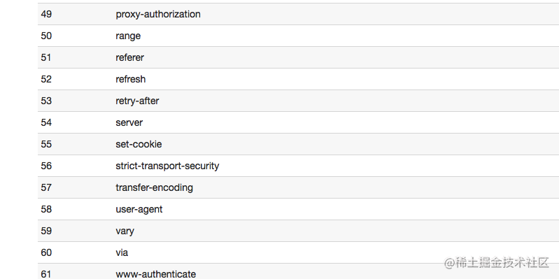

# http2

### 导读

http2 的前身是由 google 领导开发的 SPDY，后来 google 把整个成果交给 IETF，IETF 把 SPDY 标准化之后变成 http2。google 也很大方的废弃掉 SPDY，转向支持 http2。http2 是完全兼容 http/1.x 的，在此基础上添加了 4 个主要新特性：

- 二进制分帧
- 头部压缩
- 服务端推送
- 多路复用
- 优化手段

下面主要讲下这 4 个特性。

## 二进制分帧

http/1.x 是一个文本协议，而 http2 是一个彻彻底底的二进制协议，这也是 http2 可以折腾出那么多新花样的原因。http2 的二进制协议被称之为二进制分帧。

http2 协议的格式为帧，类似 TCP 中的数据报文。

```diff
+--------------------------------------------------------------+   ^
|                                                              |   |
|                   Length (24)                                |   |
|                                                              |   |
|                                                              |   |
+----------------------+---------------------------------------+   |
|                      |                                       |   +
|                      |                                       |
|        Type (8)      |     Flag (8)                          |  Frame Header
|                      |                                       |   +
+----+-----------------+---------------------------------------+   |
|    |                                                         |   |
|    |                                                         |   |
| R  |                  Stream Identifier (31)                 |   |
|    |                                                         |   v
+----+---------------------------------------------------------+
|                                                              |
|                            Frame Payload                     |
|                                                              |
+--------------------------------------------------------------+


```

帧由 Frame Header 和 Frame Payload 组成。之前在 http/1.x 中的 header 和 body 都放在 Frame Payload 中。

- Type 字段用来表示该帧中的 Frame Payload 保存的是 header 数据还是 body 数据。除了用于标识 header/body，还有一些额外的 Frame Type。
- Length 字段用来表示 Frame Payload 数据大小。
- Frame Payload 用来保存 header 或者 body 的数据。

**Stream Identifier 用来标识该 frame 属于哪个 stream。**这句话可能感觉略突兀，这里要明白 Stream Identifier 的作用，需要引出 http2 的第二个特性『多路复用』。

## 多路复用

在 http/1.x 情况下，每个 http 请求都会建立一个 TCP 连接，这就意味着每个请求都需要进行三次握手。这样子就会浪费比较多的时间和资源,这点在 http/1.x 的情况下是没有办法避免的。并且浏览器会限制同一个域名下并发请求的个数。所以，在 http/1.x 的情况下，一个常见的优化手段是把静态资源分布到不同域名下，以此来突破浏览器并发数的限制。
在 http2 的情况下，所有的请求都会共用一个 TCP 连接，这个可以说是 http2 杀手级的特性了。 :punch: 因为这点，许多在 http/1.x 时代的优化手段都可以退休了。但是这里也出现了一个问题，所有的请求都共用一个 TCP 连接，那么客户端/服务端怎么知道某一帧(别忘记上面说了 http2 是的基本单位是帧)的数据属于哪个请求呢？
上面的 Stream Identifier 就是用来标识该帧属于哪个请求的。
当客户端同时向服务端发起多个请求，那么这些请求会被分解成一一个的帧，每个帧都会在一个 TCP 链路中无序的传输，同一个请求的帧的 Stream Identifier 都是一样的。当帧到达服务端之后，就可以根据 Stream Identifier 来重新组合得到完整的请求。

## 头部压缩

在 http/1.x 协议中，每次请求都会携带 header 数据，而类似 User-Agent, Accept-Language 等信息在每次请求过程中几乎是不变的，那么这些信息在每次请求过程中就变成了浪费。所以， http2 中提出了一个 HPACK 的压缩方式，用于减少 http header 在每次请求中消耗的流量。
HPACK 压缩的原理如下 ：
客户端和服务端共同维护一个『静态字典』，字典中每行 3 列，类似下表
index | header name | header value
-- | --| --
2 |:method |GET
3 |:method |POST

客户端和服务端必须维护一套一样的静态字典，这里给出了完整的静态字典，客户端和服务端都会遵守这套静态字典。



你会发现静态字典中有些 header value 没有值。这是因为有些 header 字段的值是不定的，比如 User-Agent 字段，所以标准中没有定下 header value 的值。
那么如果碰到在静态字典中 header value 没有的值，HPEACK 算法会采取下面的方式：
假设 http 请求的 header 中包含了 User-Agent:Mozilla/5.0 (Macintosh; Intel Mac OS X 10_13_0) AppleWebKit/537.36 (KHTML, like Gecko) Chrome/64.0.3282.186 Safari/537.36，那么 HPACK 会对 User-Agent 的值进行哈夫曼编码，然后在静态字典中找到 User-Agent 的 index 为 58，那么客户端会把 User-Agent 的 index 值和 User-Agent 值对应的哈夫曼编码值发送给服务端。

```css
User-Agent : Mozilla/5.0 (Macintosh; Intel Mac OS X 10_13_0) AppleWebKit/537.36 (KHTML, like Gecko) Chrome/64.0.3282.186 Safari/537.36

会被转换陈下面的 kv 值发送给服务端:

58 : Huffman('Mozilla/5.0 (Macintosh; Intel Mac OS X 10_13_0) AppleWebKit/537.36 (KHTML, like Gecko) Chrome/64.0.3282.186 Safari/537.36')
```

服务端收到请求之后，把 User-Agent 和哈夫曼编码值追加到静态字典后面，这些追加的行称之为『动态字典』。

| index | header name | header value            |
| ----- | ----------- | ----------------------- |
| 2     | :method     | GET                     |
| 3     | :method     | POST                    |
| ...   | ....        | .....                   |
| 62    | User-Agent  | Huffman('header value') |

客户端在发送请求的时候，也会把该行添加到自己维护的静态字典表后面，这样子客户端和服务端维护的字典表就会保持一致。之后的请求客户端如果需要携带 User-Agent 字段，只要发送 62 即可。

## 服务端推送

服务端推送指的是服务端主动向客户端推送数据。

举个例子，index.html 有如下代码
```html
<!DOCTYPE html>
<html>
<head>
  <link rel="stylesheet" href="style.css">
</head>
<body>
  <h1>hello world</h1>
  
</body>
</html>
```
那么正常情况下，为了展示页面需要发 3 次请求：

* 发起 1 次请求 index.html 页面
* 解析 index.html 页面发现 style.css 和 something.png 资源，发起 2 次请求获取资源。

如果服务端配置了服务端推送之后，那么情况变成下面的样子：

* 浏览器请求 index.html。
* 服务器发现浏览器请求的 index.html 中包含 style.css 和 something.png 资源，于是直接 index.html, style.css, something.png 三个资源都返回给浏览器。

这样，服务端和浏览器只需要进行一次通信，就可以获取到全部资源。

## http/1.x 转 http2

http2 的目的就是为了优化 http/1.x 的一些性能问题，所以当 http2 到来之后，很多针对 http/1.x 的优化手段已经不管用。而使用 http2 我们又应该注意一些什么问题？


### https
https 和 http2 的恩怨很有趣。google 在开发 SPDY 的时候是强制使用 https 的，按照道理基于 SPDY 的 http2 也应该是强制 https 的，但是由于社区的阻碍 http2 可以不使用 https 协议。但是 chrome 和 firefox 都表示只会开发基于 https 的 http2，所以基本意味着使用 http2 的前提是必须是 https。


不必要的优化
在 http/1.x 的时代，为了减少浏览器的请求数/提高浏览器的并发数，通常会使用如下的手段来进行优化：

域名分片：把静态资源分布在不同的域名下，以突破浏览器对统一域名并发数的限制。(在多路复用中提到)
合并文件：前端通常会把多个小文件合并成一个大文件，这样浏览器只要进行一次请求就可以获取资源。但是这样做有一个缺陷就是：如果只是改动了文件的一小部分内容，就要重新发送全部内容。

以上的优化手段，在 http2 的情况下，就显得不必要了。

## 参考链接
[http2 简介](https://juejin.cn/post/6844903577006129159)
