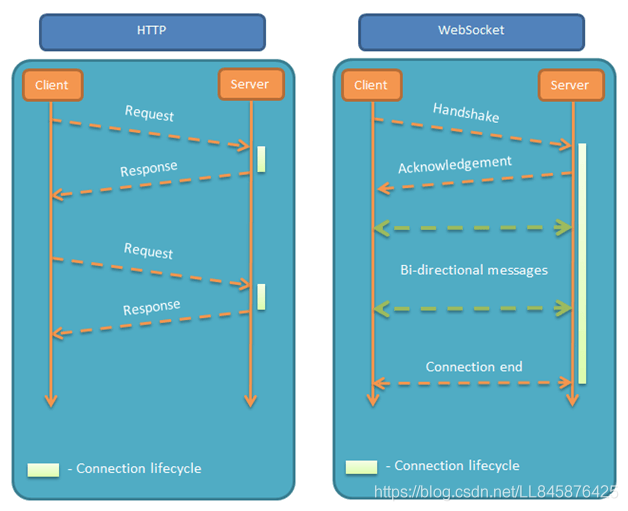
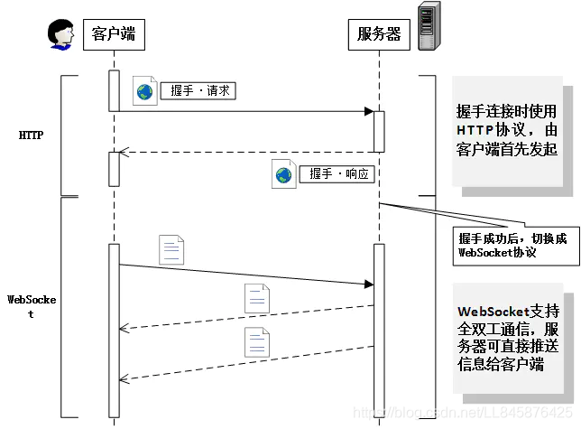
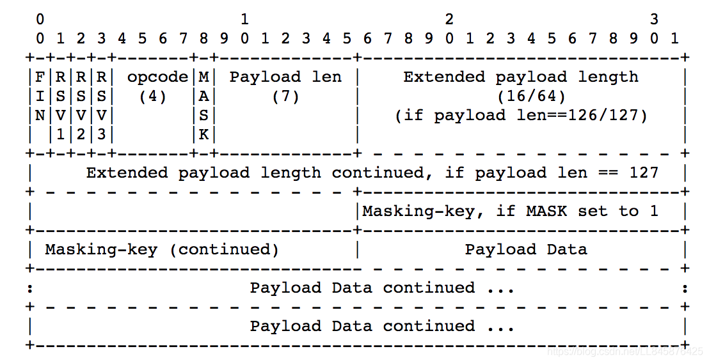

# websocket

### 前言

相较于HTTP协议，HTTP协议有一个的缺陷为：通信只能由客户端发起。在一些场景下，这种单向请求的特点，注定了如果服务器有连续的状态变化，客户端要获知就非常麻烦。我们只能使用轮询：每隔一段时候，就发出一个询问，了解服务器有没有新的信息。最典型的场景就是聊天室。

轮询的效率低，非常浪费资源（因为必须不停连接，或者 HTTP 连接始终打开）。因此，工程师们一直在思考，有没有更好的方法。WebSocket 就是这样发明的。


## websocket 协议概述

Webscoket是Web浏览器和服务器之间的一种全双工通信协议，其中WebSocket协议由IETF定为标准，WebSocket API由W3C定为标准。一旦Web客户端与服务器建立起连接，之后的全部数据通信都通过这个连接进行。通信过程中，可互相发送JSON、XML、HTML或图片等任意格式的数据。

### WS（WebSocket）与HTTP协议相比，

相同点主要有：

* 都是基于TCP的应用层协议；
* 都使用Request/Response模型进行连接的建立；
* 在连接的建立过程中对错误的处理方式相同，在这个阶段WS可能返回和HTTP相同的返回码；
* 都可以在网络中传输数据。

不同之处在于：

* WS使用HTTP来建立连接，但是定义了一系列新的header域，这些域在HTTP中并不会使用；
* WS的连接不能通过中间人来转发，它必须是一个直接连接；
* WS连接建立之后，通信双方都可以在任何时刻向另一方发送数据；
* WS连接建立之后，数据的传输使用帧来传递，不再需要Request消息；
* WS的数据帧有序。

websocket 通信过程及对应报文分析

WS整个通信过程如下图所示：



websocket是基于TCP的一个应用协议，与HTTP协议的关联之处在于websocket的握手数据被HTTP服务器当作HTTP包来处理，主要通过Update request HTTP包建立起连接，之后的通信全部使用websocket自己的协议。

**请求：**TCP连接建立后，客户端发送websocket的握手请求，请求报文头部如下：
```css
GET /uin=xxxxxxxx&app=xxxxxxxxx&token=XXXXXXXXXXXX HTTP/1.1
Host: server.example.cn:443
Connection: Upgrade
Pragma: no-cache
Cache-Control: no-cache
User-Agent: Mozilla/5.0 (Macintosh; Intel Mac OS X 10_15_2) AppleWebKit/537.36 (KHTML, like Gecko) Chrome/81.0.4044.138 Safari/537.36
Upgrade: websocket
Sec-WebSocket-Version: 13
Accept-Encoding: gzip, deflate
Accept-Language: zh-CN,zh;q=0.9
Cookie: user_id=XXXXX
Sec-WebSocket-Key: 1/2hTi/+eNURiekpNI4k5Q==
Sec-WebSocket-Extensions: permessage-deflate; client_max_window_bits
Sec-WebSocket-Protocol: binary, base64

```
第一行为为请求的方法，类型必须为GET，协议版本号必须大于1.1
Upgrade字段必须包含，值为websocket
Connection字段必须包含，值为Upgrade
Sec-WebSocket-Key字段必须包含 ，记录着握手过程中必不可少的键值。
Sec-WebSocket-Protocol字段必须包含 ，记录着使用的子协议
Origin（请求头）：Origin用来指明请求的来源，Origin头部主要用于保护Websocket服务器免受非授权的跨域脚本调用Websocket API的请求。也就是不想没被授权的跨域访问与服务器建立连接，服务器可以通过这个字段来判断来源的域并有选择的拒绝。

**响应：**服务器接收到请求后，返回状态码为101 Switching Protocols 的响应。
```css
HTTP/1.1 101 Switching Protocols
Server: WebSockify Python/2.6.6
Date: Wed, 27 May 2020 03:03:21 GMT
Upgrade: websocket
Connection: Upgrade
Sec-WebSocket-Accept: hXXXXXXXXXXXXXXxGmM=
Sec-WebSocket-Protocol: binary

```

Sec-WebSocket-Accept字段是由握手请求中的Sec-WebSocket-Key字段生层的。

握手成功后，通信不再使用HTTP协议，而采用WebSocket独立的数据帧。如下图所示，为协议帧格式：


nginx 支持websocket 配置
由于http 请求 涉及 反向代理 所以就涉及 nginx 配置需要支持 websocket 需要做一些特殊的配置；

```shell
# 配置Nginx支持webSocket开始
proxy_set_header Host $http_host;
proxy_http_version 1.1;
proxy_set_header Upgrade $http_upgrade;
proxy_set_header Connection "upgrade";

```

## 参考链接
[websocket协议详解及报文分析](https://blog.csdn.net/LL845876425/article/details/106393358)