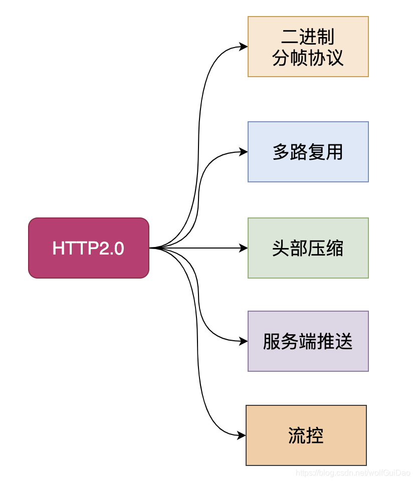
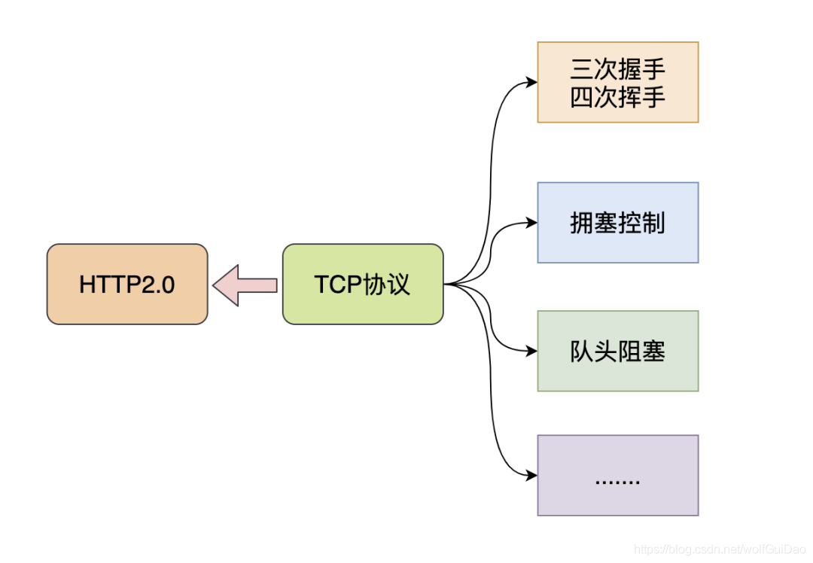
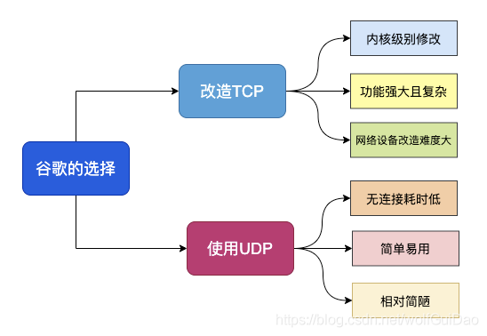
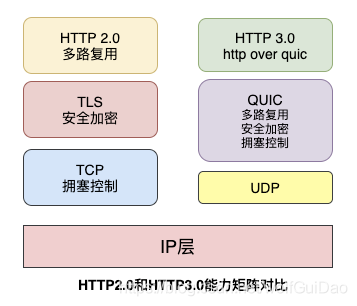
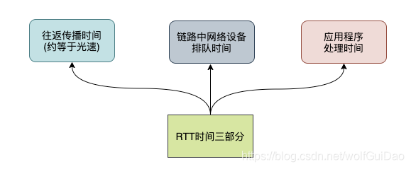
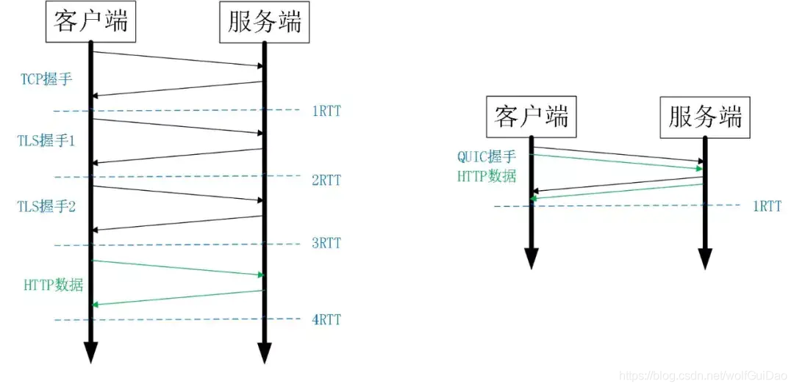

# http3

#### 写在前面

- 如果你的 App，在不需要任何修改的情况下就能提升 15% 以上的访问速度。特别是弱网络的时候能够提升 20% 以上的访问速度。
- 如果你的 App，在频繁切换 4G 和 WIFI 网络的情况下，不会断线，不需要重连，用户无任何感知。如果你的 App，既需要 TLS 的安全，也想实现 HTTP2 多路复用的强大。
- 如果你刚刚才听说 HTTP2 是下一代互联网协议，如果你刚刚才关注到 TLS1.3 是一个革命性具有里程碑意义的协议，但是这两个协议却一直在被另一个更新兴的协议所影响和挑战。

## HTTP2.0 和 HTTP3.0

### 1.1 HTTP2.0 和 TCP 的爱恨纠葛

HTTP2.0 是 2015 年推出的，还是比较年轻的，其重要的二进制分帧协议、多路复用、头部压缩、服务端推送等重要优化使 HTTP 协议真正上了一个新台阶。

- 像谷歌这种重要的公司并没有满足于此，而且想继续提升 HTTP 的性能，花最少的时间和资源获取极致体验。
- 那么肯定要问 HTTP2.0 虽然性能已经不错了，还有什么不足吗？ 建立连接时间长(本质上是 TCP 的问题) ,队头阻塞问题
- 移动互联网领域表现不佳(弱网环境) …
  

熟悉 HTTP2.0 协议的同学应该知道，这些缺点基本都是由于 TCP 协议引起的，水能载舟亦能覆舟，其实 TCP 也很无辜呀！

在我们眼里，TCP 是面向连接、可靠的传输层协议，当前几乎所有重要的协议和应用都是基于 TCP 来实现的。
网络环境的改变速度很快，但是 TCP 协议相对缓慢，正是这种矛盾促使谷歌做出了一个看似出乎意料的决定-基于 UDP 来开发新一代 HTTP 协议

### 1.2 谷歌为什么选择 UDP

上面提到，谷歌选择 UDP 是看似出乎意料的，仔细想一想其实很有道理。

我们单纯地看看 TCP 协议的不足和 UDP 的一些优点：

- 基于 TCP 开发的设备和协议非常多，兼容困难
- TCP 协议栈是 Linux 内部的重要部分，修改和升级成本很大
- UDP 本身是无连接的、没有建链和拆链成本
- UDP 的数据包无队头阻塞问题
- UDP 改造成本小

从上面的对比可以知道，谷歌要想从 TCP 上进行改造升级绝非易事，但是 UDP 虽然没有 TCP 为了保证可靠连接而引发的问题，但是 UDP 本身不可靠，又不能直接用

综合而知，谷歌决定在 UDP 基础上改造一个具备 TCP 协议优点的新协议也就顺理成章了，这个新协议就是 QUIC 协议。

### 1.3 QUIC 协议和 HTTP3.0

QUIC 其实是 Quick UDP Internet Connections 的缩写，直译为快速 UDP 互联网连接。
我们来看看维基百科对于 QUIC 协议的一些介绍：

- QUIC 协议最初由 Google 的 Jim Roskind 设计，实施并于 2012 年部署，在 2013 年随着实验的扩大而公开宣布，并向 IETF 进行了描述。
- QUIC 提高了当前正在使用 TCP 的面向连接的 Web 应用程序的性能。它在两个端点之间使用用户数据报协议（UDP）建立多个复用连接来实现此目的。
- QUIC 的次要目标包括减少连接和传输延迟，在每个方向进行带宽估计以避免拥塞。它还将拥塞控制算法移动到用户空间，而不是内核空间，此外使用前向纠错（FEC）进行扩展，以在出现错误时进一步提高性能。

HTTP3.0 又称为 HTTP Over QUIC，其弃用 TCP 协议，改为使用基于 UDP 协议的 QUIC 协议来实现。

## QUIC 详解

QUIC 协议必须要实现 HTTP2.0 在 TCP 协议上的重要功能，同时解决遗留问题，我们来看看 QUIC 是如何实现的。

### 2.1 队头阻塞问题

队头阻塞 Head-of-line blocking（缩写为 HOL blocking）是计算机网络中是一种性能受限的现象，通俗来说就是：一个数据包影响了一堆数据包，它不来大家都走不了。

队头阻塞问题可能存在于 HTTP 层和 TCP 层，在 HTTP1.x 时两个层次都存在该问题。
HTTP2.0 协议的多路复用机制解决了 HTTP 层的队头阻塞问题，但是在 TCP 层仍然存在队头阻塞问题。

TCP 协议在收到数据包之后，这部分数据可能是乱序到达的，但是 TCP 必须将所有数据收集排序整合后给上层使用，如果其中某个包丢失了，就必须等待重传，从而出现某个丢包数据阻塞整个连接的数据使用。

多路复用是 HTTP2 最强大的特性 ，能够将多条请求在一条 TCP 连接上同时发出去。但也恶化了 TCP 的一个问题，队头阻塞 ，如下图示：
HTTP2 在一个 TCP 连接上同时发送 4 个 Stream。其中 Stream1 已经正确到达，并被应用层读取。

但是 Stream2 的第三个 tcp segment 丢失了，TCP 为了保证数据的可靠性，需要发送端重传第 3 个 segment 才能通知应用层读取接下去的数据，虽然这个时候 Stream3 和 Stream4 的全部数据已经到达了接收端，但都被阻塞住了。

不仅如此，由于 HTTP2 强制使用 TLS，还存在一个 TLS 协议层面的队头阻塞

QUIC 的多路复用和 HTTP2 类似。在一条 QUIC 连接上可以并发发送多个 HTTP 请求 (stream)。但是 QUIC 的多路复用相比 HTTP2 有一个很大的优势。

QUIC 一个连接上的多个 stream 之间没有依赖。这样假如 stream2 丢了一个 udp packet，也只会影响 stream2 的处理。不会影响 stream2 之前及之后的 stream 的处理。

这也就在很大程度上缓解甚至消除了队头阻塞的影响。

QUIC 协议是基于 UDP 协议实现的，在一条链接上可以有多个流，流与流之间是互不影响的，当一个流出现丢包影响范围非常小，从而解决队头阻塞问题

### 2.2 0RTT 建链

衡量网络建链的常用指标是 RTT Round-Trip Time，也就是数据包一来一回的时间消耗。
RTT 包括三部分：往返传播时延、网络设备内排队时延、应用程序数据处理时延。

一般来说 HTTPS 协议要建立完整链接包括:TCP 握手和 TLS 握手，总计需要至少 2-3 个 RTT，普通的 HTTP 协议也需要至少 1 个 RTT 才可以完成握手。

然而，QUIC 协议可以实现在第一个包就可以包含有效的应用数据，从而实现 0RTT，但这也是有条件的。

0RTT 建连可以说是 QUIC 相比 HTTP2 最大的性能优势。那什么是 0RTT 建连呢？这里面有两层含义。
传输层 0RTT 就能建立连接

加密层 0RTT 就能建立加密连接

比如上图左边是 HTTPS 的一次完全握手的建连过程，需要 3 个 RTT。就算是 Session Resumption，也需要至少 2 个 RTT。
而 QUIC 呢？由于建立在 UDP 的基础上，同时又实现了 0RTT 的安全握手，所以在大部分情况下，只需要 0 个 RTT 就能实现数据发送，在实现前向加密 的基础上，并且 0RTT 的成功率相比 TLS 的 Sesison Ticket 要高很多。
简单来说，基于 TCP 协议和 TLS 协议的 HTTP2.0 在真正发送数据包之前需要花费一些时间来完成握手和加密协商，完成之后才可以真正传输业务数据。

#### 2.2.1 首次连接和非首次连接
使用 QUIC 协议的客户端和服务端要使用 1RTT 进行密钥交换，使用的交换算法是 DH(Diffie-Hellman)迪菲-赫尔曼算法。

### 2.3 前向安全问题
前向安全或前向保密Forward Secrecy是密码学中通讯协议的安全属性，指的是长期使用的主密钥泄漏不会导致过去的会话密钥泄漏。
前向安全能够保护过去进行的通讯不受密码或密钥在未来暴露的威胁，如果系统具有前向安全性，就可以保证在主密钥泄露时历史通讯的安全，即使系统遭到主动攻击也是如此
通俗来说，前向安全指的是密钥泄漏也不会让之前加密的数据被泄漏，影响的只有当前，对之前的数据无影响。

## 三、总结
QUIC协议 存在的意义在于解决 TCP 协议的一些无法解决的痛点

* 多次握手：TCP 协议需要三次握手建立连接，而如果需要 TLS 证书的交换，那么则需要更多次的握手才能建立可靠连接，这在如今长肥网络的趋势下是一个巨大的痛点
* 队头阻塞：TCP 协议下，如果出现丢包，则一条连接将一直被阻塞等待该包的重传，即使后来的数据包可以被缓存，但也无法被递交给应用层去处理。
* 无法判断一个 ACK 是重传包的 ACK 还是原本包的 ACK：比如 一个包 seq=1, 超时重传的包同样是 seq=1，这样在收到一个 ack=1 之后，我们无法判断这个 ack 是对之前的包的 ack 还是对重传包的 ack，这会导致我们对 RTT 的估计出现误差，无法提供更准确的拥塞控制
* 无法进行连接迁移：一条连接由一个四元组标识，在当今移动互联网的时代，如果一台手机从一个 wifi 环境切换到另一个 wifi 环境，ip 发生变化，那么连接必须重新建立，inflight 的包全部丢失。
现在我们给出一个 QUIC 协议的 Overview

* 更好的连接建立方式
* 更好的拥塞控制
* 没有队头阻塞的多路复用
* 前向纠错
* 连接迁移

## 参考链接

[HTTP3.0 和 QUIC 协议那些事](https://blog.csdn.net/wolfGuiDao/article/details/108729560)
