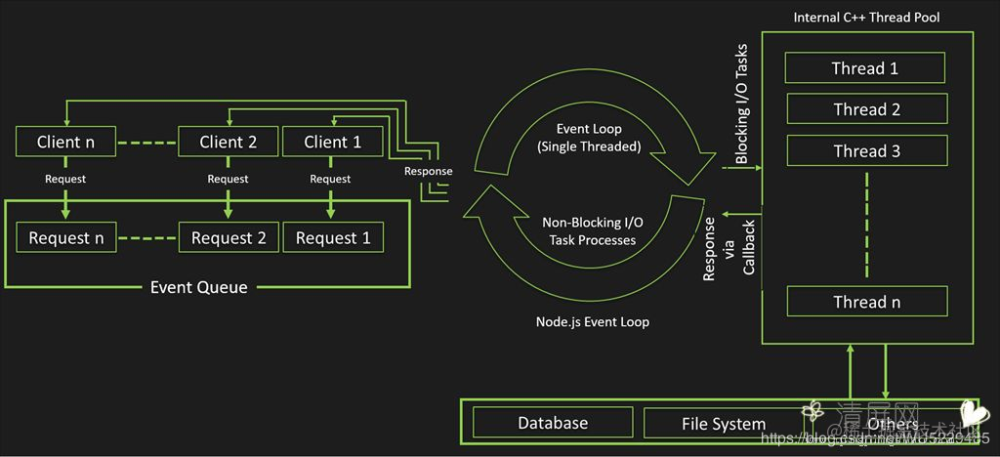
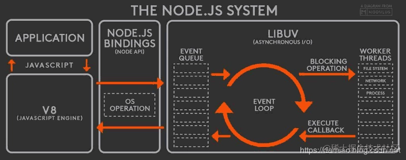

# 事件循环


## node 执行机制




## 什么是事件循环

事件循环是指nodejs执行非阻塞I/O的机制。nodejs是和系统打交道的，js是单线程的，但内核和系统是多线程的。nodejs会尽可能将操作转载到系统内核。因此他们可以在后台执行多个操作。当其中一个操作完成时，内核会告诉nodejs,一边nodejs可以将相应的回调添加到轮询队列中以最终执行。

当nodejs启动时会初始化eventloop,每一个eventloop都会包含如下的顺序的六个循环阶段：
```sql
   ┌───────────────────────┐
┌─>│        timers         │
│  └──────────┬────────────┘
│  ┌──────────┴────────────┐
│  │     I/O callbacks     │
│  └──────────┬────────────┘
│  ┌──────────┴────────────┐
│  │     idle, prepare     │
│  └──────────┬────────────┘      ┌───────────────┐
│  ┌──────────┴────────────┐      │   incoming:   │
│  │         poll          │<─────┤  connections, │
│  └──────────┬────────────┘      │   data, etc.  │
│  ┌──────────┴────────────┐      └───────────────┘
│  │        check          │
│  └──────────┬────────────┘
│  ┌──────────┴────────────┐
└──┤    close callbacks    │
   └───────────────────────┘
```

1. **timers** 阶段：这个阶段执行setTimeout(callback)和setInterval(callback)预订的callback
2. **I/O callbacks** 阶段：此阶段执行某些系统操作的回调，例如TCP错误的类型，或者*nix系统的错误哦报告
3. **idle,prepare** 阶段： 仅node内部使用
4. **poll** 阶段： 获取新的I/O事件，例如操作读取文件等等，适当的条件下node将阻塞在这里
5. **check** 阶段： 实行setImmediate()设定的callback
6. **close callbacks** 阶段： 比如socket.on('close',callback)的callback会在这个阶段执行

## 事件循环详解



这个图是整个Nodejs的运行原理，从左到右，从上到下，Nodejs被分为四层，分别是应用层，V8引擎层，Node API层和LIBUV层。

* 应用层： 即Javascript交互层，常见的就是nodejs模块，比如http,fs
* V8引擎层： 即利用V8引擎来解析Javascript语法，进而和下层API交互
* NodeAPI层： 为上层模块提供系统调用，一般是由C语言来实现，和操作系统进行交互
* LIBUV 层： 是跨平台的底层封装，实现了事件循环，文件操作等，是nodejs实现异步的核心

## 每个循环阶段的内容详解

**timer**阶段一个timer制定一个下限时间而不是准确时间，再达到这个下限时间后执行回调。在指定时间过后，timers会尽可能早的执行回调，但系统调度或其它回调的执行可能会延迟它们。

* 注意： 技术上来说，poll阶段控制timers什么时候执行。

* 注意： 这个下限范围是[1,2147483647],如果设定时间不在这个范围内，将被设置为1


**I/O callbacks阶段** 这个阶段执行一些系统操作的回调。比如TCP错误，如一个TCP socket在想要连接时收到ECONNREFUSED,
类unix系统会等待以报告错误，这就会放到 I/O callbacks 阶段的队列执行.
名字会让人误解为执行I/O回调处理程序, 实际上I/O回调会由poll阶段处理.

**poll**阶段 主要有两个功能：（1）执行下限时间已经到达的timers回到，（2）然后处理poll队列里的事件。当eventloop进入poll阶段，并且没有设定的timers，会发生下面两个事件之一：

* 如果poll队列不空，event loop会遍历队列病同步执行回调，直到队列清空或执行的回调数达到系统上限：
* 如果poll队列为空，则发生一下两件事之一：

  * 如果代码已经被setImmediate()设定了回调，eventloop将结束poll阶段进入check阶段来执行check对类
  * 如果代码没有被setImmediate设定回调，eventloop将组塞在该阶段等待回调被加入poll队列，并立即执行

* 但是，当eventloop进入poll阶段，并且有设定的timers，一旦poll队列为空 ，eventloop将检查timers，如果有timers到达时间下限，eventloop将会饶回到timers阶段，并执行timer队列。

**check**阶段 这个阶段允许在poll阶段结束后立即执行回调。如果poll阶段空闲，并且有被setImmediate()设定的回调，eventloop会转到check阶段而不是继续等待。

* setImmediate实际上是一个特殊的timer,跑在eventloop中一个独立的阶段。它使用libuv的api来设定在poll阶段结束后立即执行回调

* 通常来讲随着，随着代码的执行，eventloop终将进入poll阶段，在这个阶段等待incomming connection,request等。但是，只要有被setImmediate()设定了回调，一旦 poll 阶段空闲，那么程序将结束 poll 阶段并进入 check 阶段，而不是继续等待 poll 事件们 （poll events）。

**close callbacks** 阶段 如果一个 socket 或 handle 被突然关掉（比如 socket.destroy()），close事件将在这个阶段被触发，否则将通过process.nextTick()触发

通过一段代码来查看执行
```scss
// 事件循环本身相当于一个死循环，当代码开始执行的时候，事件循环就已经启动了
// 然后顺序调用不同阶段的方法
while(true){
// timer阶段
	timer()
// I/O callbacks阶段
	IO()
// idle阶段
	IDLE()
// poll阶段
	poll()
// check阶段
	check()
// close阶段
	close()
}
// 在一次循环中，当事件循环进入到某一阶段，加入进入到check阶段，突然timer阶段的事件就绪，也会等到当前这次循环结束，再去执行对应的timer阶段的回调函数 
// 下面看这里例子
const fs = require('fs')

// timers阶段
const startTime = Date.now();
setTimeout(() => {
    const endTime = Date.now()
    console.log(`timers: ${endTime - startTime}`)
}, 1000)

// poll阶段(等待新的事件出现)
const readFileStart =  Date.now();
fs.readFile('./Demo.txt', (err, data) => {
    if (err) throw err
    let endTime = Date.now()
    // 获取文件读取的时间
    console.log(`read time: ${endTime - readFileStart}`)
    // 通过while循环将fs回调强制阻塞5000s
    while(endTime - readFileStart < 5000){
        endTime = Date.now()
    }

})


// check阶段
setImmediate(() => {
    console.log('check阶段')
})
/*控制台打印
check阶段
read time: 9
timers: 5008
通过上述结果进行分析，
1.代码执行到定时器setTimeOut，目前timers阶段对应的事件列表为空，在1000s后才会放入事件
2.事件循环进入到poll阶段，开始不断的轮询监听事件
3.fs模块异步执行，根据文件大小，可能执行时间长短不同，这里我使用的小文件，事件大概在9s左右
4.setImmediate执行，poll阶段暂时未监测到事件，发现有setImmediate函数，跳转到check阶段执行check阶段事件（打印check阶段），第一次时间循环结束，开始下一轮事件循环
5.因为时间仍未到定时器截止时间，所以事件循环有一次进入到poll阶段，进行轮询
6.读取文件完毕，fs产生了一个事件进入到poll阶段的事件队列，此时事件队列准备执行callback，所以会打印（read time: 9），人工阻塞了5s，虽然此时timer定时器事件已经被添加，但是因为这一阶段的事件循环为完成，所以不会被执行，（如果这里是死循环，那么定时器代码永远无法执行）
7.fs回调阻塞5s后，当前事件循环结束，进入到下一轮事件循环，发现timer事件队列有事件，所以开始执行 打印timers: 5008

ps：
1.将定时器延迟时间改为5ms的时候，小于文件读取时间，那么就会先监听到timers阶段有事件进入，从而进入到timers阶段执行，执行完毕继续进行事件循环
check阶段
timers: 6
read time: 5008
2.将定时器事件设置为0ms，会在进入到poll阶段的时候发现timers阶段已经有callback，那么会直接执行，然后执行完毕在下一阶段循环，执行check阶段，poll队列的回调函数
timers: 2
check阶段
read time: 7
 */
 ```


 ## 案例解析

```javascript
const fs = require('fs');
let counts = 0;

// 定义一个 wait 方法
function wait (mstime) {
  let date = Date.now();
  while (Date.now() - date < mstime) {
    // do nothing
  }
}

// 读取本地文件 操作IO
function asyncOperation (callback) {
  fs.readFile(__dirname + '/' + __filename, callback);
}

const lastTime = Date.now();

// setTimeout
setTimeout(() => {
  console.log('timers', Date.now() - lastTime + 'ms');
}, 0);

// process.nextTick
process.nextTick(() => {
  // 进入event loop
  // timers阶段之前执行
  wait(20);
  asyncOperation(() => {
    console.log('poll');
  });  
});

/**
 * timers 21ms
 * poll
 */
```

这里呢，为了让这个setTimeout优先于fs.readFile 回调, 执行了process.nextTick, 表示在进入timers阶段前, 等待20ms后执行文件读取.

### 1. nextTick 与 setImmediate

* process.nextTick 不属于时间循环的任何一个阶段，它属于该阶段与下一个阶段之间的过度，即本阶段执行结束，进入下一个阶段前，所要执行的回调，有给人一种插队的感觉

* setImmediate 的回调处于check阶段，当poll阶段的队列为空，且checj阶段时间队列存在的时候，切换到check阶段执行


nextTicd递归的危害

由于nextTicc插队的机制，nextTick的递归会让时间循环无法进入到下一个阶段，导致I/O处理完成或者定时任务超时后仍然无法执行，导致了其他事件处理程序处于饥饿的状态。nodejs对此做出了先吃，递归深度1000 process.maxTickDepth

### 2. setImmediate

如果在一个I/O周期内进行调度，setImmediate() 将始终在任何定时器（setTimeout、setInterval）之前执行.

### 3. setTimeout 与 setImmediate

无I/O处理的情况下

```javascript
setTimeout(function timeout () {
  console.log('timeout');
},0);

setImmediate(function immediate () {
  console.log('immediate');
});
```
执行结果：
```
C:\Users\92809\Desktop\node_test>node test.js
timeout
immediate

C:\Users\92809\Desktop\node_test>node test.js
timeout
immediate

C:\Users\92809\Desktop\node_test>node test.js
timeout
immediate

C:\Users\92809\Desktop\node_test>node test.js
immediate
timeout
```

答：首先进入的是timers阶段，如果我们的机器性能一般，那么进入timers阶段，1ms已经过去了 ==(setTimeout(fn, 0)等价于setTimeout(fn, 1))==，那么setTimeout的回调会首先执行。
如果没有到1ms，那么在timers阶段的时候，下限时间没到，setTimeout回调不执行，事件循环来到了poll阶段，这个时候队列为空，于是往下继续，先执行了setImmediate()的回调函数，之后在下一个事件循环再执行setTimemout的回调函数。

有I/O操作

```javascript
var fs = require('fs')

fs.readFile(__filename, () => {
    setTimeout(() => {
        console.log('timeout');
    }, 0);
    setImmediate(() => {
        console.log('immediate');
    });
});
```
原因如下：fs.readFile的回调是在poll阶段执行的，当其回调执行完毕之后，poll队列为空，而setTimeout入了timers的队列，此时有代码 setImmediate()，于是事件循环先进入check阶段执行回调，之后在下一个事件循环再在timers阶段中执行回调。

可以得知：

* 如果两者都在主模块中调用，那么执行先后取决于进程性能，也就是你的电脑好撇，当然也就是随机。
* 如果两者都不在主模块调用（被一个异步操作包裹），那么**setImmediate的回调永远先执行**。


4. nextTick与Promise

概念：对于这两个，我们可以把它们理解成一个微任务。也就是说，它其实不属于事件循环的一部分。 那么他们是在什么时候执行呢？ 不管在什么地方调用，他们都会在其所处的事件循环最后，事件循环进入下一个循环的阶段前执行。

```javascript
setTimeout(() => {
    console.log('timeout0');
    new Promise((resolve, reject) => { resolve('resolved') }).then(res => console.log(res));
    new Promise((resolve, reject) => {
      setTimeout(()=>{
        resolve('timeout resolved')
      })
    }).then(res => console.log(res));
    process.nextTick(() => {
        console.log('nextTick1');
        process.nextTick(() => {
            console.log('nextTick2');
        });
    });
    process.nextTick(() => {
        console.log('nextTick3');
    });
    console.log('sync');
    setTimeout(() => {
        console.log('timeout2');
    }, 0);
}, 0);
```

结果

```css
C:\Users\92809\Desktop\node_test>node test.js
timeout0
sync
nextTick1
nextTick3
nextTick2
resolved
timeout2
timeout resolved
```
总结：timers阶段执行外层setTimeout的回调，遇到同步代码先执行，也就有timeout0、sync的输出。遇到process.nextTick及Promise后入微任务队列，依次nextTick1、nextTick3、nextTick2、resolved入队后出队输出。之后，在下一个事件循环的timers阶段，执行setTimeout回调输出timeout2以及微任务Promise里面的setTimeout，输出timeout resolved。
* 这里要说明的是 微任务nextTick优先级要比Promise要高

### 5.最后案例

片段1
```javascript
setImmediate(function(){
  console.log("setImmediate");
  setImmediate(function(){
    console.log("嵌套setImmediate");
  });
  process.nextTick(function(){
    console.log("nextTick");
  })
});

/* 
	C:\Users\92809\Desktop\node_test>node test.js
	setImmediate
	nextTick
	嵌套setImmediate
*/
```
解析：

事件循环check阶段执行回调函数输出setImmediate，之后输出nextTick。嵌套的setImmediate在下一个事件循环的check阶段执行回调输出嵌套的setImmediate。

片段2

```javascript
async function async1(){
    console.log('async1 start')
    await async2()
    console.log('async1 end')
  }
async function async2(){
    console.log('async2')
}
console.log('script start')
setTimeout(function(){
    console.log('setTimeout0') 
},0)  
setTimeout(function(){
    console.log('setTimeout3') 
},3)  
setImmediate(() => console.log('setImmediate'));
process.nextTick(() => console.log('nextTick'));
async1();
new Promise(function(resolve){
    console.log('promise1')
    resolve();
    console.log('promise2')
}).then(function(){
    console.log('promise3')
})
console.log('script end')
```
打印结果为
```
C:\Users\92809\Desktop\node_test>node test.js
script start
async1 start
async2
promise1
promise2
script end
nextTick
promise3
async1 end
setTimeout0
setTimeout3
setImmediate
```
nodejs中的宏任务 I/O(读写，系统错误) setTimeout setInterval setImmediate   类似于微任务 nextTick promise


### 参考链接
[深入理解NodeJS事件循环机制](https://juejin.cn/post/6844903999506923528)