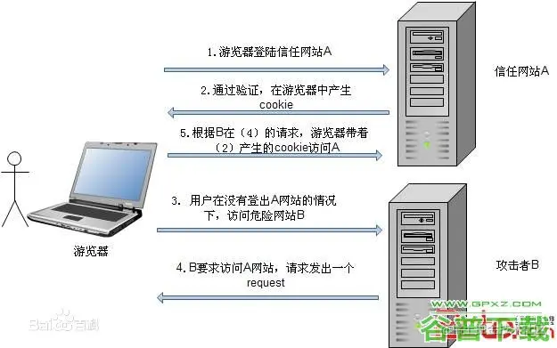

# 常见前端安全问题及解决方案

## 1.XSS

XSS 全称(Cross Site Scripting)跨站脚本攻击，是前端最常见的安全问题。XSS 是一种在 web 应用中的计算机安全漏洞，它允许恶意 web 用户将代码植入到提供给其它用户使用的页面中，攻击者通过注入非法的 html 标签或者 javascript 代码，从而当用户浏览该网页时，控制用户浏览器。

类别

### 1. 反射性 xss

反射型 XSS 也被称为非持久性 XSS，是现在最容易出现的一种 XSS 漏洞。XSS 代码出现在 URL 中，通过引诱用户点击一个链接到目标网站的恶意链接来实施攻击。
如下恶意链接，其中，xxx 是恶意代码。传到服务器的参数 data，被服务器接收之后，响应的页面包含 data 这个变量的，会将恶意代码注入到页面上面，进行攻击。 一般发生在前后端一体的应用中，服务端逻辑会改变最终的网页代码。

#### 反射型 XSS 攻击的步骤

1. 攻击者构造出特殊的 URL，其中包含恶意代码。
2. 用户打开带有恶意代码的 URL 时，网站服务端将恶意代码从 URL 中取出，拼接在 HTML 中返回给浏览器。
3. 用户浏览器接收到响应后解析执行，混在其中的恶意代码也被执行。
4. 恶意代码窃取用户数据并发送到攻击者的网站，或者冒充用户的行为，调用目标网站接口执行攻击者指定的操作。

### 2. DOM 型 xss

利用 DOM 本身存在的缺陷进行攻击。目前更流行前后端分离的项目，反射型 XSS 无用武之地。 但这种攻击不需要经过服务器，我们知道，网页本身的 JavaScript 也是可以改变 HTML 的，黑客正是利用这一点来实现插入恶意脚本。
如下代码，页面中某个图片获取路径。其中，返回的，img 标签就变成了。src 肯定会加载失败，然后会执行 onerror 中注入的恶意代码，达到攻击效果。

#### 基于 DOM 的 XSS 攻击步骤：

1. 攻击者构造出特殊的 URL，其中包含恶意代码。
2. 用户打开带有恶意代码的 URL。
3. 用户浏览器接收到响应后解析执行，前端 JavaScript 取出 URL 中的恶意代码并执行。
4. 恶意代码窃取用户数据并发送到攻击者的网站，或者冒充用户的行为，调用目标网站接口执行攻击者指定的操作。

```javascript


```

### 3. 存储型 xss

存储型 XSS 又被称为持久性 XSS，它是最危险的一种跨站脚本，相比反射型 XSS 和 DOM 型 XSS 具有更高的隐蔽性，所以危害更大，它不需要用户手动触发。
当攻击者提交一段 XSS 代码后，被服务器端接收并存储，当所有浏览者访问某个页面时都会被 XSS，其中最典型的例子就是留言板。黑客将恶意 JavaScript 脚本长期保存在服务端数据库中，用户一旦访问相关页面数据，恶意脚本就会被执行。常见于搜索、微博、社区贴吧评论等。

#### 存储型 XSS 的攻击步骤：

1. 攻击者将恶意代码提交到目标网站的数据库中。
2. 用户打开目标网站时，网站服务端将恶意代码从数据库取出，拼接在 HTML 中返回给浏览器。
3. 用户浏览器接收到响应后解析执行，混在其中的恶意代码也被执行。
4. 恶意代码窃取用户数据并发送到攻击者的网站，或者冒充用户的行为，调用目标网站接口执行攻击者指定的操作。

### 这几种 XSS 攻击类型的区别

- 反射型的 XSS 的恶意脚本存在 URL 里，存储型 XSS 的恶意代码存在数据库里。
- 反射型 XSS 攻击常见于通过 URL 传递参数的功能，如网站搜索、跳转等。
- 存储型 XSS 攻击常见于带有用户保存数据的网站功能，如论坛发帖、商品评论、用户私信等。
- 而基于 DOM 的 XSS 攻击中，取出和执行恶意代码由浏览器端完成，属于前端 JavaScript 自身的安全漏洞，其他两种 XSS 都属于服务端的安全漏洞。

## 解决方案

### 输入过滤

在用户提交时，由前端过滤输入，然后提交到后端，这种方法不可行，因为攻击者可能绕过前端过滤，直接构造请求，提交恶意代码。一般在写入数据库前，后端对输入数据进行过滤。虽然输入侧过滤能够在某些情况下解决特定的 XSS 问题，但会引入很大的不确定性和乱码问题。在防范 XSS 攻击时应避免此类方法。
根据输出数据所在的上下文来进行相应的编码。数据放置于 HTML 元素中，需进行 HTML 编码，放置于 URL 中，需要进行 URL 编码。此外，还有 JavaScript 编码、CSS 编码、HTML 属性编码、JSON 编码等等。

### 预防存储型和反射型 XSS 攻击

- 改成纯前端渲染，把代码和数据分隔开。
- 对 HTML 做充分转义。

### 预防 DOM 型 XSS 攻击

DOM 型 XSS 攻击，实际上就是网站前端 JavaScript 代码本身不够严谨，把不可信的数据当作代码执行了。

在使用 .innerHTML、.outerHTML、document.write() 时要特别小心，不要把不可信的数据作为 HTML 插到页面上，而应尽量使用 .textContent、.setAttribute() 等。

如果用 Vue/React 技术栈，并且不使用 v-html/dangerouslySetInnerHTML 功能，就在前端 render 阶段避免 innerHTML、outerHTML 的 XSS 隐患。

DOM 中的内联事件监听器，如 location、onclick、onerror、onload、onmouseover 等，\<a\> 标签的 href 属性，JavaScript 的 eval()、setTimeout()、setInterval() 等，都能把字符串作为代码运行。如果不可信的数据拼接到字符串中传递给这些 API，很容易产生安全隐患，请务必避免。

```html
<!-- 内联事件监听器中包含恶意代码 -->


<!-- 链接内包含恶意代码 -->
<a href="UNTRUSTED">1</a>

<script>
  // setTimeout()/setInterval() 中调用恶意代码
  setTimeout("UNTRUSTED");
  setInterval("UNTRUSTED");

  // location 调用恶意代码
  location.href = "UNTRUSTED";

  // eval() 中调用恶意代码
  eval("UNTRUSTED");
</script>
```

### httpOnly

在 cookie 中设置 HttpOnly 属性，使 js 脚本无法读取到 cookie 信息。

### Content Security Policy

严格的 CSP 在 XSS 的防范中可以起到以下的作用：

- 禁止加载外域代码，防止复杂的攻击逻辑。
- 禁止外域提交，网站被攻击后，用户的数据不会泄露到外域。
- 禁止内联脚本执行（规则较严格，目前发现 GitHub 使用）。
- 禁止未授权的脚本执行（新特性，Google Map 移动版在使用）。
- 合理使用上报可以及时发现 XSS，利于尽快修复问题。

## XSS 攻击案例

- 2005 年，年仅 19 岁的 Samy Kamkar 发起了对 MySpace.com 的 XSS Worm 攻击。 Samy Kamkar 的蠕虫在短短几小时内就感染了 100 万用户——它在每个用户的自我简介后边加了一句话：“but most of all, Samy is my hero.”（Samy 是我的偶像）。这是 Web 安全史上第一个重量级的 XSS Worm，具有里程碑意义。
- 2007 年 12 月，百度空间收到蠕虫攻击，用户之间开始转发垃圾短消息。
- QQ 邮箱 m.exmail.qq.com 域名被发现反射型 XSS 漏洞
- 2011 年新浪微博曾被黑客 XSS 攻击，黑客诱导用户点击一个带有诱惑性的链接，便会自动发送一条带有同样诱惑性链接微博。攻击范围层层扩大，也是一种蠕虫攻击。

## 2.CSRF

CSRF 全称(Cross-Site Request Forgeries)跨站请求伪造。攻击者诱导受害者进入第三方网站，在第三方网站中，向被攻击网站发送跨站请求。利用受害者在被攻击网站已经获取的注册凭证，绕过后台的用户验证，达到冒充用户对被攻击的网站执行某项操作的目的。



### CSRF 是怎么攻击的？

典型的 CSRF 攻击是这样的：

- 受害者登录 A 网站，并且保留了登录凭证（Cookie）
- 攻击者引诱受害者访问 B 网站
- B 网站向 A 网站发送了一个请求（这个就是下面将介绍的几种伪造请求的方式），浏览器请求头中会默认携带 A 网站的 Cookie
- A 网站服务器收到请求后，经过验证发现用户是登录了的，所以会处理请求

### 常见的 CSRF 攻击类型

#### GET 类型的 CSRF

GET 类型的 CSRF 利用非常简单，只需要一个 HTTP 请求，一般会这样利用：

```javascript
 
```

在受害者访问含有这个 img 的页面后，浏览器会自动向http://bank.example/withdraw?account=xiaoming&amount=10000&for=hacker发出一次HTTP请求。bank.example就会收到包含受害者登录信息的一次跨域请求。

#### POST 类型的 CSRF

这种类型的 CSRF 利用起来通常使用的是一个自动提交的表单，如：

```html
<form action="http://bank.example/withdraw" method="POST">
  <input type="hidden" name="account" value="xiaoming" />
  <input type="hidden" name="amount" value="10000" />
  <input type="hidden" name="for" value="hacker" />
</form>
<script>
  document.forms[0].submit();
</script>
```

访问该页面后，表单会自动提交，相当于模拟用户完成了一次 POST 操作。

POST 类型的攻击通常比 GET 要求更加严格一点，但仍并不复杂。任何个人网站、博客，被黑客上传页面的网站都有可能是发起攻击的来源，后端接口不能将安全寄托在仅允许 POST 上面。

#### 链接类型的 CSRF

链接类型的 CSRF 并不常见，比起其他两种用户打开页面就中招的情况，这种需要用户点击链接才会触发。这种类型通常是在论坛中发布的图片中嵌入恶意链接，或者以广告的形式诱导用户中招，攻击者通常会以比较夸张的词语诱骗用户点击

```javascript
  <a href="http://test.com/csrf/withdraw.php?amount=1000&for=hacker" taget="_blank">
  重磅消息！！
  <a/>

```

### CSRF 的特点

- 攻击一般发起在第三方网站，而不是被攻击的网站。被攻击的网站无法防止攻击发生。
- 攻击利用受害者在被攻击网站的登录凭证，冒充受害者提交操作；而不是直接窃取数据。
- 整个过程攻击者并不能获取到受害者的登录凭证，仅仅是“冒用”。
- 跨站请求可以用各种方式：图片 URL、超链接、CORS、Form 提交等等。部分请求方式可以直接嵌入在第三方论坛、文章中，难以进行追踪。

## 解决方案 CSRF 防范措施

由上面对 CSRF 的介绍我们知道了，CSRF 通常发生在第三方域名，并且 CSRF 攻击者不能获取到受害者的 cookie 等信息，只是借用他们的登录状态来伪造请求。所以我们可以针对这两点来制定防范措施：

### 同源检测

既然 CSRF 大多来自第三方网站，那么我们就直接禁止第三方域名（或者不受信任的域名）对我们发起请求。

在 HTTP 协议中，每一个异步请求都会携带两个 Header，用于标记来源域名：

- Origin Header
- Referer Header

这两个 Header 在浏览器发起请求时，大多数情况会自动带上，并且不能由前端自定义内容。 服务器可以通过解析这两个 Header 中的域名，确定请求的来源域。同时服务器应该优先检测 Origin。为了安全考虑，相比于 Referer，Origin 只包含了域名而不带路径。

### CSRF Token

- 在浏览器向服务器发起请求时，服务器生成一个 CSRF Token。CSRF Token 其实就是服务器生成的随机字符串，然后将该字符串植入到返回的页面中，通常是放到表单的隐藏输入框中，这样能够很好的保护 CSRF Token 不被泄漏；
- 当浏览器再次发送请求的时候，就需要携带这个 CSRF Token 值一起提交；
- 服务器验证

### 给 Cookie 设置合适的 SameSite

当从 A 网站登录后，会从响应头中返回服务器设置的 Cookie 信息，而如果 Cookie 携带了 SameSite=strict 则表示完全禁用第三方站点请求头携带 Cookie，比如当从 B 网站请求 A 网站接口的时候，浏览器的请求头将不会携带该 Cookie。

- Samesite=Strict，这种称为严格模式，表明这个 Cookie 在任何情况下都不可能作为第三方 Cookie
- jSamesite=Lax，这种称为宽松模式，比 Strict 放宽了点限制：假如这个请求是这种请求（改变了当前页面或者打开了新页面）且同时是个 GET 请求，则这个 Cookie 可以作为第三方 Cookie。（默认）
- None 任何情况下都会携带；

## 3.点击劫持(Click Jacking)

点击劫持（Clickjacking）是一种通过视觉欺骗的手段来达到攻击目的手段。往往是攻击者将目标网站通过 iframe 嵌入到自己的网页中，通过 opacity 等手段设置 iframe 为透明的，使得肉眼不可见，这样一来当用户在攻击者的网站中操作的时候，比如点击某个按钮（这个按钮的顶层其实是 iframe），从而实现目标网站被点击劫持。

点击劫持防范措施

- 在 HTTP 投中加入 X-FRAME-OPTIONS 属性，此属性控制页面是否可被嵌入 iframe 中

  - DENY：不能被所有网站嵌套或加载；
  - SAMEORIGIN：只能被同域网站嵌套或加载；
  - ALLOW-FROM URL：可以被指定网站嵌套或加载。

- 判断当前网页是否被 iframe 嵌套

## CDN 劫持

### CDN 原理？

它的名字就叫做 CDN——Content Delivery Network，内容分发网络。具体来说，CDN 就是采用更多的缓存服务器（CDN 边缘节点），布放在用户访问相对集中的地区或网络中。当用户访问网站时，利用全局负载技术，将用户的访问指向距离最近的缓存服务器上，由缓存服务器响应用户请求。（有点像电商的本地仓吧？）CDN 应用广泛，支持多种行业、多种场景内容加速，例如：图片小文件、大文件下载、视音频点播、直播流媒体、全站加速、安全加速。

### 什么是 CDN 劫持？

网络上有很多黑客为了让用户能够登录自己开发的钓鱼网站，都会通过对 CDN 进行劫持的方法，让用户自动转入自己开发的网站。而很多用户却往往无法察觉到自己已经被劫持。其实验证被劫持的方法，就是输入任何网址看看所打开的网页是否和自己输入的网址一致，

### CDN 劫持防范措施

#### 使用 SRI 来解决 CDN 劫持

SRI 全称 Subresource Integrity - 子资源完整性，是指浏览器通过验证资源的完整性（通常从 CDN 获取）来判断其是否被篡改的安全特性。

通过给 link 标签或者 script 标签增加 integrity 属性即可开启 SRI 功能，比如

```
<script type="text/javascript" src="//s.url.cn/xxxx/aaa.js"
    integrity="sha256-xxx sha384-yyy"
    crossorigin="anonymous"></script>
```

integrity 值分成两个部分，第一部分指定哈希值的生成算法（sha256、sha384 及 sha512），第二部分是经过 base64 编码的实际哈希值，两者之间通过一个短横（-）分割。integrity 值可以包含多个由空格分隔的哈希值，只要文件匹配其中任意一个哈希值，就可以通过校验并加载该资源。开启 SRI 能有效保证页面引用资源的完整性，避免恶意代码执行。

#### 浏览器如何处理 SRI

- 当浏览器在 script 或者 link 标签中遇到 integrity 属性之后，会在执行脚本或者应用样式表之前对比所加载文件的哈希值和期望的哈希值。
- 当脚本或者样式表的哈希值和期望的不一致时，浏览器必须拒绝执行脚本或者应用样式表，并且必须返回一个网络错误说明获得脚本或样式表失败。

## 内容安全策略（CSP）

内容安全策略（Content Security Policy）简称 CSP，通过它可以明确的告诉客户端浏览器当前页面的哪些外部资源可以被加载执行，而哪些又是不可以的。

### CSP 的意义

防 XSS 等攻击的利器。CSP 的实质就是白名单制度，开发者明确告诉客户端，哪些外部资源可以加载和执行，等同于提供白名单。它的实现和执行全部由浏览器完成，开发者只需提供配置。CSP 大大增强了网页的安全性。攻击者即使发现了漏洞，也没法注入脚本，除非还控制了一台列入了白名单的可信主机。

### CSP 的分类

- Content-Security-Policy 配置好并启用后，不符合 CSP 的外部资源就会被阻止加载。
- Content-Security-Policy-Report-Only 表示不执行限制选项，只是记录违反限制的行为。它必须与 report-uri 选项配合使用。

### CSP 的使用

- 通过 HTTP 头配置 Content-Security-Policy，以下配置说明该页面只允许当前源和 https://apis.google.com 这 2 个源的脚本加载和执行：

```
Content-Security-Policy: script-src 'self' https://apis.google.com
```

- 通过页面 <meta> 标签配置：

```
<meta http-equiv="Content-Security-Policy" content="script-src 'self' https://apis.google.com">
```

### 安全沙箱

多进程的浏览器架构将主要分为两块：浏览器内核和渲染内核。而安全沙箱能限制了渲染进程对操作系统资源的访问和修改，同时渲染进程内部也没有读写操作系统的能力，而这些都是在浏览器内核中一一实现了，包括持久存储、网络访问和用户交互等一系列直接与操作系统交互的功能。浏览器内核和渲染内核各自职责分明，当他们需要进行数据传输的时候会通过 IPC 进行。
而渲染进程的工作是进行 HTML、CSS 的解析，JavaScript 的执行等，而这部分内容是直接暴露给用户的，所以也是最容易被黑客利用攻击的地方，如果黑客攻击了这里就有可能获取到渲染进程的权限，进而威胁到操作系统。所以需要一道墙用来把不可信任的代码运行在一定的环境中，限制不可信代码访问隔离区之外的资源，而这道墙就是浏览器的安全沙箱。
安全沙箱的存在是为了保护客户端操作系统免受黑客攻击，但是阻止不了 XSS 和 CSRF。

安全沙箱是利用操作系统提供的安全技术，这样渲染进程在运行中就无法获取或修改操作系统中的数据。安全沙箱最小隔离单位是进程，所以无法保护单进程浏览器。

### Iframe

iframe 在给我们的页面带来更多丰富的内容和能力的同时，也带来了不少的安全隐患。因为 iframe 中的内容是由第三方来提供的，默认情况下他们不受我们的控制，他们可以在 iframe 中运行 JavaScirpt 脚本、Flash 插件、弹出对话框等等，这可能会破坏前端用户体验。

#### 如何让自己的网站不被其他网站的 iframe 引用？

* js 的防御方案：将下面这段代码放到网站页面的\</body\>标签前，这样别人在通过 iframe 框架引用你的网站网页时，浏览器会自动跳转到你的网站所引用的页面上。

```html
<script>
  if (self == top) {
    var theBody = document.getElementsByTagName("body")[0];
    theBody.style.display = "block";
  } else {
    top.location = self.location;
  }
</script>
```
* 使用X-Frame-Options防止网页被iframe：X-FRAME-OPTIONS是微软提出的一个http头，专门用来防御利用iframe嵌套的点击劫持攻击。

```
DENY               // 拒绝任何域加载
SAMEORIGIN         // 允许同源域下加载
ALLOW-FROM         // 可以定义允许frame加载的页面地址

```


### 如何禁止被使用的 iframe 对当前网站某些操作？

sandbox是html5的新属性，主要是提高iframe安全系数。iframe因安全问题而臭名昭著，这主要是因为iframe常被用于嵌入到第三方中，然后执行某些恶意操作。【这个与上面说到的安全沙箱（Sandbox）不同】
现在有一场景：我的网站需要 iframe 引用某网站，但是不想被该网站操作DOM、不想加载某些js（广告、弹框等）、当前窗口被强行跳转链接等，我们可以设置 sandbox 属性:

* allow-same-origin：允许被视为同源，即可操作父级DOM或cookie等
* allow-top-navigation：允许当前iframe的引用网页通过url跳转链接或加载
* allow-forms：允许表单提交
* allow-scripts：允许执行脚本文件
* allow-popups：允许浏览器打开新窗口进行跳转
* “”：设置为空时上面所有允许全部禁止

## 4.不安全的第三方依赖

现如今进行应用开发，无论是后端服务器应用还是前端应用开发，绝大多数时候我们都是在借助开发框架和各种类库进行快速开发。然而，一些第三方的依赖或者插件存在很多安全性问题，也会存在这样那样的漏洞，所以使用起来得谨慎。

解决方案

1.尽量减少第三方依赖，选用相对成熟的依赖包。 2.使用自动化工具检查这些第三方代码有没有安全问题，比如 NSP(Node Security Platform)，Snyk 等等。

## 5.本地存储数据泄露

很多开发者为了方便，把一些个人信息不经加密直接存到本地或者 cookie，这样是非常不安全的，黑客们可以很容易就拿到用户的信息。

解决方案

### 1.不在本地存储重要数据

敏感、机密信息不要存储在本地。

### 2.加密

所有在放到 cookie 中的信息或者 localStorage 里的信息要进行加密，加密可以自己定义一些加密方法或者网上寻找一些加密的插件，或者用 base64 进行多次加密然后再多次解码。

## 参考链接

[常见前端安全问题及解决方案](https://juejin.cn/post/6844903942036389895)
[前端常见的安全问题及防范措施](https://segmentfault.com/a/1190000041454108)
